# SharedKanban architecture

This is the Phase 0 technical architecture for SharedKanban. It applies the decisions in docs/decisions/decision-register.md (D01 to D22), cites them inline, and never overrides them: where this document and the register disagree, the register wins and this document has a bug. Wire contracts and examples live in docs/api.md; threats and mitigations in docs/threat-model.md. It is written for two readers: the owner, who approves Phase 0 by reading it, and the future sessions (cloud Linux and Mac mini Cowork) that implement Phases 1 to 11 from it without guessing. There is no production code yet; the JSON, shell and Mermaid below are specification, not implementation.

## 1. Overview and constraints

SharedKanban is a native SwiftUI iPhone and iPad app (iOS and iPadOS 18.0 minimum, Swift 6 strict concurrency, D20) backed by one Swift 6, Vapor 4, Fluent 4 binary and a PostgreSQL 17 database that run on a household Mac mini under Docker Compose with a launchd escape hatch (D11). The server is authoritative: the app keeps a disposable SwiftData cache and a durable outbox of queued mutations (D08, D12); every mutation is idempotent through a body `operationId` (D18); optimistic concurrency with field-level merge replaces any CRDT (D05); card order is a fractional-indexing string rank moved through a neighbor-based contract (D06). Every project-scoped write is serialized on the project row and allocates a gap-free per-project sequence, and one `activity_events` table feeds realtime delivery, catch-up, the activity feed, notifications and conflict detection (D13, D17). Apple is used only for Sign in with Apple and APNs (D10). Devices reach the Mac mini through one of three ingress profiles in order: LAN for development, Tailscale for the household beta and release-1 production, and a public hostname (Tailscale Funnel or Cloudflare Tunnel) only when a concrete need appears; a tunnel is transport, never authorization (D10). Claude reaches the same application service layer through an MCP adapter that lives inside the api process, has no SQL and no filesystem access, and can only propose changes that a separate confirmation applies (D15). Hard product constraints: exactly three or four active columns per project (D19), a non-drag alternative for every drag (D01, D02), explicit confirmation for destructive and membership-changing AI actions (D15), and no secrets in the repository (D11, D21).

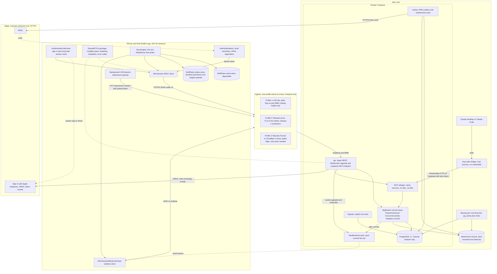

Reading the diagram: the app talks to exactly one origin over HTTPS and WSS, and whichever ingress profile is active forwards to the loopback-only `api` container, the only process that serves clients. `api` hosts the Vapor routes, the realtime hub and the MCP endpoint in one process, and all three call the same application service layer; `worker` shares the binary and the database but never serves clients and never publishes events (D11, D13). The two Apple dependencies are reached outbound from the Mac mini, plus the device-side system sign-in sheet and push delivery. Claude connects through a credential-free stdio bridge to the loopback MCP endpoint (D15).

## 2. Component responsibilities

Each component lists what it owns, what it must never do, and its interfaces. "Service layer" always means the application service layer in 2.10: the only code that reads or writes domain state, shared by REST and MCP (D15).

### 2.1 SharedDTOs package

- Owns: plain `Codable` value types for every request, response, event and WebSocket message; `Patch<T>`; `Page<T>`; `APIError` and the snake_case error-code enum; the activity action enum with `.unknown`; `ProjectTemplate` (`homeProjects`, `restaurantsToTry`, `custom`); `RankKey.generateKeyBetween` and `generateNKeysBetween`; `JSONCoding.encoder` and `decoder`; the `LenientEnum` helper (D06, D19, D20, D22). Declares iOS 18, macOS 15 and Linux.
- Must never: import SwiftData, Vapor or Fluent; contain a float in any DTO (the D18 request hash is canonical JSON); hold business logic beyond key generation and template definitions.
- Interfaces: compiled into the app, the server and both test suites; fixtures under `shared/Fixtures/` are decoded by contract tests on Linux and iOS so docs/api.md cannot drift (D22).

### 2.2 Sign-in and session store (AuthenticationServices and Keychain)

- Owns: the native Sign in with Apple request with a cryptographic nonce; the fresh re-authentication bound to a server challenge for account deletion (D09); one Keychain blob holding `installationId`, access token, refresh token and expiries with `kSecAttrAccessibleAfterFirstUnlockThisDeviceOnly`, non-synchronizable; single-flight proactive refresh when fewer than 5 minutes remain, one retry on 401 `token_expired`, forced sign-out handling (D16); the launch-time `getCredentialState` check (D09); the first-launch flag that wipes Keychain items left over from an uninstall (D12).
- Must never: store the Apple identity token or Apple refresh token on the device; put tokens in URLs or logs; sync Keychain items through iCloud; wipe the outbox on a forced sign-out (D08).
- Interfaces: `POST /v1/auth/apple`, `POST /v1/auth/refresh`, `POST /v1/auth/logout`, `GET /v1/auth/sessions`, `DELETE /v1/auth/sessions/{id}`, `POST /v1/auth/sessions/revoke-all`; supplies the `Authorization: Bearer` header to the REST client and the WebSocket upgrade. Background uploads use upload tokens, never the access token (D14).

### 2.3 SwiftData cache, outbox and SyncEngine

- Owns: `cache.store` (`CachedProject`, `CachedColumn`, `CachedTask`, `CachedMember`, `CachedUser`, `CachedComment`, `CachedAttachment`, `CachedActivityEvent`, `SyncState`) and `outbox.store` (`PendingOperation`, `StagedUpload`); the single `SyncEngine` `@ModelActor` that performs every write; the draft overlay fields and `hasPendingOperation`; snapshot and event application in sequence order; the strict FIFO replay loop; eviction of projects unopened for 30 days; the `CacheSchema.version` check that deletes a mismatched cache; the `ProjectRepository` protocol with an in-memory fake for previews and tests (D08, D12).
- Must never: be the source of truth; expose `@Model` objects to the APIClient or to DTOs; run a cache migration (wipe instead); gate event application on versions; place the outbox container in the SwiftUI environment; keep attachment bytes in SwiftData (they live in a 200 MB LRU under Caches).
- Interfaces: `@Query` on the main context sorted by `(rank, id)` with `.lexical`; an `@Observable SyncStatus` (pending count, offline, reconnecting); one REST call at a time from the outbox (D08).

### 2.4 URLSession REST client

- Owns: a typed `APIClient` over async/await; the `Authorization`, `X-Request-Id` and `X-Client-Version` headers; decoding of the single error envelope into typed errors; backoff for 5xx, network errors and 429 (1 s doubling to 60 s with 20 % jitter); polling `GET events` every 60 s while the socket is down (D08, D13, D22).
- Must never: mint a new `operationId` for a retry on its own; send outbox operations out of order; trust push payload or deep-link content without re-fetching under its own session (D07).
- Interfaces: the `/v1` surface in docs/api.md; a stub `URLProtocol` in contract tests.

### 2.5 WebSocket client

- Owns: one `URLSessionWebSocketTask` to `WSS /v1/realtime` with the access token in the upgrade header; `subscribe` and `unsubscribe` per cached project; a `ping` every 30 s in the foreground; gap detection (`sequence == lastSequence + 1`) with handoff to REST catch-up; reconnect backoff 1, 2, 4, 8, 16, 30 s with 20 % jitter, immediate reconnect on `NWPathMonitor` changes and on `scenePhase == .active`; close 5 s after entering the background; the "Reconnecting" capsule after 5 s (D13).
- Must never: put the token in the query string; apply an event out of order; replay history over the socket; open a socket while in the background.
- Interfaces: the JSON frame protocol documented in docs/api.md (`subscribe`, `unsubscribe`, `ping` outbound; `subscribed`, `event`, `unsubscribed`, `error`, `pong` inbound) and close codes 4401, 4408, 4429 (D13).

### 2.6 Notifications (UserNotifications, local reminders, APNs registration)

- Owns: local `UNCalendarNotificationTrigger` reminders `due:<taskId>:soon` and `due:<taskId>:now` for tasks assigned to the user or unassigned tasks they created, at most 50 pending, rescheduled after every sync, on foreground, on time-zone change, on push receipt and from a `BGAppRefreshTask`, shifted to the end of quiet hours; the per-account lead time; the permission prompt at the first useful moment with a one-sentence pre-prompt; `PUT /v1/devices/{installationId}` with the APNs token, environment and IANA time zone; deep-link resolution that re-checks authorization; the client-side watchdog that posts a local notification after 24 h without a successful sync while online (D07, D21).
- Must never: schedule server-driven due reminders; show payload content without re-fetching; prompt on first launch; use provisional authorization; show a badge.
- Interfaces: APNs registration through the system; `PUT /v1/devices/{installationId}`; the payload `sk` object `{type, projectId, taskId?, commentId?, sequence}` (D07).

### 2.7 Background URLSession transfers

- Owns: the background session `app.sharedkanban.uploads`; staging under `Application Support/uploads/<attachmentId>` with location EXIF stripped by default; one file-based `PUT /v1/attachments/{id}/content` per attachment with `Authorization: Bearer <uploadToken>`; `handleEventsForBackgroundURLSession`; Progress, Retry and Cancel on the attachment row; the 200 MB download and thumbnail cache (D14).
- Must never: use the access token for uploads; load a 25 MB file into memory; start a PUT while offline (the file waits as "waiting to upload"); call a completion endpoint (none exists; the PUT is the completion step).
- Interfaces: `POST /v1/tasks/{id}/attachments/initiate`, `PUT /v1/attachments/{id}/content`, `GET /v1/attachments/{id}/content` with `Range`, `DELETE /v1/attachments/{id}`.

### 2.8 Ingress (LAN, Tailscale serve, Funnel or Cloudflare Tunnel)

- Owns: TLS termination and transport to the loopback-only api. Profile 1 owns nothing (plain http on the LAN for Debug builds). Profile 2 is `tailscale serve` with a Let's Encrypt certificate for the tailnet hostname. Profile 3 is a public hostname through Tailscale Funnel scoped to `/v1/*`, `/invite`, `/.well-known/*`, `/health` and, after Phase 9b, `/mcp`, or `cloudflared` with an owned domain (D10).
- Must never: be relied on for authorization or IP allowlisting; expose PostgreSQL; expose `/mcp` before Phase 9b; see the invitation token (it travels in the URL fragment, D04).
- Interfaces: port 443 on the tailnet or public hostname forwarded to `127.0.0.1:8080`; WebSocket upgrades and bodies above 25 MB must pass (verify at Phase 10).

### 2.9 Vapor API

- Owns: routing under `/v1`; the content-free `/invite` page and the AASA at `/.well-known/apple-app-site-association` (D04); `/health` and `/ready` (D11); the `/mcp` Streamable HTTP endpoint on loopback (D15); the `WSS /v1/realtime` upgrade (D13); bearer verification as one indexed session lookup plus the user row (D16); request canonicalization and the idempotency middleware (D18); rate limits, the error middleware that converts every thrown error into the single envelope, security headers and the `X-Client-Version` 426 gate (D22); JSON logging with token and path redaction (D11).
- Must never: contain domain rules; auto-run migrations on `serve`; serve files through `FileMiddleware` (D14); answer anything but `not_found` for ids outside the caller's projects (D22); log raw tokens.
- Interfaces: HTTPS JSON, WSS and MCP Streamable HTTP inbound; outbound HTTPS to Apple for JWKS, `/auth/token` and `/auth/revoke` (D10).

### 2.10 Application service layer

- Owns: every domain operation as a method that takes an actor; `ProjectAuthorizer.require(capability, project:, user:)` over the `Capability` enum (D03); the `ConcurrencyGate` shared by PATCH and `/move` (D05, D06); `Mutation.commit`, which inside one transaction takes the project row lock, writes the entity change, allocates the sequence, writes the event or events and the operation record, and registers the post-commit hub publication (D17, D18); the 3-to-4 column invariant, templates, done-column semantics and WIP flagging (D19); invitation acceptance, role changes, removal, ownership transfer and account deletion (D03, D04, D09); attachment metadata, quota and free-space checks (D14); the PendingAIChange proposal and confirmation engine (D15); the `AppleIdentityProvider` and `PushProvider` protocols with deterministic fakes (D07, D09).
- Must never: publish before commit; write a mutation without an event (a test failure); hold the project lock during a file transfer (uploads touch it only in the final metadata write, D17); acknowledge an id from another project (`not_found`).
- Interfaces: called by the Vapor controllers and by the MCP adapter; talks to Fluent and SQLKit and to the attachment volume; exposes the after-commit hook consumed by the hub.

### 2.11 Realtime hub

- Owns: the in-process `RealtimeHub` actor keyed by project to connections and by session id to sockets; the membership check on `subscribe` (D03); post-commit fan-out of `event` frames; `evict(userId:projectId:)` on removal, self role change, archive and deletion, delivered within one second; closing a session's sockets with 4401 on every revocation path; re-validating every open socket's session against the database every 60 s; the limits of 3 sockets per session, 20 subscriptions per socket, 10 inbound messages per second and 64 KB per frame (D13).
- Must never: publish uncommitted data; serve catch-up (REST does); answer `forbidden` to a non-member subscribe (always `not_found`); accept a token in the query string; run as more than one api instance (the hub is in-memory, D13).
- Interfaces: the after-commit hook from the service layer; revocation callbacks from the session code (D16); the frame protocol in 2.5.

### 2.12 Worker

- Owns: the APNs outbox `notification_deliveries` unique on `(event_id, user_id)` drained with `FOR UPDATE SKIP LOCKED`; per-project cursors in `worker_cursors` polled every 2 s against `projects.last_sequence`; collapse ids, passive delivery during quiet hours, the 5-minute activity throttle, the actor exclusion; device inactivation on APNs 410 or `BadDeviceToken`; hourly and daily maintenance: pending-attachment cleanup, deleted-file unlink after 24 h, the weekly orphan scan, the 30-day project purge, Apple revoke retries hourly for 7 days, session and operation purges; backup status and disk-free reporting for `/ready`, the owner's System Status screen and the owner alerts (D07, D09, D11, D14, D17, D21).
- Must never: write project activity events (so it never needs the hub); push for due dates (D07); push to the actor of an event; auto-archive tasks (D19).
- Interfaces: PostgreSQL only, plus outbound HTTP/2 to APNs through `PushProvider` and the attachment volume for cleanup.

### 2.13 MCP adapter and stdio bridge

- Owns: the MCP server inside the api process at `http://127.0.0.1:8080/mcp`, accepting only `skct_` Claude connection tokens; the read tools `list_projects`, `get_project`, `list_tasks`, `get_task`, `search_tasks`, `list_project_members`; the proposal tools `propose_create_task`, `propose_update_task`, `propose_move_task`, `propose_comment`, `propose_create_project`, `propose_invite_member`, `propose_remove_member`; `confirm_change` and `cancel_change`; strict JSON Schemas with `additionalProperties: false`, string caps (title 200, notes 20,000, comment 5,000) and array caps (50); one required scope per tool; 60 reads and 10 proposals per minute per grant; `mcp_audit_log` rows for every call including denials; the `Run mcp-stdio` bridge, a host process launched by Claude Desktop or Claude Code that forwards MCP messages to the loopback endpoint with the connection token from its environment (D15).
- Must never: query PostgreSQL or touch the filesystem (the adapter calls services; the bridge holds no credentials at all); apply any mutation without `confirm_change`; bypass `ProjectAuthorizer`; be reachable through Funnel or a tunnel before Phase 9b; offer ownership transfer or permanent deletion (no such tools exist, D03).
- Interfaces: MCP Streamable HTTP on loopback; stdio toward the Claude client; `GET /v1/mcp/audit` for the in-app Claude activity screen; `Run mcp-token` for creating, listing and revoking grants.

### 2.14 PostgreSQL

- Owns: all durable state (3.1); the single-owner partial unique index and deferrable constraint trigger (D03); the 3-to-4 active column deferrable constraint trigger and the single `is_done` partial unique index (D19); the `(column_id, rank)` partial unique index under `COLLATE "C"` (D06); `(project_id, sequence)` uniqueness (D17); the `(user_id, operation_id)` primary key (D18). It is also the only queue (D11).
- Must never: publish a port outside the Compose network (`127.0.0.1:5432` only under the `dev` profile); hold attachment bytes (D14); be migrated by `serve`.
- Interfaces: Fluent and SQLKit from api, worker and migrate; `pg_dump -Fc` from the backup job (D21).

### 2.15 Attachment volume

- Owns: `/Users/kanban/SharedKanban/data/attachments` on the host, bind-mounted at `/data/attachments` (0700, owned by the api user) into api and worker; files under `<k[0..2]>/<k[2..4]>/<k>` where `k` is 64 lowercase hex characters validated against `^[0-9a-f]{64}$` before any path is built; `.part` files during upload; the quarantine for orphans (D14).
- Must never: contain user-named files or extensions; be served by path; be written by anything but the api upload handler and the worker cleanup.
- Interfaces: streamed writes, atomic rename and `Range` reads by the api; unlink and orphan scans by the worker; snapshots by restic.

### 2.16 Backup job

- Owns: `deploy/backup/backup.sh` under host launchd every 6 hours (`pg_dump -Fc` through `docker compose exec`, the last 8 dumps kept locally, `restic backup` of the dumps directory and the attachments directory to the external SSD at `/Volumes/KanbanBackup/restic`); the nightly 02:30 `restic copy` to the iCloud Drive repository (Backblaze B2 or any S3-compatible bucket as the alternative); retention 14 daily, 8 weekly, 12 monthly with weekly `forget --prune`; weekly `restic check --read-data-subset=10%` on both repositories; `restore.sh` into the disposable Compose project `sharedkanban-drill` with blank Apple and APNs credentials; the monthly automated drill and the quarterly human-observed drill; `health.sh` every 5 minutes with a Docker Desktop and stack restart after three consecutive failures; `export-secrets.sh` (D21).
- Must never: include the secrets directory in a restic repository; run inside a container; push real notifications or revoke real tokens during a drill; add a second encryption layer on top of restic.
- Interfaces: the Compose postgres service, the attachments directory, `/ready`, and the System Status screen through the worker.

### 2.17 Sign in with Apple endpoints (Apple)

- Owns, outside our control: identity tokens; JWKS at `appleid.apple.com`, cached 24 h; `/auth/token` code exchange returning Apple's refresh token; `/auth/revoke`; server-to-server events delivered to `POST /v1/auth/apple/notifications` once a public hostname exists (D09, D10).
- The system must never: expect name or email after the first authorization (they are stored at first sign-in); store Apple's refresh token unencrypted (AES-GCM under `APPLE_TOKEN_KEY`); call live Apple endpoints from automated tests.
- Interfaces: the `AppleIdentityProvider` protocol; JWTKit verification of signature, issuer, audience, expiry and nonce; the `client_secret` JWT signed with the Sign in with Apple `.p8` key (format verified at Phase 3).

### 2.18 APNs (Apple)

- Owns: delivery of remote notifications to registered devices in the sandbox and production environments.
- The system must never: put notes, tokens or emails in a payload; exceed the task title plus 80 characters of comment text; rely on silent background pushes; send a push for every card move by default.
- Interfaces: token-based HTTP/2 with the APNs `.p8` key through `PushProvider`; `apns-collapse-id`, `interruption-level: passive` during quiet hours and `thread-id` equal to the project id (D07).

## 3. Data model

All ids are UUID v4, documented lowercase and compared case-insensitively (D22). Tables are plural snake_case; DTO keys are camelCase, and the same camelCase identifiers key the `changes` object of events (D17). "Mutable record" means project, column, task, comment and member: the five records that carry `version`, `updated_at` and `updated_by` (D05). Timestamps are `timestamptz`, serialized as ISO-8601 UTC with milliseconds (D22).

### 3.1 Entities

| Entity | Table | Fields | Notes |
|---|---|---|---|
| User | `users` | `id`, `apple_subject` (unique; null after deletion), `display_name`, `email` (nullable; may be a private relay address), `apple_refresh_token_ciphertext` (AES-GCM under `APPLE_TOKEN_KEY`), `apple_revoked_at`, account notification preferences (category toggles, `dueLeadTime`, quiet hours start and end), `created_at`, `deleted_at` | Name and email are captured at first sign-in only. Deletion anonymizes in place (`display_name = 'Deleted member'`) and keeps the row forever as the foreign-key target (D09). The register fixes the account-level notification settings but not their column layout; Phase 2 decides between columns on `users` and a side table (D07). |
| Session | `sessions` | `id`, `user_id`, `installation_id`, `access_token_hash`, `access_expires_at`, `refresh_token_hash`, `refresh_expires_at`, `absolute_expires_at`, `previous_refresh_token_hash`, `previous_valid_until`, `rotated_at`, `device_name`, `device_model`, `os_version`, `app_version`, `last_ip_prefix` (/24 or /48), `created_at`, `last_used_at`, `revoked_at`, `revoke_reason` | One per app installation; only SHA-256 hashes of tokens; expired and revoked rows purged after 30 days (D16). |
| Project | `projects` | `id`, `name`, `owner_id`, `last_sequence`, `archived_at`, `deleted_at`, `version`, `created_at`, `updated_at`, `updated_by` | `last_sequence` is the per-project event counter (D17). Exactly one owner, enforced by `owner_id`, a partial unique index on members and a deferrable constraint trigger (D03). |
| ProjectMember | `project_members` | `project_id`, `user_id`, `role` (owner, admin, editor or viewer), `notification_settings` (`muted`, per-category `overrides`), `joined_at`, `version`, `updated_at`, `updated_by` | Composite key. Carries `version` so two concurrent role changes conflict (D03, D05, D07). |
| Invitation | `invitations` | `id`, `project_id`, `role` (admin, editor or viewer; never owner), `inviter_id`, `token_hash` (SHA-256 hex, unique), `expires_at`, `accepted_at`, `accepted_by_user_id`, `declined_at`, `revoked_at`, `created_at` | The 256-bit plaintext token exists only in the creation response and the share sheet (D04). |
| Column | `columns` | `id`, `project_id`, `title` (1 to 40 chars), `rank` (`TEXT COLLATE "C"`), `color` (semantic token, not hex), `wip_limit` (null or 1 to 99), `is_done`, `version`, `archived_at`, `created_at`, `updated_at`, `updated_by` | Archived, never deleted. 3 to 4 active per project; at most one `is_done` per project (partial unique index) (D06, D19). |
| Task | `tasks` | `id`, `project_id`, `column_id`, `title`, `notes`, `rank` (`TEXT COLLATE "C"`), `assignee_id`, `due_at`, `completed_at`, `created_by`, `version`, `archived_at`, `created_at`, `updated_at`, `updated_by` | Clients may supply `id` (D08). `completed_at` is derived from the done column and never patched (D19). Partial unique index on `(column_id, rank)` for active tasks (D06). `created_by` supports the local-reminder rule for unassigned tasks the user created (D07). |
| Attachment | `attachments` | `id`, `task_id`, `project_id` (denormalized for authorization), `uploader_id`, `storage_key` (64 lowercase hex), `original_name` (sanitized, 255 max), `declared_mime`, `sniffed_mime`, `byte_size`, `sha256`, `state` (pending or complete), `upload_token_hash`, `upload_expires_at`, `session_id`, `created_at`, `completed_at`, `deleted_at` | Bytes live on the volume, never in PostgreSQL (D14). |
| Comment | `comments` | `id`, `task_id`, `project_id`, `author_id`, `body`, `mentioned_user_ids` (validated as members at creation), `version`, `edited_at`, `deleted_at`, `created_at`, `updated_at`, `updated_by` | `body` is the only patchable field, so concurrent edits of one comment always conflict (D05, D07). |
| ActivityEvent | `activity_events` | `id`, `project_id`, `sequence`, `actor_user_id` (null for system), `via` (app, mcp or system), `action`, `entity_type`, `entity_id`, `entity_version` (nullable), `changes` (jsonb, `field` to `{from, to}`), `extra` (jsonb), `operation_id` (nullable), `created_at` | Unique `(project_id, sequence)`; index on `(entity_type, entity_id, entity_version)`; kept forever (D17). |
| Device | `devices` | `id`, `installation_id`, `user_id`, `session_id`, `apns_token`, `environment` (sandbox or production), `time_zone` (IANA), `is_active`, `last_seen_at`, `created_at`, `updated_at` | Full replacement by `PUT /v1/devices/{installationId}`; inactive after APNs 410 or `BadDeviceToken`; deleted on logout and on every session revocation (D07, D16). |
| PendingAIChange | `pending_ai_changes` | `id`, `user_id`, `client_id`, `project_id`, `tool`, `operations` (typed JSON list, each with its own pre-generated `operationId`), `diff` (list of `{entity, field, old, new}`), `captured_versions` (`entityId` to `version`), `risk_level`, `required_scope`, `confirmation_token_hash`, `state` (pending, confirmed, cancelled, expired or failed), `created_at`, `expires_at` (+10 minutes), `confirmed_at`, `result_sequence` | Never a project event until confirmed (D15). |
| Operation | `operations` | `user_id`, `operation_id`, `request_hash`, `status_code`, `response_body` (jsonb), `created_at`, `completed_at` | Primary key `(user_id, operation_id)`; 30-day TTL (D18). See 3.7. |
| Supporting rows | `notification_deliveries`, `worker_cursors`, `mcp_grants`, `mcp_audit_log`, delete challenges, Apple revoke retries, security audit rows | `notification_deliveries {event_id, user_id, category, state, attempts, created_at, sent_at}` unique on `(event_id, user_id)` (D07); `worker_cursors {job, project_id, last_sequence}` (D17); `mcp_grants {id, user_id, client_id, token_hash, scopes, created_at, expires_at, last_used_at, revoked_at}` and `mcp_audit_log {id, at, user_id, client_id, tool, args_redacted, project_id, change_id, outcome, error_code, duration_ms, remote_addr}` (D15); the single-use account-deletion challenge (5-minute expiry), the hourly Apple revoke retry record and the `security.session_reuse` and account-deletion audit rows (D09, D16) | The register defines the behavior of the last three but not their table layout; Phase 3 fixes it. |

### 3.2 Relationships

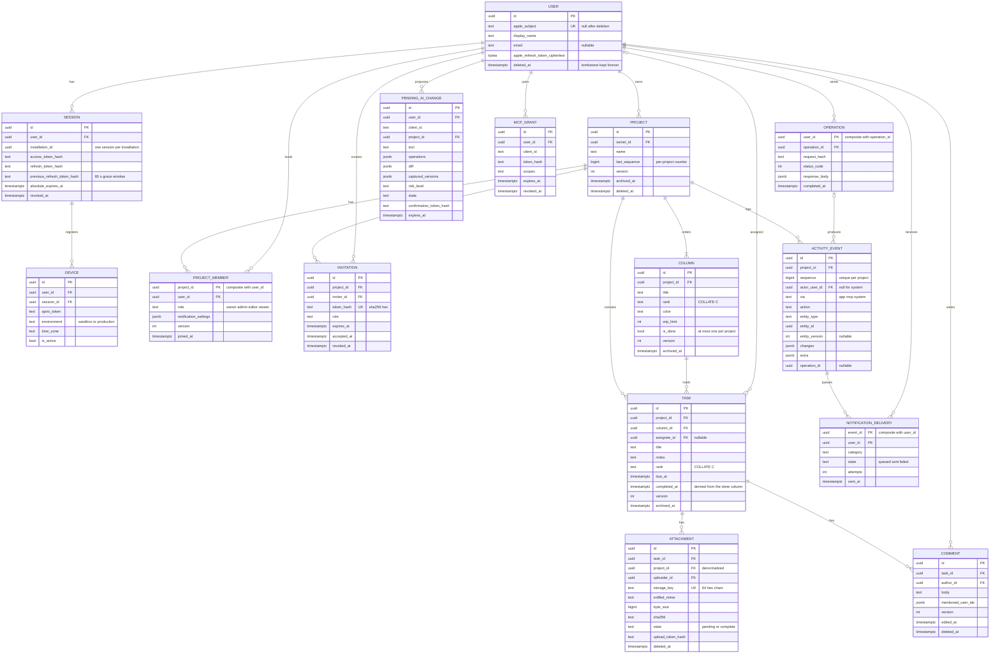

The diagram shows keys and the fields that carry a rule; 3.1 is the complete field list. `worker_cursors` and `mcp_audit_log` are omitted from the picture because they reference nothing that a client sees.

### 3.3 Versioning fields

Every mutable record carries `version` (starts at 1, +1 per committed change of that record), `updated_at` and `updated_by`, where `updated_by` is always the actor of the committed write (D05). Every version increment is recorded by exactly one activity event carrying that `entity_version`; a mutation without an event, or an event with incomplete `changes` keys, is a test failure, because field-level merge (5.1) is computed from these events (D05, D17). Clients send `expectedVersion` on every PATCH, `expectedTaskVersion` on `/move`, `expectedProjectVersion` on `/columns/reorder` and the project's `expectedVersion` on `/transfer-ownership`, always beside an `operationId` (D03, D05, D06, D18). Rank renormalization rewrites `rank` without bumping any version and records a `column.ranks_normalized` event whose `entity_version` is null (D06, D17). Users, sessions, invitations, attachments, devices and events carry no `version`: their changes are state transitions (accepted, revoked, complete, inactive), not concurrent field edits.

### 3.4 Rank representation

`tasks.rank` and `columns.rank` are `TEXT NOT NULL COLLATE "C"` holding fractional-indexing keys over the 62-symbol alphabet `0-9A-Za-z`, generated by `RankKey.generateKeyBetween(a, b)` and `RankKey.generateNKeysBetween(a, b, n)` in SharedDTOs and unit-tested on Linux and iOS (D06). Keys never end in the smallest symbol, so a key between any two neighbors always exists, and repeated insertion at one spot grows the key by about one character per insertion. A partial unique index on `tasks (column_id, rank) WHERE archived_at IS NULL` guards active tasks. Every sort is byte-wise (`COLLATE "C"` on the server; `.lexical` or UTF-8 comparison on the client, never locale-aware) with `id` as the tiebreaker, and the Phase 2 tests include keys such as `a9` and `a10` on both platforms. Because the client runs the same generator, an optimistic placement produces the key the server will accept. Renormalization is specified in 5.4. Column order uses the same keys: `POST /v1/projects/{id}/columns/reorder` reassigns all column ranks with `generateNKeysBetween` and writes one `column.reordered` event with `extra.orderedColumnIds` (D06). Verify that `COLLATE "C"` is byte-wise on the pinned PostgreSQL major at Phase 2.

### 3.5 Sequence allocation

`projects.last_sequence` is the only counter. Every project-scoped mutation runs in one transaction that first executes `SELECT ... FOR UPDATE` on the project row, performs the domain writes, and then runs `UPDATE projects SET last_sequence = last_sequence + 1 WHERE id = $1 RETURNING last_sequence` once per event; because the lock is held until commit, sequence order equals commit order and a rollback leaves no gap (D17). The result is a gap-free, strictly increasing per-project `bigint` with a unique `(project_id, sequence)` constraint. PostgreSQL sequences are not used (they are non-transactional and leave gaps) and there is no global counter. Consumers depend on gap-freeness: the client applies a live event only when `sequence == lastSequence + 1`, catch-up is `GET /v1/projects/{id}/events?after=`, and worker jobs find work by comparing `projects.last_sequence` with their `worker_cursors` row (D13, D17). The same lock serializes every write to a project, which is the deliberate single serialization point for moves (D06).

### 3.6 Soft deletion and retention

| Record | Marker | Effect while marked | Reversal | Purge |
|---|---|---|---|---|
| User | `deleted_at` plus anonymized fields | Non-member everywhere; comments, attachments, tasks and events stay attributed to "Deleted member" | None; a later sign-in with the same Apple subject creates a new user | Never, the row is a tombstone (D09) |
| Project | `deleted_at` | Hidden for everyone at once; pending invitations auto-revoked; subscriptions dropped | Owner restore within 30 days via `POST /v1/projects/{id}/restore`; not restorable when deleted by account deletion | Worker hard-deletes rows and attachment files after 30 days (D03) |
| Project | `archived_at` | Read-only; every mutation returns 409 `project_archived` except unarchive, leave, member removal and notification settings | Unarchive by owner or admin | None (D03) |
| Column | `archived_at` | Off the board; never deleted, so archived tasks keep a column | `POST /v1/columns/{id}/restore` unless 4 are active | None (D19) |
| Task | `archived_at` via `DELETE /v1/tasks/{id}` | Off the board; searchable under Archived | `POST /v1/tasks/{id}/restore` to the bottom of its column, or of the first column if its column is archived | Only `DELETE /v1/tasks/{id}?permanent=true` by owner or admin on an archived task, writing `task.deleted` and removing comments and attachment rows with files deleted through the worker path; no automatic purge (D19) |
| Comment | `deleted_at` | Body hidden; event preview fragments remain and are disclosed in the privacy inventory | None | None (D17) |
| Attachment | `deleted_at` | Download 404; `attachment.deleted` event | None | Worker unlinks the file 24 h later; `pending` rows older than 48 h and their `.part` files hourly; orphan files quarantined weekly and deleted after 7 more days (D14) |
| Invitation | `revoked_at`, `declined_at` or `accepted_at` | 410 `invitation_unavailable` with `details.reason` | None; create a new invitation | None (D04) |
| Session | `revoked_at` and `revoke_reason` | 401 `session_revoked`; sockets closed with 4401; upload tokens and device rows invalidated | None; sign in again | Expired and revoked rows older than 30 days, daily (D16) |
| Device | `is_active = false` | No pushes | A later `PUT /v1/devices/{installationId}` replaces the row | Deleted with its session (D07) |
| Operation | none | Replay source | none | 30 days, daily (D18) |
| PendingAIChange | `state` | Cancelled, expired and failed proposals are inert | Re-propose | Not fixed by the register; audit rows are kept 1 year (D15) |
| ActivityEvent | none | Kept forever | none | Only with the project at purge (D17) |

### 3.7 Idempotency records

Every mutating `POST` and `PATCH` carries `operationId` (UUID v4) in the body as part of the typed DTO; `DELETE` carries no body and is a strict state no-op when the target is already in the requested state (same status, no new event); `PUT` requests (attachment content, device registration, notification settings) are full replacements and idempotent by state; auth endpoints carry no `operationId`; the `Idempotency-Key` header is not used (D18). The `operations` row is keyed by `(user_id, operation_id)`, so the same UUID from another user is a different operation, and stores `request_hash` = SHA-256 of method, path and the canonical JSON body (sorted keys, explicit nulls preserved, no floats in any DTO), `status_code`, `response_body`, `created_at` and `completed_at`.

Inside the mutation transaction, after the project lock, the service runs `INSERT ... ON CONFLICT DO NOTHING RETURNING` on the operation row first; a concurrent duplicate blocks on the primary key until the first transaction finishes, so no in-progress state is needed. If the row was inserted, the mutation runs inside a `SAVEPOINT`: on success the row is completed with the status and body and the transaction commits; on a storable failure (409 or 422, except `idempotency_mismatch`) the savepoint is rolled back, the failure is stored and the transaction still commits; on any other failure (401, 403, 404, 429, 5xx, transport) everything rolls back and the retry is a fresh evaluation. If the row already existed, the same `request_hash` replays the stored status and body verbatim with `Idempotency-Replayed: true`, re-emitting no events and no pushes; a different hash returns 422 `idempotency_mismatch`. A replayed 409 stays a 409: after resolving a conflict the client mints a new `operationId` with the corrected input. Events written by an operation carry `operation_id` so a client recognises its own echoes during catch-up. Rows are purged after 30 days, matching the outbox age-out (D08). MCP confirmations execute the per-operation ids generated at proposal time, so a double confirm cannot double-apply (D15). Whether Fluent plus SQLKit can express the savepoint pattern is verified at Phase 2.

## 4. Sequence diagrams

Participants are abbreviated: App is the iOS app, API the Vapor process, Svc the application service layer, DB PostgreSQL, Hub the realtime hub. Error codes are the D22 codes.

### 4a. Sign in with Apple and session issuance

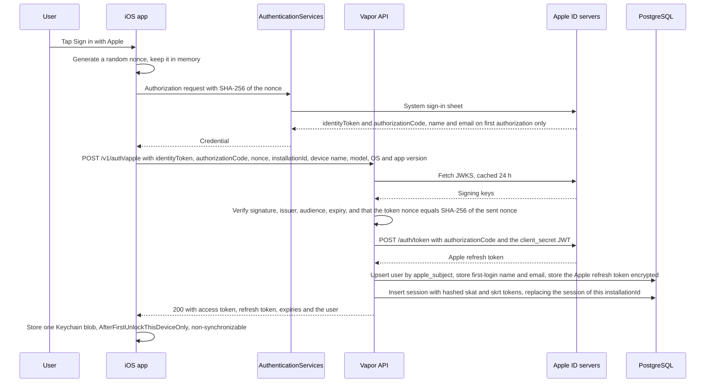

The server verifies the identity token with JWTKit against the cached JWKS, then exchanges the short-lived authorization code with Apple and keeps only the resulting Apple refresh token, encrypted, for later revocation (D09, D11). Name and email are stored now or never (D09). One session exists per installation, so a sign-in on the same installation replaces the previous session (D16). `/v1/auth/apple` is limited to 10 requests per minute per IP and 5 per user, failed verifications log reason codes only, App Attest is not used, and automated tests run against an `AppleIdentityProvider` fake, never live Apple endpoints (D16). The exact `client_secret` JWT format is verified at Phase 3.

### 4b. Token refresh with rotation and reuse detection

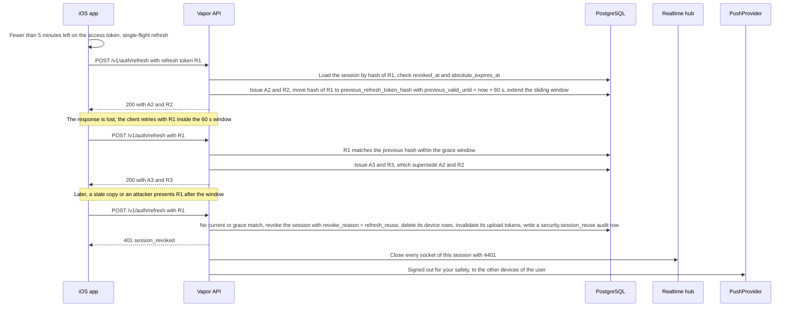

Access tokens live 60 minutes; refresh tokens rotate on every use with a 90-day sliding and 365-day absolute lifetime (D16). The 60-second grace window makes a retry after a lost response harmless, while any other presentation of a non-current token revokes the whole session, closes its sockets (D13) and warns the user's other devices. The client single-flights refreshes, retries once on 401 `token_expired`, and on `session_revoked` shows the sign-in screen while keeping the outbox (D08). `/v1/auth/refresh` is limited to 30 per minute per session. The security push has no project event behind it, so it cannot ride the worker's event-keyed outbox; the diagram shows the api handing it to `PushProvider` directly, and Phase 3 confirms that placement.

### 4c. Task move with optimistic UI, the move contract, commit, event sequence and the 409 path

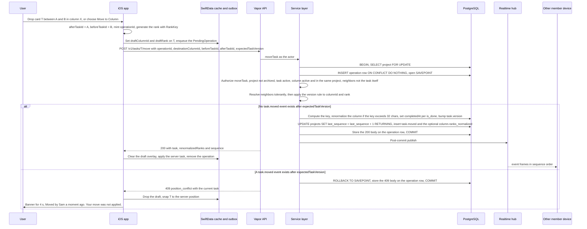

Every drop and every menu move computes `(destinationColumnId, afterTaskId, beforeTaskId)` from the cached column order and calls one `MoveCoordinator.move` (D01). `afterTaskId` names the card that will precede the moved card and `beforeTaskId` the card that will follow; both null means append to the bottom (D06). The server tolerates neighbors that are no longer adjacent (place after `afterTaskId`), uses the surviving neighbor when one is gone, and answers 409 `neighbors_changed` with `details.currentOrder` when both are gone, which the client retries once with new neighbors and a new `operationId` (D06). A stale `expectedTaskVersion` is tolerated unless a `task.moved` event exists after it; then the move is a `position_conflict` and the card snaps back with the plain-language banner and an accessibility announcement, never a dialog (D01, D05, D08). The stored 409 is replayed verbatim if the request is retried with the same `operationId` (D18). WIP limits never reject a move; the event records `wipExceeded` (D19).

### 4d. Realtime fan-out over WebSocket, disconnect, and catch-up

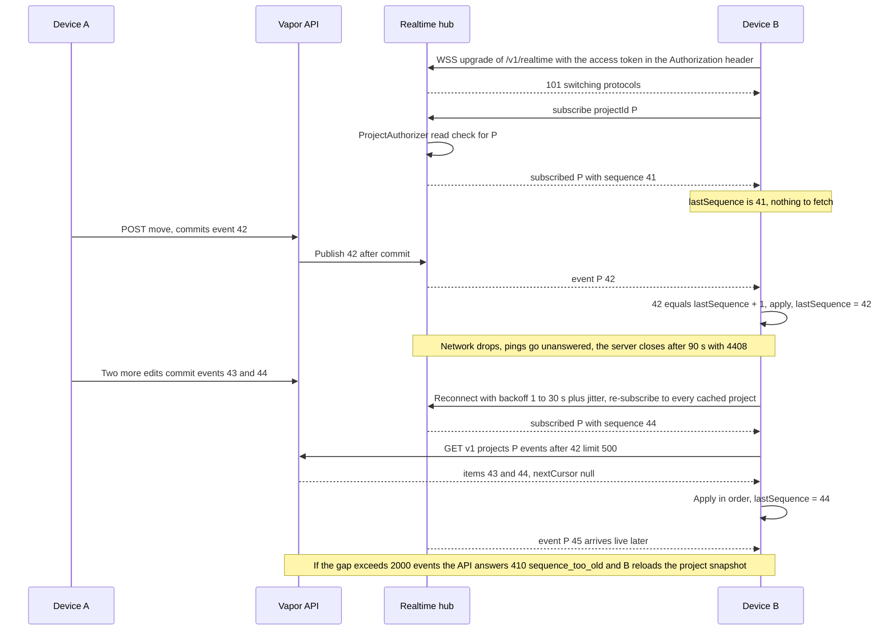

The upgrade is authenticated by the bearer header and rejected with HTTP 401 before the upgrade when invalid; a subscribe to a project the user is not a member of answers `not_found` (D13). Events are published only by the post-commit hook, never by the worker, and catch-up is REST-only: after `subscribed`, or whenever a live event is not `lastSequence + 1`, the client pages `GET /v1/projects/{id}/events?after=` until caught up; a gap above 2,000 events, or a `SyncState` older than 24 h, triggers a full snapshot reload (D08, D13). Duplicate delivery is harmless because application is by sequence. Sockets outlive access tokens; every revocation path closes them explicitly with 4401, and the hub re-validates sessions every 60 s (D13, D16). While disconnected in the foreground the client polls events every 60 s and shows "Reconnecting" after 5 s; it closes the socket 5 s after backgrounding (D13).

### 4e. Offline queue replay with idempotency keys

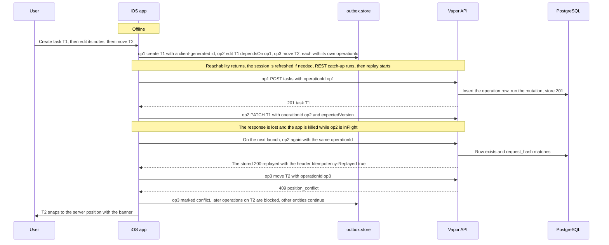

The outbox replays in strict global FIFO by `createdAt`, one operation in flight, only after the session is valid and reachability has returned, and after REST catch-up (D08). Client-generated ids for tasks, comments, columns and projects mean a create-then-edit chain replays without temporary-id mapping (a collision is 409 `duplicate_id`), and `dependsOn` makes a rejected create fail its dependents visibly (D08, D22). A 409 marks the operation `conflict`, removes it from the head and blocks later operations on the same entity while the rest of the board keeps flowing; 400, 403, 404, 410 and 422 mark it `failed` with a user-visible reason; 5xx, network errors and 429 retry the head with backoff (D08). An operation left `inFlight` by a kill is retried with the same `operationId`, which is exactly the D18 replay case. Operations older than 30 days fail as "too old to apply", matching the idempotency TTL. Membership changes, invitations, project creation and attachment uploads are never queued (D08).

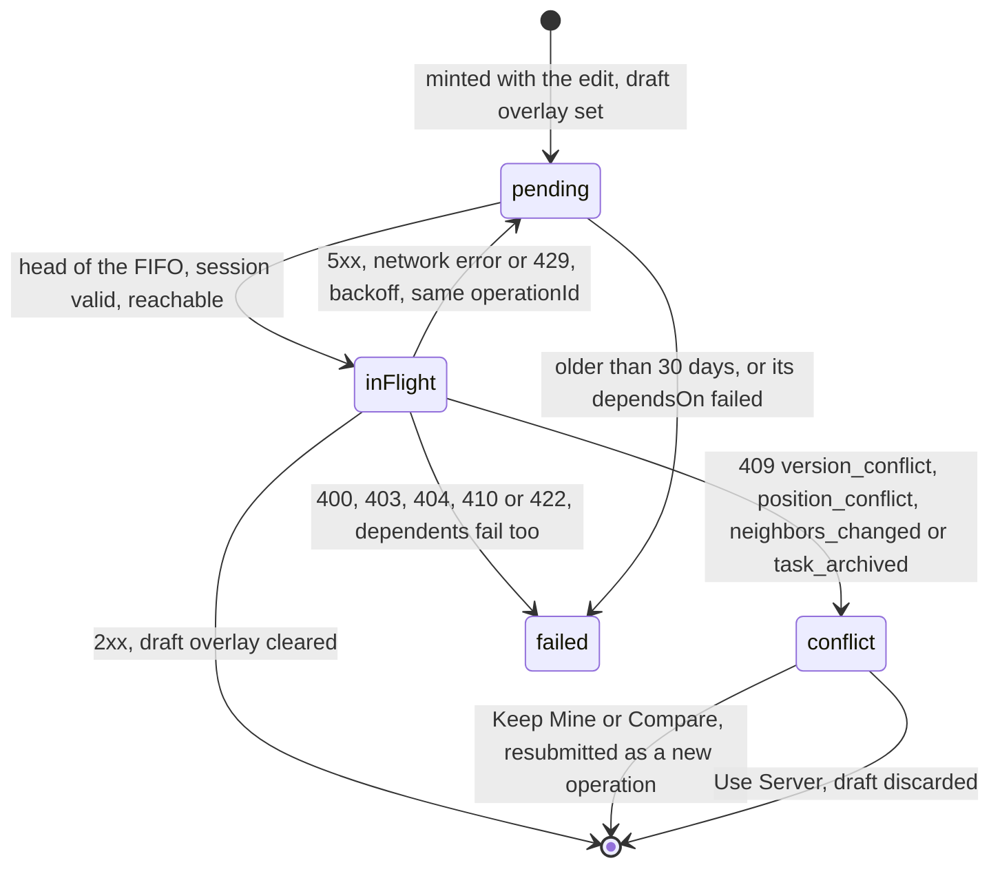

### 4f. Invitation create, share, preview, accept

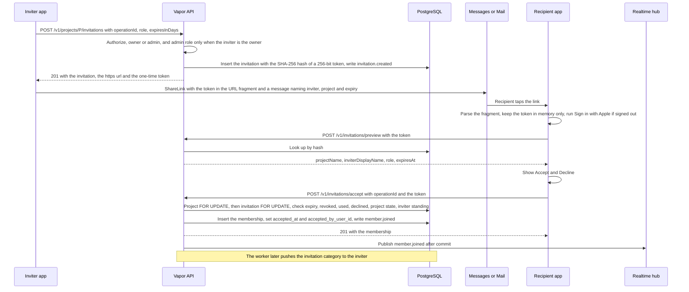

The token is 32 CSPRNG bytes as base64url, stored only as its SHA-256, single use, and travels in the fragment of `https://<host>/invite#<token>` so no proxy, tunnel or server log ever sees it; the `/invite` page is content-free and hands the token to the app through the custom scheme or a "Copy code" button, and a "Join with code" field accepts the bare token (D04). Preview, accept and decline require a signed-in user and are limited to 10 per minute per user and 30 per IP; creation is 5 per project per hour (D04, D22). The accept transaction returns 404 for an unknown token, 410 `invitation_unavailable` with a reason for expired, revoked, used, declined, archived-project and inviter-unavailable cases, and 200 `{alreadyMember: true}` for an existing member while still consuming the token (D04). The inviter is notified on accept and decline; nothing is pushed on creation because a link has no known recipient (D07).

### 4g. Attachment upload initiate, background upload, completion and authorized download

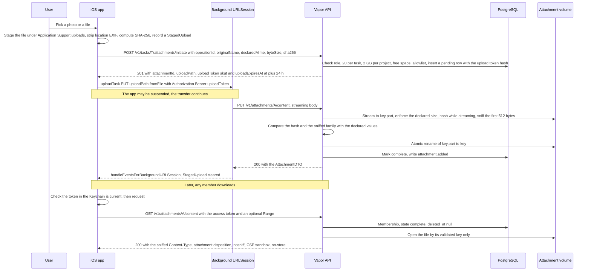

The PUT is the completion step; there is no separate `/complete` endpoint (D14). The upload token is a single-purpose secret bound to the attachment, size, hash, user and issuing session, valid 24 hours, hashed at rest and invalidated when that session is revoked, so a background transfer can finish long after the access token expired without making access tokens long-lived (D14, D16). The server rejects oversized bodies with 413, sniff mismatches with 415, hash mismatches with 409 `version_conflict` on a re-PUT, more than 10 pending uploads per user with 429, and a volume under 10 % or 10 GB free with 507 (D14). A re-PUT on a complete row with a matching hash returns 200 and emits nothing. Downloads require membership and a complete, undeleted row, never derive a path from user input, and carry the headers that keep polyglot files inert (D14). Thumbnails are generated on the client only.

### 4h. MCP propose, confirm, cancel and audit

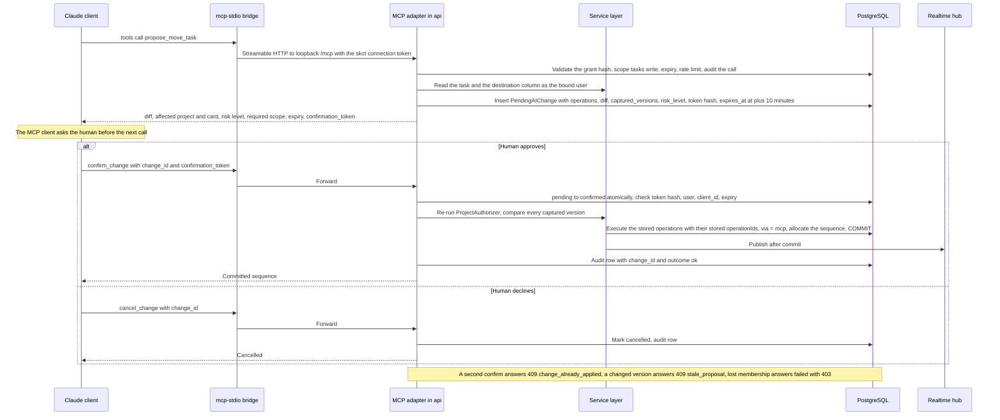

Read tools execute immediately under the bound user's permissions; every mutation tool only writes a `PendingAIChange` and returns the exact diff, so the human sees what will happen before anything is applied (D15). Confirmation is single use, bound to the user, client, change and expiry, re-authorizes at confirmation time, and refuses to apply a diff whose captured versions moved, so the diff shown is exactly what gets applied; execution reuses the per-operation ids from the proposal, so a double confirm cannot double-apply (D15, D18). Confirmed changes appear in the feed as "<Name> via Claude" with `via = mcp`; pending proposals are never project events. Every call, including denials, is audited with redacted arguments and is readable in Settings → Claude activity (D15). Scopes default to `projects:read` and `tasks:read`; writes need an explicit grant and `members:manage` is a separate opt-in. In release 1 the human veto rests on the MCP client's per-call approval, because the model holds the confirmation token; an in-app approval mode is a release-2 candidate (D15).

### 4i. Account deletion with Apple token revocation and ownership handling

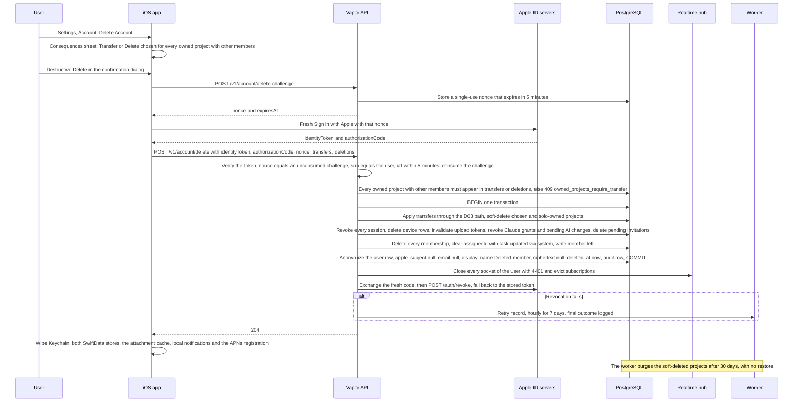

Deletion requires a fresh Apple sign-in bound to a server-issued single-use challenge, so a stolen access token cannot delete the account; the brief's `DELETE /v1/account` is realized as `POST /v1/account/delete` because DELETE requests carry no body (D09, D18). Every owned project is decided in the one request: transfers run through the same ownership-transfer path as the UI, projects without other members are deleted permanently, and projects soft-deleted this way have no owner left and cannot be restored (D03, D09). The user row is anonymized in place and kept forever, so the other household member keeps their board history under "Deleted member"; MCP audit rows are kept 1 year (D09, D15). Apple revocation is best effort with worker retries, and the server-to-server endpoint `POST /v1/auth/apple/notifications` handles `consent-revoked` and `account-delete` events once a public hostname exists (D09, D10). Whether the revoke call runs before or after the 204 is an implementation choice fixed at Phase 3; it never blocks deletion.

### 4j. Member removal while the member has an open socket

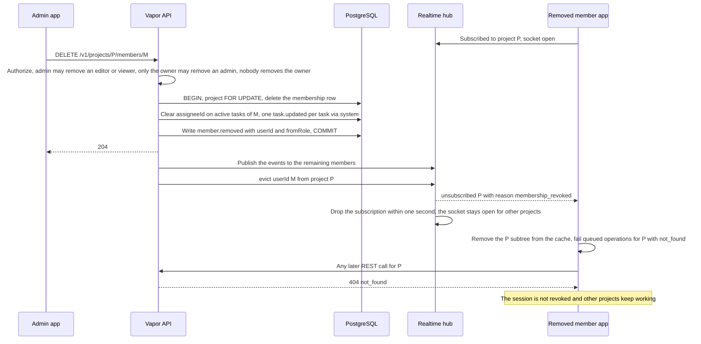

Removal deletes the membership row and leaves events, comments and attachments attributed; the removed user's assignments on active tasks are cleared with system events (D03). From the next request every REST call for that project answers 404 `not_found` (existence never leaks), the hub sends `unsubscribed` with `membership_revoked` and drops the subscription within one second, and the client removes the project subtree and fails its queued operations for that project (D03, D08, D12, D13). The session is deliberately not revoked. The worker also sends the removed user a `membership` push, which bypasses project mute, and tells owners and admins (D07). A repeat `DELETE` is a strict no-op (D18). The same eviction path serves self role changes, project archive and project deletion (D13).

## 5. Concurrency and consistency model

### 5.1 Optimistic concurrency rules

1. The server is the authority; the client applies changes optimistically through the draft overlay and reconciles with the response or the event stream (D08, D12).
2. Every project-scoped mutation is one transaction that first takes `SELECT ... FOR UPDATE` on the project row, inserts the operation row, performs the domain writes, allocates the sequence once per event, writes the events, stores the operation outcome and commits; publication happens only after commit (D06, D17, D18). One lock per transaction makes deadlocks impossible; the only transaction that touches several projects is account deletion (5.3).
3. PATCH on a task, column, project, comment or member requires `operationId` and `expectedVersion` (400 `invalid_request` if either is missing) and uses `Patch<T>`: an absent field is unchanged, an explicit `null` clears (D05, D22). The fields present in the body are the "fields in this patch".
4. If `expectedVersion == current.version`: apply, bump, write one event. If `expectedVersion < current.version`: load the events for this entity with `entity_version > expectedVersion` and union their `changes` keys; if the union is disjoint from the patched fields, merge and answer 200 with `X-Merged-From-Version`; if an intersecting field carries the same value the server already has, drop it and still merge (and if nothing is left, answer 200 with the current record, no bump, no event); otherwise answer 409 `version_conflict` with `conflictingFields` and the full current DTO. If the events for the window are missing for any reason, every field is treated as changed (fail closed). If `expectedVersion > current.version`: 400 `invalid_request` with `details.reason = "expectedVersionAhead"` and the client reloads the snapshot (D05).
5. Mergeable fields: task `title`, `notes`, `dueAt`, `assigneeId`; column `title`, `color`, `wipLimit`, `isDone`; project `name`; comment `body`; member `role`. `completedAt`, `columnId`, `rank` and `archivedAt` are never patched: position goes through `/move`, completion is derived from the done column, archive and restore have their own endpoints, and column order goes through `/columns/reorder` with `expectedProjectVersion` (D05, D06, D19).
6. Validation runs on every write, merged or not: `assigneeId` must be a current member (422 `validation_failed`); an archived task answers 409 `task_archived` with the current DTO; an archived project answers 409 `project_archived`; an unknown or permanently deleted entity answers 404 (D05).
7. A retry with the same `operationId` replays the stored outcome, including a stored 409; a resolved conflict is always a new `operationId` with the new `expectedVersion` (D05, D18).

### 5.2 What merges and what returns 409

| Situation | Outcome |
|---|---|
| `expectedVersion` equals current | Applied; version bumped; one event |
| Stale version, patched fields disjoint from the fields changed since | Merged; 200 with `X-Merged-From-Version` |
| Stale version, overlapping field with the same value | Field dropped, rest merged; 200 with the current record and no event if nothing remains |
| Stale version, overlapping field with a different value | 409 `version_conflict` with `conflictingFields` and `current` |
| Events for the window missing | Fail closed: 409 `version_conflict` |
| `expectedVersion` ahead of current | 400 `invalid_request`, reason `expectedVersionAhead`; client resyncs |
| Move with a stale `expectedTaskVersion` and no later `task.moved` | Applied |
| Move with a later `task.moved` | 409 `position_conflict` with the current task |
| Move whose neighbors are no longer adjacent, or one neighbor gone | Applied using `afterTaskId` first, else the surviving neighbor |
| Move with both neighbors gone | 409 `neighbors_changed` with `details.currentOrder`; client retries once with new neighbors |
| Any write to an archived task | 409 `task_archived`; client offers Restore |
| Any write to an archived project except unarchive, leave, removal, notification settings | 409 `project_archived` |
| Concurrent edits of one comment body | Always 409 (single field) |
| Concurrent role changes of one member | 409 `version_conflict` on the member row version |
| Create with a client id that already exists | 409 `duplicate_id` |
| Owner tries to leave with other members present | 409 `owner_must_transfer` |
| Attachment re-PUT with a different hash | 409 `version_conflict` |
| MCP confirm after a captured version moved, or twice | 409 `stale_proposal`, 409 `change_already_applied` |
| Retry with the same `operationId` and body | The stored status replayed verbatim, even a 409 |
| Retry with the same `operationId` and a different body | 422 `idempotency_mismatch` |

### 5.3 Transactions for moves and membership changes

A move (D06): under the project lock, authorize `moveTask` and refuse an archived project; require an active task (409 `task_archived`) and an active destination column of the task's own project (404 otherwise; a column id from another project is never acknowledged); refuse the task as its own neighbor (422); resolve neighbors tolerantly (any neighbor from another project is 404); apply the version rule to `{columnId, rank}`; compute the key, renormalize if needed, set `completedAt` when entering the `is_done` column and clear it when leaving, bump `task.version`; write `task.moved` with `changes {columnId, rank, completedAt?}` and `extra {fromColumnId, toColumnId, wipExceeded, completionChange}`, then the optional `column.ranks_normalized`, then the operation record; respond `{task, renormalizedRanks, sequence}`. Column archive with tasks requires `moveTasksTo` and appends the moved tasks to the target's bottom with `task.moved` events; column reorder reassigns every rank under `expectedProjectVersion`; a restored task returns to the bottom of its column or of the first column (D06, D19).

Membership changes (D03, D04, D09): invitation acceptance takes the project lock, then `SELECT ... FOR UPDATE` on the invitation row, re-checks expiry, revocation, prior use, project state and the inviter's current standing, inserts the membership and writes `member.joined`. A role change carries the member row's `expectedVersion`, writes `member.role_changed`, and the hub evicts the affected user's subscription so the client re-subscribes and drops edit affordances (D03, D13). Removal deletes the membership row, clears `assigneeId` on that project's active tasks with one `task.updated` per task (`via = system`), writes `member.removed`, and after commit publishes and evicts; sessions are not revoked and the next request answers 404. Ownership transfer makes the target owner and the previous owner admin, increments `project.version` and records `project.ownership_transferred` in one transaction; it has no MCP tool and needs a confirming alert. An owner leaving with other members present receives 409 `owner_must_transfer`; a solo owner's Leave is project deletion. Account deletion is the one transaction that spans several projects: it runs the transfer path for each transferred project, soft-deletes the rest, deletes memberships with the same assignee-clearing events, revokes sessions and grants, and anonymizes the user. Because it takes several project locks, it acquires them in ascending project id order so two concurrent deletions cannot deadlock; verify the ordering at Phase 3.

### 5.4 Rank renormalization

Trigger: the generated key is longer than 32 characters. Scope: the destination column only, inside the same transaction. Every active task in the column, in current order with the moving task at its new place, receives keys from `generateNKeysBetween(nil, nil, n)`. Because the partial unique index cannot be deferred, the update is two-pass: pass one prefixes every rank in the column with `-` (outside the alphabet, so no final key collides), pass two assigns the final keys. Renormalization rewrites `rank` only, bumps no versions, and writes one `column.ranks_normalized` event with `extra.ranks = [{taskId, rank}]` after the `task.moved` event, which other clients apply in sequence order without version gating (D06, D08). The Phase 2 suite inserts 1,000 times into one gap to exercise it, and whether the two passes are expressible through Fluent plus SQLKit is verified then.

### 5.5 Event ordering guarantees

- Per project, events form a total order equal to commit order, gap-free from 1; `(project_id, sequence)` is unique (D17).
- A client learns the sequence of its own mutation from the move response or the `X-Project-Sequence` header, and events carry `operation_id`, so an echo is recognisable (D18, D22).
- A mutation that writes two events (`task.moved` then `column.ranks_normalized`) writes them in that order with consecutive sequences; bulk effects such as assignee clearing on removal are contiguous within one transaction (D06, D17).
- Nothing uncommitted is ever broadcast; delivery to a connected client is at-least-once across socket plus REST catch-up, and application is idempotent by sequence (D13).
- Catch-up by `after=` returns events in sequence order, up to 500 per page; `before=` pages the feed backwards (D22).
- Worker consumption is exact: per-project cursors advance over a gap-free counter (D17).
- Eviction after removal, role change, archive or deletion reaches the socket within one second, and every revocation closes sockets explicitly; the hub re-validates sessions every 60 s as a backstop (D13).

### 5.6 Explicitly not guaranteed

- No ordering across projects; no global sequence (D17).
- No exactly-once socket delivery; duplicates and gaps are expected and handled by sequence (D13).
- No read-your-writes across devices before the event or snapshot arrives; a `GET` outside the lock may trail the latest sequence by the time it is read.
- No automatic text merge; same-field conflicts are surfaced, not resolved; comment edits always conflict (D05, D08).
- No conflict dialog for moves; a rejected move snaps back (D01, D08).
- No cross-device consistency of unsent drafts; no replay of operations older than 30 days (D08).
- No correctness with more than one api instance or with worker-published events; the hub is in-memory and LISTEN/NOTIFY is deliberately not built (D11, D13).
- No point-in-time consistency between the database dump and the attachment snapshot; the restore drill tolerates files without rows (D21).
- No stability of a replayed response's `sequence`; a replayed body may carry a sequence that is now stale (D18).
- No WIP enforcement; limits warn only (D19).
- No due reminder on a device that has not synced the task; no server-sent due reminders (D07).
- No server-side defense against prompt injection in task content read by Claude; the confirmation step and the audit log are the mitigation (D15).

## 6. Runtime topology on the Mac mini

### 6.1 Processes, bindings and volumes

| Process | Runs as | Network binding | Storage |
|---|---|---|---|
| `api` (`Run serve`) | Compose service, non-root, read-only root filesystem, health check, restart policy, graceful shutdown | `127.0.0.1:8080` only; the `dev` profile publishes on the LAN interface instead; `/mcp` is loopback-only until Phase 9b | `/data/attachments` bind mount (rw), `/tmp` |
| `worker` (`Run worker`) | Compose service, same image and hardening | None published | `/data/attachments` (rw) for cleanup |
| `postgres` (`postgres:17-alpine`) | Compose service | Internal Compose network only; `127.0.0.1:5432` under the `dev` profile only | Named volume for the cluster |
| `migrate` (`Run migrate`) | One-shot Compose service run explicitly with `docker compose run --rm migrate`, never in `depends_on` | None | None |
| Tailscale (`tailscaled`, `tailscale serve`, optional `funnel`) | macOS host app | 443 on the tailnet hostname, forwarded to `127.0.0.1:8080`; Funnel path-scoped when enabled | None |
| `cloudflared` | Compose service only in the Cloudflare alternative | Outbound-only tunnel to `api` | None |
| Backup (`backup.sh`, restic, `health.sh`, `export-secrets.sh`) | Host launchd jobs, not containers | `pg_dump` through `docker compose exec`; probes `/ready` | `/Users/kanban/SharedKanban/data/backups`, `/Volumes/KanbanBackup/restic`, the iCloud Drive repository |
| `Run mcp-stdio` | Host process launched by Claude Desktop or Claude Code | Client of `127.0.0.1:8080/mcp` | None, holds no credentials beyond the connection token in its environment |
| `Run mcp-token`, `Run admin` | Host or `docker compose run`, operator-invoked | None | None |

The register places Tailscale, the backup jobs and the stdio bridge on the macOS host rather than in Compose, so that backups reach the SSD and iCloud Drive natively, nothing TLS-terminating runs twice, and the AI-launched process holds no credentials (D11, D15, D21). Writable host data is `/Users/kanban/SharedKanban/data/{attachments,backups}`, which stays under `/Users` so Docker Desktop shares it by default (D11). Docker Desktop (OrbStack is the lighter documented alternative) runs under the dedicated auto-login service user `kanban`; the api and worker containers get a best-effort egress allowlist of the Apple hosts only (D10, D11).

### 6.2 Environment and secrets

Configuration comes exclusively from environment variables loaded from `/Users/kanban/SharedKanban/secrets/.env`, outside the repository; `.env.example` is committed with placeholder values and the exact variable names are fixed there at Phase 1 (D11). The register names `DATABASE_URL` for tests and `APPLE_TOKEN_KEY`, 32 bytes, for encrypting Apple refresh tokens (D09, D20). The secrets directory also holds the Sign in with Apple `.p8` key, the APNs `.p8` key, the App Store Connect API key used by the Cowork session for TestFlight uploads, and `restic-password` (0600); it is never inside a restic repository, and `export-secrets.sh` writes it as an encrypted disk image to the SSD whose passphrase lives in the owner's password manager (D20, D21). The Claude connection token sits in the Claude client's configuration on the Mac mini, readable by that macOS user, which the threat model accepts for the trusted host (D15). On the client side the base URL and environment name come from a git-ignored `Config/Environment.xcconfig` with a committed example plus a Debug-only in-app picker, so the production hostname never enters source control (D10). Nothing secret is ever written to `CLAUDE.md`.

### 6.3 The launchd escape hatch

If Docker Desktop proves unstable or too heavy on the Mac mini, `deploy/launchd/build.sh` builds the arm64 release binary with `swift build -c release` and `deploy/launchd/` plists run `Run serve` and `Run worker` as LaunchDaemons against Homebrew `postgresql@17` with identical environment variables; this path needs no GUI login and is exercised once in Phase 10 so it is known to work before it is needed (D11). Because the worker, the migrations and the MCP endpoint are subcommands of one binary and PostgreSQL is the only queue, the escape hatch changes nothing in the application.

### 6.4 Ingress profiles in order

| Profile | When | What it requires | What it changes |
|---|---|---|---|
| 1. LAN development | Phases 1 to 9 on the home network | Debug builds only; `http://<mac-mini>.local:8080`; `NSAllowsLocalNetworking = true` and `NSLocalNetworkUsageDescription` in the Debug Info.plist; the Compose `dev` profile publishing the api on the LAN interface | Release builds carry no ATS exception; nothing else |
| 2. Tailscale household beta, the release-1 production profile | From Phase 10 onward, by default | Tailscale on the Mac mini and on both devices with on-demand VPN; HTTPS certificates enabled once in the admin console; key expiry disabled for the Mac mini node; `tailscale serve` terminating TLS with a Let's Encrypt certificate for `<mini>.<tailnet>.ts.net` and proxying to `127.0.0.1:8080`; a macOS Tailscale build whose CLI supports `serve`, `cert` and `funnel` (verify at Phase 10) | Nothing listens on the public internet; no domain, certificate work or ATS exception; invitations use the https link, the content-free `/invite` page and the code field; the Associated Domains developer-mode experiment at Phase 7 may let universal links work on the household devices; first-run UX says the VPN must be on |
| 3. Public HTTPS, only when a concrete need appears | Remote MCP from claude.ai or a phone, universal links, a device that cannot run Tailscale | Default: Tailscale Funnel on the same hostname, one admin-console toggle, path-scoped to `/v1/*`, `/invite`, `/.well-known/*`, `/health` and, after Phase 9b, `/mcp`. Alternative: Cloudflare Tunnel with an owned domain and `cloudflared` in Compose, accepting that Cloudflare decrypts at its edge and trusting forwarded client-IP headers only for requests arriving from the tunnel | Enables the AASA fetch by Apple's CDN, registration of `/v1/auth/apple/notifications` in the developer portal, and the Phase 9b OAuth server for `/mcp`; the Funnel endpoint is public internet in the threat model |

In every profile a tunnel is transport, not authorization: every REST request, WebSocket upgrade and MCP call carries a SharedKanban bearer token and passes project authorization; no IP- or tailnet-based allowlist is relied on; PostgreSQL has no published port; rate limits key by user first and by client IP only where the address reaches the origin; HSTS and `X-Content-Type-Options: nosniff` are on every response (D10, D22). Funnel WebSocket support, idle timeouts and bandwidth limits are verified at Phase 10, and the Phase 10 runbook holds the "switch to public" steps.

## 7. Build, test and delivery topology

### 7.1 Where work runs

| Work | Cloud Linux session | Mac mini Cowork session | GitHub Actions CI (ubuntu) |
|---|---|---|---|
| Writing code, docs, DTOs, migrations, deploy files | All of it | Fixes found while building | None |
| `swift build` and `swift test` for `shared/` and `server/` | Yes, when a Swift 6 toolchain is present; integration tests read `DATABASE_URL` and `XCTSkip` without a database | Yes, natively, also for the launchd binary | Yes, on every push, with a PostgreSQL service |
| Compiling and testing the iOS app | Never | `xcodebuild build` and `test` on simulators at the D02 widths (320 to 1366pt, Slide Over, Split View, Stage Manager); `xcrun simctl`; `xcodebuild -runFirstLaunch` and `-downloadPlatform iOS`; screenshots at Phases 4 and 6 | No macOS runners in release 1 |
| Real-device work | Never | `xcrun devicectl` cable installs; Sign in with Apple, APNs sandbox and background-upload checklists | None |
| Signing and distribution | Never | Automatic signing with the login keychain kept unlocked; App Store Connect API uploads to TestFlight; reports when the Apple ID session needs the human | None |
| Lint and format | SwiftLint and format where the toolchain exists | SwiftLint and format | Same script |
| Operations | Writes `deploy/` | `docker compose`, Tailscale and `tailscale serve`, restic, launchd, restore drills, log inspection | None |

One CI script runs in all three places with "requires macOS" markers, so the Mac mini is the macOS CI (D20). Swift Testing is used for new unit tests and XCTest for UI tests; warnings are errors for `server/` and SharedDTOs from Phase 1 and for the iOS target once Phase 4 stabilizes (D20). The owner's part is the one-time nine-item checklist in D20: Apple ID and Xcode sign-in, Developer Program enrollment, portal capabilities and the three keys, device Developer Mode and trust, the Tailscale account and console toggles, macOS admin prompts, the UPS and SSD, the password-manager entries, and the optional B2 account; enrollment can take days and gates Phases 3 and 8, so it starts during Phase 1.

### 7.2 The cloud container today

As observed on 2026-10-01, the cloud Linux container has no Swift toolchain (`swift` and `swiftc` are not installed) and no Docker daemon (the Docker CLI is present but `/var/run/docker.sock` does not exist). A PostgreSQL 16 client and server package are installed but no server is running, and 16 is not the pinned major. Consequently nothing in `server/` or `shared/` can be compiled or tested here until Phase 1 installs a Swift 6 toolchain in the container and starts a local PostgreSQL (apt or, if a daemon becomes available, Docker); if that proves impossible, those tests skip here and run on the Mac mini and in CI, exactly the fallback D20 and the register's Phase 1 assumptions allow. This session can still write every file, validate Mermaid and JSON fixtures, and run shell and Node tooling.

### 7.3 Versions

Fixed by the register: iOS and iPadOS 18.0 minimum, Swift 6 language mode with `-strict-concurrency=complete` (server fallback to Swift 5 mode with an ADR if the chosen Vapor is not clean), Vapor 4, Fluent 4 with `fluent-postgres-driver`, JWTKit 5, APNSwift, swift-log, swift-crypto, PostgreSQL 17 by image tag (D11, D20). Everything else, including the exact Xcode, Swift minor, Vapor minor and whether both household devices run iOS 18 or later, is "verify at Phase 1"; Phase 1 records the resolved versions in this section and in `Package.resolved` (D20).

| Component | Fixed now | Resolved at Phase 1 |
|---|---|---|
| iOS and iPadOS deployment target | 18.0 (raised to the previous major at Phase 4 only if both devices run the current major) | Device OS versions confirmed |
| Xcode | Latest shipping release, no betas | Exact version |
| Swift | 6.x, same minor on Linux and the Mac mini | Exact minor |
| Vapor and Fluent | 4.x latest (Vapor 5 evaluated once if stable) | Exact `Package.resolved` pins |
| PostgreSQL | 17 (`postgres:17-alpine`), one major for the life of release 1 | Confirmed or re-pinned once |
| Tailscale on macOS | Variant with `serve`, `cert`, `funnel` | Verified at Phase 10 |

## 8. Cross-reference table

| Register ID | Topic | Sections of this document | ADR |
|---|---|---|---|
| D01 | iPhone board and cross-column dragging | 1, 4c, 5.6 | none |
| D02 | iPad split view and compact windows | 1, 7.1 | none |
| D03 | Roles and permissions | 2.10, 2.11, 2.14, 3.1, 3.6, 4f, 4i, 4j, 5.3 | none |
| D04 | Invitation links | 2.8, 2.9, 3.1, 3.6, 4f, 5.3 | none |
| D05 | Optimistic concurrency | 3.3, 4c, 5.1, 5.2 | none |
| D06 | Card ranking and move contract | 2.1, 3.4, 3.5, 4c, 5.3, 5.4 | none |
| D07 | Local versus remote notifications | 2.6, 2.12, 2.18, 3.1, 4j | none |
| D08 | Offline cache and conflicts | 2.3, 2.4, 4c, 4d, 4e, 5.6 | none |
| D09 | Account deletion and token revocation | 2.2, 2.17, 3.1, 3.6, 4a, 4i, 5.3 | none |
| D10 | Local, Apple and ingress | 1, 2.8, 2.9, 6.1, 6.4 | none |
| D11 | Backend stack and runtime | 2.9, 2.12, 2.14, 6.1, 6.2, 6.3, 7.3 | ADR-0001 Vapor, Fluent and PostgreSQL (beside the register) |
| D12 | SwiftData as cache only | 2.3, 5.1 | ADR-0002 SwiftData as cache (beside the register) |
| D13 | WebSockets for realtime | 2.5, 2.11, 4b, 4d, 4j, 5.5, 5.6 | ADR-0003 WebSockets realtime (beside the register) |
| D14 | Local attachment storage | 2.7, 2.15, 3.1, 3.6, 4g | ADR-0004 Local attachment storage (beside the register) |
| D15 | MCP adapter semantics | 1, 2.13, 3.1, 4h, 5.6, 6.2 | ADR-0005 MCP proposal and confirmation (beside the register) |
| D16 | Session and token lifecycle | 2.2, 2.9, 3.1, 3.6, 4a, 4b | none |
| D17 | Activity log and sequence | 3.1, 3.3, 3.5, 5.5 | none |
| D18 | Idempotency | 3.7, 4c, 4e, 5.1, 5.2 | none |
| D19 | Workflow invariants and templates | 2.10, 2.14, 3.1, 3.6, 5.3 | none |
| D20 | Platform targets and where work runs | 1, 7.1, 7.2, 7.3 | none |
| D21 | Backup and restore | 2.16, 6.1, 6.2 | none |
| D22 | API conventions | 2.1, 2.4, 2.9, 3.1, 5.2, 5.5 | none |

The five ADRs named above live beside docs/decisions/decision-register.md and expand D11 to D15; this document does not restate their rationale.
