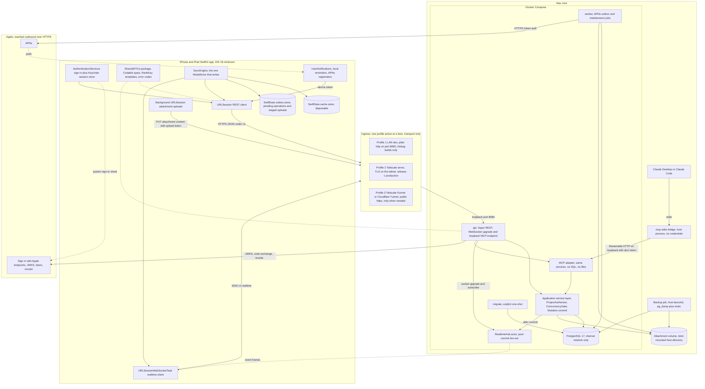

# SharedKanban architecture

This is the Phase 0 technical architecture for SharedKanban. It applies the decisions in docs/decisions/decision-register.md (D01 to D22), cites them inline, and never overrides them: where this document and the register disagree, the register wins and this document has a bug. Wire contracts and examples live in docs/api.md; threats and mitigations in docs/threat-model.md. It is written for two readers: the owner, who approves Phase 0 by reading it, and the future sessions (cloud Linux and Mac mini Cowork) that implement Phases 1 to 11 from it without guessing. There is no production code yet; the JSON, shell and Mermaid below are specification, not implementation.

## 1. Overview and constraints

SharedKanban is a native SwiftUI iPhone and iPad app (iOS and iPadOS 18.0 minimum, Swift 6 strict concurrency, D20) backed by one Swift 6, Vapor 4, Fluent 4 binary and a PostgreSQL 17 database that run on a household Mac mini under Docker Compose with a launchd escape hatch (D11). The server is authoritative: the app keeps a disposable SwiftData cache and a durable outbox of queued mutations (D08, D12); every mutation is idempotent through a body `operationId` (D18); optimistic concurrency with field-level merge replaces any CRDT (D05); card order is a fractional-indexing string rank moved through a neighbor-based contract (D06). Every project-scoped write is serialized on the project row and allocates a gap-free per-project sequence, and one `activity_events` table feeds realtime delivery, catch-up, the activity feed, notifications and conflict detection (D13, D17). Apple is used only for Sign in with Apple and APNs (D10). Devices reach the Mac mini through one of three ingress profiles in order: LAN for development, Tailscale for the household beta and release-1 production, and a public hostname (Tailscale Funnel or Cloudflare Tunnel) only when a concrete need appears; a tunnel is transport, never authorization (D10). Claude reaches the same application service layer through an MCP adapter that lives inside the api process, has no SQL and no filesystem access, and can only propose changes that a separate confirmation applies (D15). Hard product constraints: exactly three or four active columns per project (D19), a non-drag alternative for every drag (D01, D02), explicit confirmation for destructive and membership-changing AI actions (D15), and no secrets in the repository (D11, D21).

Reading the diagram: the app talks to exactly one origin over HTTPS and WSS, and whichever ingress profile is active forwards to the loopback-only `api` container, the only process that serves clients. `api` hosts the Vapor routes, the realtime hub and the MCP endpoint in one process, and all three call the same application service layer; `worker` shares the binary and the database but never serves clients and never publishes events (D11, D13). The two Apple dependencies are reached outbound from the Mac mini, plus the device-side system sign-in sheet and push delivery. Claude connects through a credential-free stdio bridge to the loopback MCP endpoint (D15).

## 2. Component responsibilities

Each component lists what it owns, what it must never do, and its interfaces. "Service layer" always means the application service layer in 2.10: the only code that reads or writes domain state, shared by REST and MCP (D15).

### 2.1 SharedDTOs package

- Owns: plain `Codable` value types for every request, response, event and WebSocket message; `Patch<T>`; `Page<T>`; `APIError` and the snake_case error-code enum; the activity action enum with `.unknown`; `ProjectTemplate` (`homeProjects`, `restaurantsToTry`, `custom`); `RankKey.generateKeyBetween` and `generateNKeysBetween`; `JSONCoding.encoder` and `decoder`; the `LenientEnum` helper (D06, D19, D20, D22). Declares iOS 18, macOS 15 and Linux.
- Must never: import SwiftData, Vapor or Fluent; contain a float in any DTO (the D18 request hash is canonical JSON); hold business logic beyond key generation and template definitions.
- Interfaces: compiled into the app, the server and both test suites; fixtures under `shared/Fixtures/` are decoded by contract tests on Linux and iOS so docs/api.md cannot drift (D22).

### 2.2 Sign-in and session store (AuthenticationServices and Keychain)

- Owns: the native Sign in with Apple request with a cryptographic nonce; the fresh re-authentication bound to a server challenge for account deletion (D09); one Keychain blob holding `installationId`, access token, refresh token and expiries with `kSecAttrAccessibleAfterFirstUnlockThisDeviceOnly`, non-synchronizable; single-flight proactive refresh when fewer than 5 minutes remain, one retry on 401 `token_expired`, forced sign-out handling (D16); the launch-time `getCredentialState` check (D09); the first-launch flag that wipes Keychain items left over from an uninstall (D12).
- Must never: store the Apple identity token or Apple refresh token on the device; put tokens in URLs or logs; sync Keychain items through iCloud; wipe the outbox on a forced sign-out (D08).
- Interfaces: `POST /v1/auth/apple`, `POST /v1/auth/refresh`, `POST /v1/auth/logout`, `GET /v1/auth/sessions`, `DELETE /v1/auth/sessions/{id}`, `POST /v1/auth/sessions/revoke-all`; supplies the `Authorization: Bearer` header to the REST client and the WebSocket upgrade. Background uploads use upload tokens, never the access token (D14).

### 2.3 SwiftData cache, outbox and SyncEngine

- Owns: `cache.store` (`CachedProject`, `CachedColumn`, `CachedTask`, `CachedMember`, `CachedUser`, `CachedComment`, `CachedAttachment`, `CachedActivityEvent`, `SyncState`) and `outbox.store` (`PendingOperation`, `StagedUpload`); the single `SyncEngine` `@ModelActor` that performs every write; the draft overlay fields and `hasPendingOperation`; snapshot and event application in sequence order; the strict FIFO replay loop; eviction of projects unopened for 30 days; the `CacheSchema.version` check that deletes a mismatched cache; the `ProjectRepository` protocol with an in-memory fake for previews and tests (D08, D12).
- Must never: be the source of truth; expose `@Model` objects to the APIClient or to DTOs; run a cache migration (wipe instead); gate event application on versions; place the outbox container in the SwiftUI environment; keep attachment bytes in SwiftData (they live in a 200 MB LRU under Caches).
- Interfaces: `@Query` on the main context sorted by `(rank, id)` with `.lexical`; an `@Observable SyncStatus` (pending count, offline, reconnecting); one REST call at a time from the outbox (D08).

### 2.4 URLSession REST client

- Owns: a typed `APIClient` over async/await; the `Authorization`, `X-Request-Id` and `X-Client-Version` headers; decoding of the single error envelope into typed errors; backoff for 5xx, network errors and 429 (1 s doubling to 60 s with 20 % jitter); polling `GET events` every 60 s while the socket is down (D08, D13, D22).
- Must never: mint a new `operationId` for a retry on its own; send outbox operations out of order; trust push payload or deep-link content without re-fetching under its own session (D07).
- Interfaces: the `/v1` surface in docs/api.md; a stub `URLProtocol` in contract tests.

### 2.5 WebSocket client

- Owns: one `URLSessionWebSocketTask` to `WSS /v1/realtime` with the access token in the upgrade header; `subscribe` and `unsubscribe` per cached project; a `ping` every 30 s in the foreground; gap detection (`sequence == lastSequence + 1`) with handoff to REST catch-up; reconnect backoff 1, 2, 4, 8, 16, 30 s with 20 % jitter, immediate reconnect on `NWPathMonitor` changes and on `scenePhase == .active`; close 5 s after entering the background; the "Reconnecting" capsule after 5 s (D13).
- Must never: put the token in the query string; apply an event out of order; replay history over the socket; open a socket while in the background.
- Interfaces: the JSON frame protocol documented in docs/api.md (`subscribe`, `unsubscribe`, `ping` outbound; `subscribed`, `event`, `unsubscribed`, `error`, `pong` inbound) and close codes 4401, 4408, 4429 (D13).

### 2.6 Notifications (UserNotifications, local reminders, APNs registration)

- Owns: local `UNCalendarNotificationTrigger` reminders `due:<taskId>:soon` and `due:<taskId>:now` for tasks assigned to the user or unassigned tasks they created, at most 50 pending, rescheduled after every sync, on foreground, on time-zone change, on push receipt and from a `BGAppRefreshTask`, shifted to the end of quiet hours; the per-account lead time; the permission prompt at the first useful moment with a one-sentence pre-prompt; `PUT /v1/devices/{installationId}` with the APNs token, environment and IANA time zone; deep-link resolution that re-checks authorization; the client-side watchdog that posts a local notification after 24 h without a successful sync while online (D07, D21).
- Must never: schedule server-driven due reminders; show payload content without re-fetching; prompt on first launch; use provisional authorization; show a badge.
- Interfaces: APNs registration through the system; `PUT /v1/devices/{installationId}`; the payload `sk` object `{type, projectId, taskId?, commentId?, sequence}` (D07).

### 2.7 Background URLSession transfers

- Owns: the background session `app.sharedkanban.uploads`; staging under `Application Support/uploads/<attachmentId>` with location EXIF stripped by default; one file-based `PUT /v1/attachments/{id}/content` per attachment with `Authorization: Bearer <uploadToken>`; `handleEventsForBackgroundURLSession`; Progress, Retry and Cancel on the attachment row; the 200 MB download and thumbnail cache (D14).
- Must never: use the access token for uploads; load a 25 MB file into memory; start a PUT while offline (the file waits as "waiting to upload"); call a completion endpoint (none exists; the PUT is the completion step).
- Interfaces: `POST /v1/tasks/{id}/attachments/initiate`, `PUT /v1/attachments/{id}/content`, `GET /v1/attachments/{id}/content` with `Range`, `DELETE /v1/attachments/{id}`.

### 2.8 Ingress (LAN, Tailscale serve, Funnel or Cloudflare Tunnel)

- Owns: TLS termination and transport to the loopback-only api. Profile 1 owns nothing (plain http on the LAN for Debug builds). Profile 2 is `tailscale serve` with a Let's Encrypt certificate for the tailnet hostname. Profile 3 is a public hostname through Tailscale Funnel scoped to `/v1/*`, `/invite`, `/.well-known/*`, `/health` and, after Phase 9b, `/mcp`, or `cloudflared` with an owned domain (D10).
- Must never: be relied on for authorization or IP allowlisting; expose PostgreSQL; expose `/mcp` before Phase 9b; see the invitation token (it travels in the URL fragment, D04).
- Interfaces: port 443 on the tailnet or public hostname forwarded to `127.0.0.1:8080`; WebSocket upgrades and bodies above 25 MB must pass (verify at Phase 10).

### 2.9 Vapor API

- Owns: routing under `/v1`; the content-free `/invite` page and the AASA at `/.well-known/apple-app-site-association` (D04); `/health` and `/ready` (D11); the `/mcp` Streamable HTTP endpoint on loopback (D15); the `WSS /v1/realtime` upgrade (D13); bearer verification as one indexed session lookup plus the user row (D16); request canonicalization and the idempotency middleware (D18); rate limits, the error middleware that converts every thrown error into the single envelope, security headers and the `X-Client-Version` 426 gate (D22); JSON logging with token and path redaction (D11).
- Must never: contain domain rules; auto-run migrations on `serve`; serve files through `FileMiddleware` (D14); answer anything but `not_found` for ids outside the caller's projects (D22); log raw tokens.
- Interfaces: HTTPS JSON, WSS and MCP Streamable HTTP inbound; outbound HTTPS to Apple for JWKS, `/auth/token` and `/auth/revoke` (D10).

### 2.10 Application service layer

- Owns: every domain operation as a method that takes an actor; `ProjectAuthorizer.require(capability, project:, user:)` over the `Capability` enum (D03); the `ConcurrencyGate` shared by PATCH and `/move` (D05, D06); `Mutation.commit`, which inside one transaction takes the project row lock, writes the entity change, allocates the sequence, writes the event or events and the operation record, and registers the post-commit hub publication (D17, D18); the 3-to-4 column invariant, templates, done-column semantics and WIP flagging (D19); invitation acceptance, role changes, removal, ownership transfer and account deletion (D03, D04, D09); attachment metadata, quota and free-space checks (D14); the PendingAIChange proposal and confirmation engine (D15); the `AppleIdentityProvider` and `PushProvider` protocols with deterministic fakes (D07, D09).
- Must never: publish before commit; write a mutation without an event (a test failure); hold the project lock during a file transfer (uploads touch it only in the final metadata write, D17); acknowledge an id from another project (`not_found`).
- Interfaces: called by the Vapor controllers and by the MCP adapter; talks to Fluent and SQLKit and to the attachment volume; exposes the after-commit hook consumed by the hub.

### 2.11 Realtime hub

- Owns: the in-process `RealtimeHub` actor keyed by project to connections and by session id to sockets; the membership check on `subscribe` (D03); post-commit fan-out of `event` frames; `evict(userId:projectId:)` on removal, self role change, archive and deletion, delivered within one second; closing a session's sockets with 4401 on every revocation path; re-validating every open socket's session against the database every 60 s; the limits of 3 sockets per session, 20 subscriptions per socket, 10 inbound messages per second and 64 KB per frame (D13).
- Must never: publish uncommitted data; serve catch-up (REST does); answer `forbidden` to a non-member subscribe (always `not_found`); accept a token in the query string; run as more than one api instance (the hub is in-memory, D13).
- Interfaces: the after-commit hook from the service layer; revocation callbacks from the session code (D16); the frame protocol in 2.5.

### 2.12 Worker

- Owns: the APNs outbox `notification_deliveries` unique on `(event_id, user_id)` drained with `FOR UPDATE SKIP LOCKED`; per-project cursors in `worker_cursors` polled every 2 s against `projects.last_sequence`; collapse ids, passive delivery during quiet hours, the 5-minute activity throttle, the actor exclusion; device inactivation on APNs 410 or `BadDeviceToken`; hourly and daily maintenance: pending-attachment cleanup, deleted-file unlink after 24 h, the weekly orphan scan, the 30-day project purge, Apple revoke retries hourly for 7 days, session and operation purges; backup status and disk-free reporting for `/ready`, the owner's System Status screen and the owner alerts (D07, D09, D11, D14, D17, D21).
- Must never: write project activity events (so it never needs the hub); push for due dates (D07); push to the actor of an event; auto-archive tasks (D19).
- Interfaces: PostgreSQL only, plus outbound HTTP/2 to APNs through `PushProvider` and the attachment volume for cleanup.

### 2.13 MCP adapter and stdio bridge

- Owns: the MCP server inside the api process at `http://127.0.0.1:8080/mcp`, accepting only `skct_` Claude connection tokens; the read tools `list_projects`, `get_project`, `list_tasks`, `get_task`, `search_tasks`, `list_project_members`; the proposal tools `propose_create_task`, `propose_update_task`, `propose_move_task`, `propose_comment`, `propose_create_project`, `propose_invite_member`, `propose_remove_member`; `confirm_change` and `cancel_change`; strict JSON Schemas with `additionalProperties: false`, string caps (title 200, notes 20,000, comment 5,000) and array caps (50); one required scope per tool; 60 reads and 10 proposals per minute per grant; `mcp_audit_log` rows for every call including denials; the `Run mcp-stdio` bridge, a host process launched by Claude Desktop or Claude Code that forwards MCP messages to the loopback endpoint with the connection token from its environment (D15).
- Must never: query PostgreSQL or touch the filesystem (the adapter calls services; the bridge holds no credentials at all); apply any mutation without `confirm_change`; bypass `ProjectAuthorizer`; be reachable through Funnel or a tunnel before Phase 9b; offer ownership transfer or permanent deletion (no such tools exist, D03).
- Interfaces: MCP Streamable HTTP on loopback; stdio toward the Claude client; `GET /v1/mcp/audit` for the in-app Claude activity screen; `Run mcp-token` for creating, listing and revoking grants.

### 2.14 PostgreSQL

- Owns: all durable state (3.1); the single-owner partial unique index and deferrable constraint trigger (D03); the 3-to-4 active column deferrable constraint trigger and the single `is_done` partial unique index (D19); the `(column_id, rank)` partial unique index under `COLLATE "C"` (D06); `(project_id, sequence)` uniqueness (D17); the `(user_id, operation_id)` primary key (D18). It is also the only queue (D11).
- Must never: publish a port outside the Compose network (`127.0.0.1:5432` only under the `dev` profile); hold attachment bytes (D14); be migrated by `serve`.
- Interfaces: Fluent and SQLKit from api, worker and migrate; `pg_dump -Fc` from the backup job (D21).

### 2.15 Attachment volume

- Owns: `/Users/kanban/SharedKanban/data/attachments` on the host, bind-mounted at `/data/attachments` (0700, owned by the api user) into api and worker; files under `<k[0..2]>/<k[2..4]>/<k>` where `k` is 64 lowercase hex characters validated against `^[0-9a-f]{64}$` before any path is built; `.part` files during upload; the quarantine for orphans (D14).
- Must never: contain user-named files or extensions; be served by path; be written by anything but the api upload handler and the worker cleanup.
- Interfaces: streamed writes, atomic rename and `Range` reads by the api; unlink and orphan scans by the worker; snapshots by restic.

### 2.16 Backup job

- Owns: `deploy/backup/backup.sh` under host launchd every 6 hours (`pg_dump -Fc` through `docker compose exec`, the last 8 dumps kept locally, `restic backup` of the dumps directory and the attachments directory to the external SSD at `/Volumes/KanbanBackup/restic`); the nightly 02:30 `restic copy` to the iCloud Drive repository (Backblaze B2 or any S3-compatible bucket as the alternative); retention 14 daily, 8 weekly, 12 monthly with weekly `forget --prune`; weekly `restic check --read-data-subset=10%` on both repositories; `restore.sh` into the disposable Compose project `sharedkanban-drill` with blank Apple and APNs credentials; the monthly automated drill and the quarterly human-observed drill; `health.sh` every 5 minutes with a Docker Desktop and stack restart after three consecutive failures; `export-secrets.sh` (D21).
- Must never: include the secrets directory in a restic repository; run inside a container; push real notifications or revoke real tokens during a drill; add a second encryption layer on top of restic.
- Interfaces: the Compose postgres service, the attachments directory, `/ready`, and the System Status screen through the worker.

### 2.17 Sign in with Apple endpoints (Apple)

- Owns, outside our control: identity tokens; JWKS at `appleid.apple.com`, cached 24 h; `/auth/token` code exchange returning Apple's refresh token; `/auth/revoke`; server-to-server events delivered to `POST /v1/auth/apple/notifications` once a public hostname exists (D09, D10).
- The system must never: expect name or email after the first authorization (they are stored at first sign-in); store Apple's refresh token unencrypted (AES-GCM under `APPLE_TOKEN_KEY`); call live Apple endpoints from automated tests.
- Interfaces: the `AppleIdentityProvider` protocol; JWTKit verification of signature, issuer, audience, expiry and nonce; the `client_secret` JWT signed with the Sign in with Apple `.p8` key (format verified at Phase 3).

### 2.18 APNs (Apple)

- Owns: delivery of remote notifications to registered devices in the sandbox and production environments.
- The system must never: put notes, tokens or emails in a payload; exceed the task title plus 80 characters of comment text; rely on silent background pushes; send a push for every card move by default.
- Interfaces: token-based HTTP/2 with the APNs `.p8` key through `PushProvider`; `apns-collapse-id`, `interruption-level: passive` during quiet hours and `thread-id` equal to the project id (D07).
