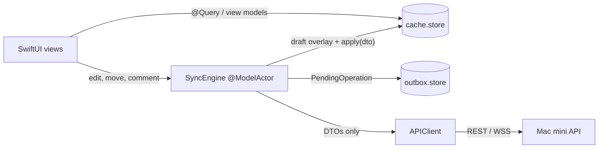

# ADR-0002: SwiftData as an offline cache only, never the shared source of truth

Status: Accepted (2026-10-01)

## Context

The brief requires the app to read cached projects offline, queue edits, and reconcile on reconnect, while the Mac mini server stays authoritative. SwiftData is the natural query layer for SwiftUI views but a poor long-lived schema contract: migrations are fragile and `@Model` classes are not transport types. Unsynced edits are the one thing the device holds that nothing else does, so losing them during a cache reset would violate the brief's "never silently lose data" bar. This ADR expands D12 and the cache-related parts of D08; replay and conflict rules remain in D08, realtime catch-up in D13.

## Decision

The server is always right (D05, D06, D17). SwiftData holds a disposable copy of server state plus a durable queue of local intent; nothing in SwiftData is truth the server must adopt (D12).

**Two containers, two store files** in Application Support (D12):

| Store | Durability | Models | Reset rule |
|---|---|---|---|
| `cache.store` | Disposable | `CachedProject`, `CachedColumn`, `CachedTask`, `CachedMember`, `CachedUser`, `CachedComment`, `CachedAttachment`, `CachedActivityEvent`, `SyncState` | Deleted on `CacheSchema.version` mismatch, logout and account deletion; rebuilt from snapshots |
| `outbox.store` | Durable | `PendingOperation` (D08), `StagedUpload` (D14) | `VersionedSchema`, additive lightweight migrations only; never wiped by a cache reset |

**Scope of the cache** (D08): the project list; for every project opened in the last 30 days, its columns, active tasks, members, the last 200 activity events, attachment metadata, comments for opened tasks, and `SyncState { projectId, lastSequence, snapshotAt }`. Archived tasks are fetched on demand and cached once viewed. Attachment bytes and thumbnails live in a 200 MB LRU on-disk cache under Caches, never in SwiftData (D08, D14).

**DTO and cache mapping** (D12, D22): transport DTOs are plain `Codable` structs in SharedDTOs with no SwiftData import, encoded with the shared `JSONCoding` coder. `@Model` classes exist only in the iOS target, are never `Codable` for transport, and never cross the `APIClient` boundary. One explicit mapping file per entity provides `CachedTask.apply(_ dto: TaskDTO)` (upsert by `#Unique([\.id])`, overwrite every server-owned field, leave draft fields untouched) and `CachedTask.toDTO()`, used only to build requests. `CachedTask` carries the server fields plus the D08 draft overlay (`draftTitle`, `draftNotes`, `draftDueAt`, `draftAssigneeId`, `draftColumnId`, `draftRank`) and `hasPendingOperation`; views render the draft over the server fields.

**Ownership of writes** (D12): `SyncEngine`, a single `@ModelActor`, performs every write to both stores. Views read through `@Query` on the main context, sorted by `(rank, id)` with `comparator: .lexical` (D06), or through `@Observable` view models that never hold `@Model` instances across actors (D20). The outbox container is never placed in the SwiftUI environment; only `SyncEngine` touches it and publishes an `@Observable SyncStatus` (pending count, offline, reconnecting). A `ProjectRepository` protocol separates views from storage and transport, with a live SwiftData implementation and an in-memory fake for previews, tests and the Phase 4 prototype.

**Relationship to the pending operation queue** (D08, D12, D18): an optimistic edit mutates the cache row's draft fields and enqueues a `PendingOperation` (its `id` is the `operationId`, minted at creation) in the same `SyncEngine` save. Pending operations reference entity ids, not cache objects, so they survive a cache wipe. Replay is strict FIFO by `createdAt`; success or discard clears the overlay. Clients generate entity ids at creation (D22); no temporary-id mapping exists.

**Invalidation** (D08, D12, D13): events are applied in sequence order without version gating; a snapshot (`GET /v1/projects/{id}`) replaces the project subtree in one transaction (upsert by id, delete rows missing from the snapshot). A `member.removed` event for self, a 403 or 404 on a project fetch, or a `project.deleted` event removes that project's subtree immediately. Snapshot reload happens on 410 `sequence_too_old`, on `SyncState` older than 24 h, and on pull to refresh; projects not opened for 30 days are evicted by a maintenance pass; the project list shows "Updated N min ago" during a background refresh.

**Migration stance** (D12): `cache.store` has no migration path. A `CacheSchema.version` string in the store metadata is compared at launch; on mismatch the file is deleted and projects are re-fetched. No SwiftData migration code is ever written for the cache; every DTO change needs a mapping update and a version bump. `outbox.store` migrates additively; if a lightweight migration fails, pending operations are exported to `Application Support/unsynced-operations.json`, surfaced as "unsynced changes", and the store is recreated. Each `PendingOperation` carries `requestVersion` so an app update never replays a stale request shape (a mismatch fails that operation visibly).

**Lifecycle and files** (D08, D09, D12): logout wipes both stores after the non-empty-outbox warning; a forced sign-out keeps both and resumes if the same user signs back in (a different user wipes both); account deletion wipes both. Store files, the staged-upload directory and the attachment cache use `FileProtectionType.completeUntilFirstUserAuthentication` and `isExcludedFromBackup = true`. Test targets use `isStoredInMemoryOnly` containers.

## Alternatives considered

All rejected in D12 unless noted.

- **SwiftData models as the DTOs.** Couples the wire format to the on-device schema and breaks Linux testing of SharedDTOs (D20).
- **Core Data.** More code for the same disposable cache, no benefit on the iOS 18 minimum.
- **GRDB or hand-rolled SQLite.** A third-party dependency or more code for the same result.
- **One container for cache and outbox.** A cache wipe would destroy unsent edits.
- **CloudKit mirroring.** Makes the device a co-equal source of truth and violates server-authoritative Mac mini hosting (D10).
- **No local cache.** Fails the brief's offline requirement.

## Consequences

### Positive

- A disposable cache removes the SwiftData migration risk class; a schema bump costs one re-fetch.
- Unsynced edits survive cache resets, forced sign-outs and app updates.
- DTOs stay pure `Codable`, so the contract and its fixtures are testable on Linux (D22).
- The repository seam gives previews and tests a fake with no network or SwiftData.

### Negative

- Every DTO change touches a mapping file and `CacheSchema.version`; a forgotten bump is a bug class tests must catch.
- The overlay-aware fetch (a server event arriving for an entity with a pending draft) is the most intricate client code (D08).
- A cache wipe forces a full snapshot load; views must tolerate an empty cache meanwhile.

### Neutral

- Two store files, one `@ModelActor` and lexical `@Query` sorting are fixed patterns later phases follow.
- The 30-day scope, 24-hour staleness and 200-event window are tuning constants, not promises.

## Verification

- Phase 1: SharedDTOs builds and tests on Linux with no SwiftData import.
- Phase 4: the in-memory `ProjectRepository` fake drives every preview and the prototype.
- Phase 5 (exit gate): repository tests for `apply(dto)` upsert and draft preservation; outbox tests for replay order, `dependsOn` failure, `inFlight` recovery after a kill and `requestVersion` mismatch; a cache-wipe test proving pending operations survive and replay; a schema-mismatch test proving `cache.store` is deleted and re-fetched; snapshot-replace tests including rows with `hasPendingOperation`; the two-container and `ModelActor` setup verified on the minimum OS.
- Phase 6: catch-up equivalence with a snapshot; a sequence gap triggers catch-up (D13).
- Phase 11: `@Query` performance measured at about 1,000 tasks per project; the two-device manual scenario edits one task's notes offline and online (D08).

## Related

- Register: D05, D06, D08, D09, D10, D12, D13, D14, D17, D18, D20, D22 (docs/decisions/decision-register.md)
- ADR-0001 (backend stack), ADR-0003 (realtime catch-up), ADR-0004 (staged uploads)
- docs/architecture.md
