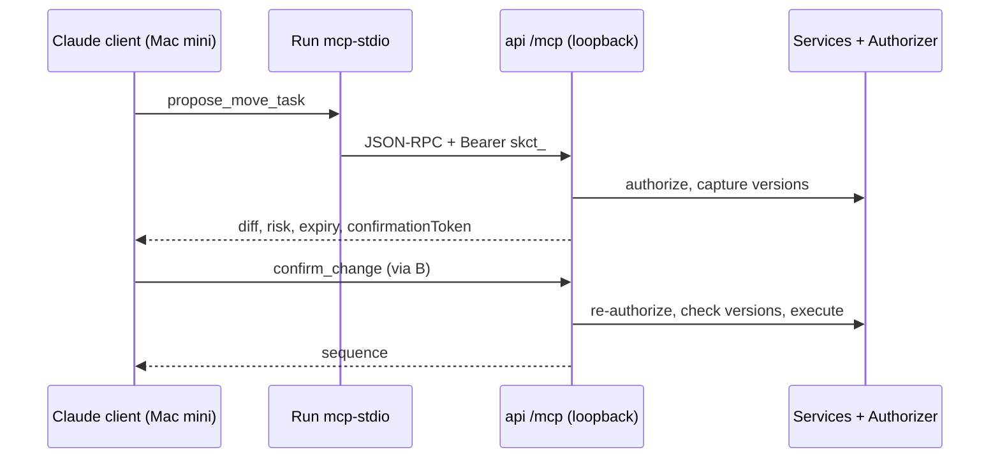

# ADR-0005: MCP proposal and confirmation semantics

Status: Accepted (2026-10-01)

## Context

The brief wants Claude to use the same application service layer as the iOS app through MCP tools, never raw database or filesystem access, with destructive and membership-changing actions always confirmed by a human and every call audited. The household runs Claude Desktop or Claude Code on the trusted Mac mini today; claude.ai or phone access is a possible later want, and the MCP authorization specification is a moving target. Read tools return notes and comments, which are untrusted text to a model. This ADR expands register D15; the register is law where the two differ. Contracts live in `docs/api.md`; threats in `docs/threat-model.md`.

## Decision

**Placement.** The MCP server is a thin layer inside the `api` process (D11, subcommand `serve`). It calls application services and `ProjectAuthorizer.require(...)` (D03) exactly as REST handlers do: no SQL of its own, no Fluent queries, no filesystem access, no attachment bytes (D14). Tool results reuse SharedDTOs types (D22). An MCP Swift SDK, if adopted, is a new server dependency and needs its own ADR at Phase 9 (D11); otherwise the JSON-RPC surface is hand-written. Verify at Phase 9.

**Identity and scopes.** Every call carries a Claude connection token `skct_…` (D16), created in Settings → Connect Claude (shown once, scopes chosen, 90-day expiry, revocable) or by `Run mcp-token create --user <id> --client <name> --scopes …`, stored hashed in `mcp_grants { id, user_id, client_id, token_hash, scopes, created_at, expires_at, last_used_at, revoked_at }`. The grant binds every call to one user; normal role checks then apply (D03). Each tool declares exactly one scope:

| Scope | Default | Tools |
|---|---|---|
| `projects:read` | yes | `list_projects`, `get_project` |
| `tasks:read` | yes | `list_tasks`, `get_task`, `search_tasks` |
| `members:read` | explicit | `list_project_members` |
| `tasks:write` | explicit | `propose_create_task`, `propose_update_task`, `propose_move_task` |
| `comments:write` | explicit | `propose_comment` |
| `projects:write` | explicit | `propose_create_project` |
| `members:manage` | separate opt-in, never default | `propose_invite_member`, `propose_remove_member` |

`confirm_change` and `cancel_change` declare no scope of their own; they re-check the change's stored `required_scope` against the grant. A missing scope → `denied` in the audit log and 403 `forbidden`. No tool exists for ownership transfer, project deletion, column changes, attachments or account actions.

**Read tools** run immediately under the bound user's permissions. `search_tasks` matches title, notes and comment bodies case-insensitively and excludes archived tasks unless `includeArchived` is true. Ids outside the user's projects answer `not_found` (D22). Returned text has control characters stripped; it is still untrusted model input.

**Proposal tools** never mutate. Each writes one row:

```text
pending_ai_changes { id, user_id, client_id, project_id (null for create_project), tool,
  operations [typed JSON, each with a pre-generated operationId],
  diff [{entity, field, old, new}], captured_versions {entityId: version},
  risk_level ∈ low|medium|high, required_scope, confirmation_token_hash,
  state ∈ pending|confirmed|cancelled|expired|failed,
  created_at, expires_at (= created_at + 10 minutes), confirmed_at, result_sequence }
```

Proposal runs the same authorization and validation confirmation will repeat, so an impossible change is refused up front (`denied`, nothing stored). The response is the diff with exact old and new values, affected project and cards, risk level, required scope, expiry and a one-time `confirmationToken` (32 CSPRNG bytes base64url, hashed at rest):

```json
{ "changeId": "7f1b…", "project": { "id": "…", "name": "Home Projects" },
  "riskLevel": "low", "requiredScope": "tasks:write", "expiresAt": "2026-10-01T12:44:56.789Z",
  "diff": [ { "entity": "task:3c2e…", "field": "columnId", "old": "To Do", "new": "In Progress" } ],
  "confirmationToken": "…" }
```

Risk is display and audit only: low = one task created, updated, moved or commented; medium = project creation, assignee change, due-date removal; high = more than one task touched, invitations, removals, archive. Tools carry `readOnlyHint` and `destructiveHint` annotations.

**What requires confirmation.** Everything. Every proposal tool, at every risk level, needs `confirm_change`; the brief's destructive, membership-changing and multi-task cases are therefore covered without a special list, and no auto-apply preference exists in release 1.

**Confirmation.** `confirm_change(change_id, confirmation_token)`, in one transaction: (1) `SELECT … FOR UPDATE` on the change; `state ≠ pending` → 409 `change_already_applied` (or `expired`/`cancelled` reported in `details.reason`); past `expires_at` → mark `expired`, 410. (2) Constant-time compare of the token hash; the grant's `user_id` and `client_id` must equal the row's; a mismatch is `denied`, 403, and the row stays pending. (3) Re-run authorization now: lost membership or role → `failed`, 403. (4) Every captured entity version must be unchanged, else 409 `stale_proposal` and the model re-proposes, so the diff shown is exactly what is applied. (5) Execute `operations` in order through the normal services with the stored operationIds (D18), `via = mcp`, actor = the confirming user (D17), all-or-nothing; set `confirmed`, `result_sequence`, return the committed sequence. A second confirmation cannot double-apply: the row is no longer pending and the operationIds would replay anyway. `cancel_change` marks `cancelled` (no-op when not pending). Pending proposals are not project events; only confirmed changes produce activity events, shown as `<Name> via Claude`. The worker purges rows older than 30 days daily; grants and pending changes die with account deletion (D09).

**Validation and limits.** Strict JSON Schemas, `additionalProperties: false`, undeclared parameters rejected; title ≤ 200, notes ≤ 20,000, comment ≤ 5,000, arrays ≤ 50. 60 reads and 10 proposals per minute per grant (D22). Tool errors carry the D22 envelope as the tool result's JSON with `isError: true` (verify mapping at Phase 9).

**Audit.** `mcp_audit_log { id, at, user_id, client_id, tool, args_redacted (≤ 4 KB), project_id, change_id, outcome ∈ ok|denied|error, error_code, duration_ms, remote_addr }`, written for every call including denials, kept 1 year (also for deleted users), in backups (D21), readable at `GET /v1/mcp/audit` (Settings → Claude activity). Confirmation tokens, connection tokens and full notes never enter it.

**Release-1 transport.** Streamable HTTP at `http://127.0.0.1:8080/mcp`, published by Compose on the host loopback only and excluded from every `tailscale serve`, Funnel and tunnel path set (D10); it accepts only `skct_` tokens in `Authorization: Bearer`. `Run mcp-stdio` is the bridge Claude Desktop or Claude Code launches on the Mac mini: it forwards MCP messages to that endpoint with the token read from `SHAREDKANBAN_MCP_TOKEN` in its environment and holds no database credentials, secrets or filesystem access. Clients that speak local HTTP may connect directly. The token sits in plaintext in the client configuration of the `kanban` macOS user; accepted for the trusted host and stated in the threat model.



**Deferred remote transport (Phase 9b, only if wanted).** `https://<host>/mcp` on the public profile with the MCP authorization specification current then: protected-resource metadata at `/.well-known/oauth-protected-resource`, a minimal Vapor authorization server (authorization code + PKCE, resource indicators binding tokens to `/mcp`, 1-hour access tokens, 30-day rotating refresh tokens, per-grant scopes, dynamic client registration if required), TLS from tailscale serve or Funnel, and consent in the iOS app via an 8-character pairing code. Example host: `kanban.example.invalid`. Verify the specification and client support at Phase 9b.

## Alternatives considered

- Auto-apply low-risk changes: removes the veto before the audit trail is proven.
- Adapter launched by Claude Desktop with its own database connection: credentials in the AI-launched process.
- Static API keys for remote access: not scoped or rotatable per client; forbidden by the brief.
- OAuth server in release 1: the largest non-product component, for an access path nobody has asked for.
- Web Sign in with Apple on the consent page: Services ID, domain verification, more human steps.
- 6-digit pairing code: brute-forceable.

## Consequences

### Positive

One authorization path for app and Claude; a human veto on every write; captured versions make confirmation safe against concurrent edits; re-authorization closes the propose-then-removed gap; stored operationIds make double confirmation harmless; the audit log answers "what did Claude do" on the phone.

### Negative

Two round trips per change and a 10-minute expiry can feel slow in conversation. In release 1 the model holds the confirmation token, so the human veto rests on the client's per-call approval; an in-app "Claude proposes…" approval mode is release 2. Prompt injection through board content cannot be prevented server-side.

### Neutral

Phase 9 delivers the bridge, proposal engine, scopes, audit log and Connect Claude screen; 9b may never be built. `/mcp` is rate-limited like auth endpoints once public. Risk levels exist for display and audit only.

## Verification

- Phase 9 tests: cross-project ids, injected arguments, overlong strings, undeclared parameters, denied scope, duplicate confirmation, expired confirmation, wrong-client token, membership removal between proposal and confirmation, stale captured versions, cancel then confirm, rate limits, audit rows for denials.
- Phase 9 exit gate: read, propose, deny, propose again, confirm, audit event (manual scenario 7) through the stdio bridge with a token minted by `mcp-token`.
- Phase 9 static check: the MCP module imports no Fluent or filesystem APIs.
- Phase 9b: token for another audience, missing resource indicator, PKCE downgrade, pairing-code brute force.
- Phase 10 restore drill: audit rows survive restore. Phase 11: confirmation-bypass review.

## Related

- Register: D15 (expanded here), D03, D09, D10, D11, D16, D17, D18, D21, D22.
- ADR-0001 (api process), ADR-0004 (no filesystem access from MCP).
- `docs/api.md`, `docs/threat-model.md`, `docs/decisions/decision-register.md`.
