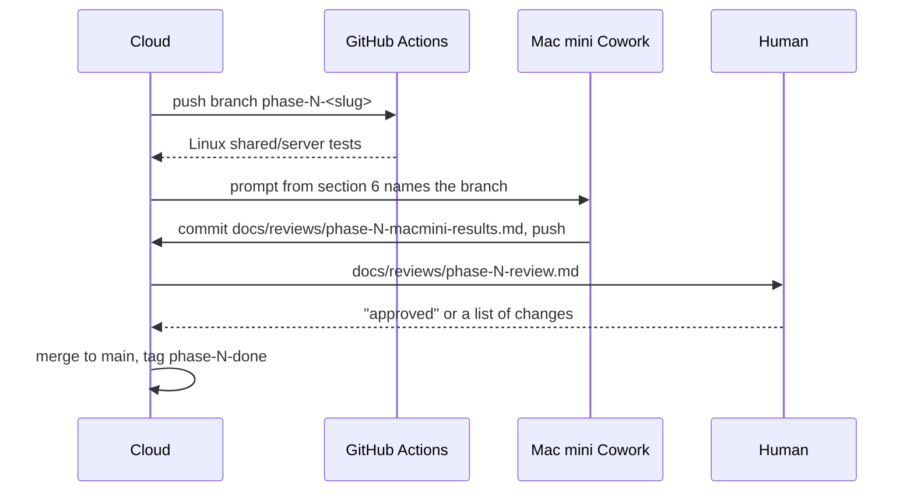

# SharedKanban operator playbook

Who does what for every phase of SharedKanban, written for an owner who wants to be involved as little as possible and for the Claude sessions that implement Phases 1 to 11 without guessing. It applies docs/decisions/decision-register.md (cited inline as D01 to D22) and the phase table in the owner's brief. Step-by-step human instructions live in docs/human-checklist.md; architecture in docs/architecture.md; repository rules in CLAUDE.md.

## 1. The three executors

| Executor | Can do | Cannot do |
|---|---|---|
| (A) Cloud: Claude Code in a cloud Linux container (Ubuntu 24.04, Node 22, Python 3.11, local PostgreSQL 16 that can be started, Docker CLI without a daemon) | Write all code and docs; run Node and Python tooling; run PostgreSQL locally; commit, push, open and merge pull requests; read CI. With section 4 done, also `swift build` and `swift test` for `shared/` and `server/` (D20). | Compile Swift today (no toolchain; download.swift.org and github.com file downloads are denied by the network policy; registry.npmjs.org and PyPI are allowed); run Docker containers; run Xcode, simulators or devices; sign apps; reach the Mac mini or Apple. |
| (B) Mac mini Cowork: Claude Cowork sessions the owner directs on the Mac mini | Install and run Xcode and tools; `xcodebuild build/test` on simulators; `xcrun simctl` and `devicectl`; screenshots; Docker Desktop or OrbStack and Compose; native `swift test`; migrations; Tailscale, restic, cloudflared; launchd; restore drills; drive a browser while the human types credentials; commit and push the results note (D20). | Type Apple ID passwords or 2FA codes; pay; accept legal agreements; physically connect, trust or unlock devices; create third-party accounts; tap a phone. |
| (C) Human: the owner | Read a phase review and reply "approved" or list changes; do the one-time actions in docs/human-checklist.md; hold a phone when a test needs a finger. | Nothing else is asked. |

Rule (D20): the cloud session writes everything and tests what Linux can test; the Mac mini session builds, tests and operates; the human reads and approves.

## 2. Handoff protocol



Branches. Each phase lives on one branch `phase-N-<slug>` (for example `phase-1-scaffold`) cut from `main`. The cloud session commits there in small commits and opens a pull request. Nobody commits to `main` directly; the cloud session merges after the human's "approved" and tags `phase-N-done`.

Results note. When a phase needs the Mac mini, a Cowork session pulls the branch, runs what its prompt says, commits exactly one file, `docs/reviews/phase-N-macmini-results.md` (plus screenshots where the prompt says so), and pushes to the same branch. Standard shape:

```text
# Phase N Mac mini results
Date, macOS, Xcode, Swift versions, branch, commit SHA
## Commands run      (exact command, PASS or FAIL, duration)
## Checks            (check | result | evidence: log excerpt or screenshot path)
## Screenshots       (paths under docs/reviews/phase-N-screenshots/)
## Resolved "verify at Phase N" items
## Needs the human   (exact tap, credential or purchase, or "none")
## Verdict: PASS | PARTIAL | FAIL
```

Phase review. The cloud session reads the results note and writes `docs/reviews/phase-N-review.md`: what was built, what the gate required, evidence it passed, open risks, at most one question. The human reads only that file and replies "approved" or lists changes. That reply is the done signal for every phase.

Secrets. Never in chat, the repository, CLAUDE.md, a results note or a review. On the Mac mini they live in `/Users/kanban/SharedKanban/secrets/` (D11, D21): `.env` (a committed `.env.example` lists every variable name), the Sign in with Apple, APNs and App Store Connect API keys as `.p8` files, and `restic-password`. Until the `kanban` service user exists (Phase 10), Cowork keeps the identical layout at `~/SharedKanban/secrets/`. The iOS base URL lives in the git-ignored `Config/Environment.xcconfig` (D10). A Cowork session that needs a secret names the file and waits; it never asks for a value in chat. The encrypted disk image from `deploy/backup/export-secrets.sh` is the only copy (D21).

## 3. Automation that keeps the human out of the loop

GitHub Actions. The cloud session writes `.github/workflows/ci.yml` in Phase 1: on every push and pull request, one job on `ubuntu-latest` in the official `swift:6.x` container (exact tag recorded at Phase 1, D11) with a `postgres:17-alpine` service, running `swift build` and `swift test` in `shared/` and `server/` with `DATABASE_URL` set (D20). Integration tests `XCTSkip` without `DATABASE_URL`, so one script serves the cloud container, the Mac mini and CI, with "requires macOS" markers for iOS steps. Branch protection on `main` requires the job. Human action: none. Actions is enabled by default for a repository, and the workflow needs no secrets because automated tests never touch live Apple endpoints (D09, D20).

iOS build automation. Per D20 there are no macOS runners in release 1; the Mac mini Cowork session is the macOS CI. Two optional upgrades, not enabled in release 1:

| Option | What it gives | What it needs from the human |
|---|---|---|
| GitHub-hosted macOS job | iOS build and simulator tests on every push without the Mac mini | macOS minutes are billed at a multiplier; accepting the cost is a payment decision, so it is off by default |
| Mac mini self-hosted runner | The same, unattended, on the Mac mini | One sitting: a Cowork session installs the runner as a launchd service and pastes the registration token from the repository settings page, which it opens in the browser while the human signs in to GitHub |

Say so in any phase reply to enable either; the self-hosted runner is the recommended one.

## 4. Optional one-time human action: let the cloud compile Swift

Today the cloud session writes the Vapor server and SharedDTOs but cannot build them; GitHub Actions and the Mac mini compile instead (the fallback D20's assumptions allow). Enabling Swift in the cloud saves one round trip in every phase from 2 onward. Five minutes, once. Verify every step at Phase 1, where the exact Swift version is chosen (D11).

1. In a Claude Code cloud session, open the session title bar menu and choose Edit the cloud environment.
2. Under Network access, add `download.swift.org` (or choose a broader level if a single-domain allowlist is not offered). For the swiftly approach also allow `swift.org`.
3. Under Setup script, add one install approach, chosen at Phase 1 and recorded in docs/architecture.md:
   - swiftly (the swift.org installer): download `swiftly-$(uname -m).tar.gz` from `download.swift.org/swiftly/linux/`, run `./swiftly init --assume-yes`, `swiftly install 6.x`, and add swiftly's bin directory to `PATH`.
   - Toolchain tarball: download the Ubuntu 24.04 tarball for the pinned Swift 6.x release from `download.swift.org/swift-6.x-release/ubuntu2404/`, extract it, and add its `usr/bin` to `PATH`.
   Both need the Linux toolchain's apt dependencies (binutils, libcurl4-openssl-dev, libxml2, zlib1g-dev and the rest of the list on swift.org), so the script also runs `apt-get install`; if apt mirrors are blocked, the Phase 1 cloud session says which domain to add.
4. Save. The Phase 1 cloud session then proves it by running `swift test` in `shared/` and `server/` against the local PostgreSQL started with `pg_ctlcluster` (D11, D20).

Skipping this blocks nothing.

## 5. Per-phase plan

The done signal is always the human's reply on docs/reviews/phase-N-review.md; the column lists what must be true before that review is written. "Nothing" in the Human column means read the review and reply.

### Phase 0: Product and architecture

| Deliverable | Exit gate | Cloud does | Mac mini Cowork does | Human does | Done signal |
|---|---|---|---|---|---|
| Decision register D01 to D22, ADRs, product, architecture, design-system, threat-model and API docs, this playbook, docs/human-checklist.md, CLAUDE.md | Decisions reviewed; no application code | Writes every document on `phase-0-docs`, opens the PR, writes `docs/reviews/phase-0-review.md` | Nothing | Read the review, reply "approved" or list changes | Reply; cloud merges and tags `phase-0-done` |

### Phase 1: Repository scaffold

| Deliverable | Exit gate | Cloud does | Mac mini Cowork does | Human does | Done signal |
|---|---|---|---|---|---|
| Monorepo, SharedDTOs, Vapor service with `/health` and `/ready`, adaptive iOS shell, Compose `dev` profile (D11), `.env.example`, `Config/Environment.xcconfig.example` (D10), CI workflow, test scripts | Empty app and API build; CI passes | Writes everything; runs `swift test` if section 4 is done, else relies on CI; records resolved versions in docs/architecture.md and `Package.resolved` (D20) | Prompt 1: installs Xcode, builds and tests on simulators at the D02 widths, runs server tests natively on PostgreSQL 17, checks both devices run iOS 18 or later (D20), results note | One sitting: Apple ID on the Mac mini and in Xcode, Xcode license, Docker Desktop first launch and admin password; start Developer Program enrollment (takes days, gates Phase 3); optionally section 4; reply | CI green, results note PASS, versions recorded, reply |

### Phase 2: Domain and database

| Deliverable | Exit gate | Cloud does | Mac mini Cowork does | Human does | Done signal |
|---|---|---|---|---|---|
| Migrations and models, column-count trigger (D19), `ProjectAuthorizer` (D03), `Mutation.commit` and sequences (D17), idempotency (D18), rank generator and move service (D06), `ConcurrencyGate` (D05) | Unit and integration tests for permissions and ordering pass | Writes code and the Phase 2 test lists in D05, D06, D18, D19; CI runs them | Native `swift test` on PostgreSQL 17; confirms `COLLATE "C"` is byte-wise and the savepoint and two-pass renormalization work through Fluent plus SQLKit (D06, D18); results note | Nothing | CI green, results note PASS, reply |

### Phase 3: Sign in with Apple and sessions

| Deliverable | Exit gate | Cloud does | Mac mini Cowork does | Human does | Done signal |
|---|---|---|---|---|---|
| Sign in with Apple, sessions with rotation and reuse detection (D16), account deletion with challenge, transfers and Apple revocation (D09), `AppleIdentityProvider` fake, Settings screen, rate limits | Real-device sign-in works; token and deletion tests pass | Writes client and server code, the D09 and D16 tests, and the portal and variable documentation without values | Prompt 3: capabilities via automatic signing, installs on both devices with `xcrun devicectl`, runs the device checklist with the human, checks the Apple server flow against current docs (D09), results note | One sitting: enrollment active; Developer Mode and trust on both devices; with Cowork driving the portal, create the three keys and download each `.p8` once into the secrets folder; tap Sign in with Apple when asked | Results note PASS with sign-in, sign-out and deletion observed on a device, reply |

### Phase 4: Native design shell and local sample data

| Deliverable | Exit gate | Cloud does | Mac mini Cowork does | Human does | Done signal |
|---|---|---|---|---|---|
| Every screen on the in-memory `ProjectRepository` fake (D12): paged board and switcher (D01), split view with two layout modes and the inspector rule (D02), keyboard focus model, task detail, offline and conflict states (D08), UTType and drag payload (D01), templates (D19), design review checklist | iPhone and iPad layouts reviewed at multiple sizes | Writes views, previews, snapshot and UI tests at the D02 widths | Prompt 4: runs tests, screenshots at every D02 width in light and dark at default and accessibility XL type, verifies `.inspector`, `onGeometryChange` and the switcher chrome (D01, D02), reports device OS versions for the minimum-OS decision (D20), results note | Look at the screenshots linked from the review; reply | Results note PASS with screenshots committed, reply |

### Phase 5: Core client and sync

| Deliverable | Exit gate | Cloud does | Mac mini Cowork does | Human does | Done signal |
|---|---|---|---|---|---|
| `APIClient`, repositories, two SwiftData containers with `SyncEngine` (D12), outbox with FIFO replay and draft overlay (D08), Keychain session store (D16), snapshot and event catch-up, conflict UI, fixture contract tests (D22) | Two devices can create and edit shared data | Writes code and the D08 and D12 tests, including "server event arrives for an entity with a pending draft" | Server on the LAN through the Compose `dev` profile (D10), two simulators with separate fake accounts, UI tests; verifies the two-store setup on the minimum OS (D12); results note | Nothing | Results note PASS with the two-simulator demonstration, reply |

### Phase 6: Drag and drop, realtime, offline queue

| Deliverable | Exit gate | Cloud does | Mac mini Cowork does | Human does | Done signal |
|---|---|---|---|---|---|
| Drop targets 1 to 4 plus the edge-dwell extra (D01), `MoveCoordinator` and move contract (D06), `WSS /v1/realtime` hub, evictions and reconnect (D13), menu alternatives and iPad shortcuts (D02), two-device script | Concurrent moves and reconnect tests pass | Writes code and the D06 and D13 test lists | Prompt 6: two-simulator concurrent scenario and WebSocket tests; records whether edge-dwell paging survives (D01) and the WebSocket header and background findings (D13); results note | Nothing; an optional ten-minute real-device drag-feel check is offered in the review | Results note PASS, reply |

### Phase 7: Invitations, roles, comments, activity

| Deliverable | Exit gate | Cloud does | Mac mini Cowork does | Human does | Done signal |
|---|---|---|---|---|---|
| Invitations, `/invite` page, AASA, code field (D04); role changes, removal, ownership transfer, project delete and restore (D03); comments with `mentionedUserIds` (D07); activity feed (D17); security review | Permission matrix and invite lifecycle pass | Writes code, the full role-by-capability tests (D03) and the D04 lifecycle tests | Runs tests; tries Associated Domains developer mode on the devices (D04); installs the build on both; results note | One five-minute check: open an invitation link received in Messages on the other device and confirm the invited screen appears (fragment survival, D04) | Results note PASS including the fragment finding, reply |

### Phase 8: Due dates, attachments, notifications

| Deliverable | Exit gate | Cloud does | Mac mini Cowork does | Human does | Done signal |
|---|---|---|---|---|---|
| Local reminders, device registration, notification outbox and worker with the `PushProvider` fake (D07, D17); attachment initiate and background PUT with sniffing, quotas and cleanup (D14); HEIC fixtures; device checklist | Background upload and APNs sandbox tests pass | Writes code, the D07 and D14 tests, and the APNs setup notes | Prompt 8: runs tests; runs the worker with the APNs key against the sandbox on a real device; drives the checklist with the human; checks Focus handling of passive pushes (D07); results note | Present about fifteen minutes: tap Allow for notifications, attach a photo, lock the phone, report whether the push and the reminder arrived | Results note PASS with the sandbox push observed, reply |

### Phase 9: MCP connector

| Deliverable | Exit gate | Cloud does | Mac mini Cowork does | Human does | Done signal |
|---|---|---|---|---|---|
| MCP server inside `api` on loopback, `mcp-stdio` bridge, `mcp-token`, read and proposal tools, `PendingAIChange`, confirm and cancel, scopes, audit log, Settings → Connect Claude (D15), setup instructions without secrets | Read, propose, confirm, deny and audit tests pass | Writes code and the D15 adversarial tests; documents the per-call approval dependency (D15) | Runs the api, creates a token with `Run mcp-token create`, pairs the Claude client on the Mac mini through the stdio bridge, demonstrates read, propose, deny, propose again, confirm and the audit row; results note | Nothing, unless Cowork cannot paste the token into the Claude client (checklist item 9) | Results note PASS with the flows logged, reply. Phase 9b (remote OAuth) only if the owner asks for claude.ai or phone access (D15) |

### Phase 10: Mac mini deployment and backups

| Deliverable | Exit gate | Cloud does | Mac mini Cowork does | Human does | Done signal |
|---|---|---|---|---|---|
| Production Dockerfiles and Compose, launchd plists and `build.sh` (D11); backup, restore, health and export-secrets scripts with launchd jobs (D21); deploy/runbook.md with both ingress profiles (D10), incident steps, monthly drill, status screen | Restore drill succeeds; remote HTTPS works | Writes every deploy file and the runbook; cannot run Docker, so validation is entirely on the Mac mini | Prompt 10: service user, Docker Desktop or OrbStack, Tailscale, restic; `tailscale serve` to `127.0.0.1:8080`; `migrate`; stack up; launchd path exercised once; restore drill into `sharedkanban-drill`; a week of restic copies to iCloud Drive (D21); results note | One sitting: Tailscale account and sign-in on all three devices; in the admin console (Cowork drives the browser) enable HTTPS certificates and disable key expiry (D10); admin password when asked; plug in the UPS and SSD; save the restic password and secrets-image passphrase in a password manager; in the reply accept FileVault OFF or ask for ON (D21) | Results note PASS with `/ready` reached over https from both devices and the drill's integrity checks, reply |

### Phase 11: Accessibility, security, performance, beta

| Deliverable | Exit gate | Cloud does | Mac mini Cowork does | Human does | Done signal |
|---|---|---|---|---|---|
| Release-candidate audit of every boundary in the brief's Prompt 11, blocker fixes, TestFlight checklist, privacy inventory including "Deleted member" retention (D09, D17), support runbook, release criteria | TestFlight checklist and release criteria pass | Writes audits, fixes, checklist and inventory; labels non-blocking follow-ups | Prompt 11: every suite, `@Query` timing with about 1,000 tasks (D12), the two-user scenario, archive and upload to TestFlight with the App Store Connect API key (D20); results note | Accept the TestFlight invite on each device, use the app for a few days, reply with anything that felt wrong | Both devices on the TestFlight build, results note PASS, "approved" closes release 1 |

## 6. Ready-to-paste Cowork prompts

Each prompt is self-contained. Paste one into a Claude Cowork session on the Mac mini. All use `~/Developer/SharedKanban` as the working clone and the results-note shape from section 2.

### Prompt 1: Phase 1 scaffold build

Human must be present: yes, for the first ten minutes. Xcode's App Store install and Apple ID sign-in, the Xcode license, Docker Desktop's first launch and the admin password need a person (D20). Then the session runs alone.

```text
You are the Mac mini build session for SharedKanban, Phase 1. First read CLAUDE.md, docs/operator-playbook.md section 2, and D11 and D20 in docs/decisions/decision-register.md.
1. Clone the SharedKanban repository to ~/Developer/SharedKanban if absent; check out phase-1-scaffold and pull.
2. Ensure the latest shipping Xcode (no betas) and the command line tools are installed; run `xcodebuild -runFirstLaunch` and `xcodebuild -downloadPlatform iOS`. When the App Store, the Apple ID or the license needs the human, say exactly what to click and wait.
3. Install Docker Desktop (or OrbStack) and Homebrew postgresql@17 as a fallback; ask the human once for the first-launch approval and admin password.
4. Run the documented scripts: `swift build` and `swift test` in shared/ and server/ with DATABASE_URL pointing at the Compose dev PostgreSQL 17; `xcodebuild build` and `test` on an iPhone and an iPad simulator at the widths the test plan lists; `docker compose --profile dev up` and curl /health and /ready.
5. Record macOS, Xcode, Swift, Vapor (from Package.resolved) and PostgreSQL versions. If devices are cable-connected, note each iOS version from `xcrun devicectl list devices` (both must be 18 or later).
6. Write docs/reviews/phase-1-macmini-results.md in the standard format: commands with PASS/FAIL, versions, device versions or "not connected", what needed the human, Verdict. Commit as "docs: phase 1 Mac mini results" and push to phase-1-scaffold. Commit nothing else; no secrets or hostnames in the note.
```

### Prompt 3: Phase 3 real-device sign-in

Human must be present: yes. Sign in with Apple cannot run in the Simulator, the portal keys need the Apple ID session, and someone must tap the sign-in button and Face ID (D20).

```text
You are the Mac mini session for SharedKanban, Phase 3. First read CLAUDE.md, docs/operator-playbook.md section 2, docs/human-checklist.md, and D09, D16 and D20 in docs/decisions/decision-register.md.
1. In ~/Developer/SharedKanban check out phase-3-sign-in-with-apple and pull. Run the server and iOS tests; stop and report any failure.
2. Confirm the Apple Developer Program is active in Xcode > Settings > Accounts; if not, stop and tell the human.
3. Open the developer portal in the browser and guide the human: App ID capabilities Sign in with Apple, Push Notifications, Associated Domains; create the Sign in with Apple key, the APNs key and an App Store Connect API key; the human downloads each .p8 once and you move them into ~/SharedKanban/secrets/ under the names docs/human-checklist.md gives. Never read key contents into chat.
4. Fill ~/SharedKanban/secrets/.env from .env.example with the key ids and team id; start the server with the Compose dev profile on the LAN.
5. Confirm Developer Mode and Mac trust on the cable-connected iPhone and iPad (ask the human if not). Install the Debug build with `xcrun devicectl device install app`, with the LAN base URL in Config/Environment.xcconfig.
6. Walk the human through the branch's device checklist: sign in, see the session in Settings, sign out, sign in again, revoke the session from the other device, delete the account, sign in again as a new user. Record each outcome as reported.
7. Write docs/reviews/phase-3-macmini-results.md in the standard format with the checklist outcomes and the resolved D09 Apple-flow items (client_secret JWT, refresh token from /auth/token, revoke behavior). Commit as "docs: phase 3 Mac mini results" and push. No secrets, key ids, team ids or hostnames in the note.
```

### Prompt 4: Phase 4 design review screenshots

Human must be present: no. Everything runs on simulators; the owner reads the screenshots later.

```text
You are the Mac mini session for SharedKanban, Phase 4. First read CLAUDE.md, docs/operator-playbook.md section 2, and D01, D02 and D20 in docs/decisions/decision-register.md.
1. In ~/Developer/SharedKanban check out phase-4-design-shell and pull. Run the iOS unit, snapshot and UI tests.
2. With `xcrun simctl`, capture every screen in the branch's design review checklist (sign in, project list and empty state, new project per template, iPhone board, iPad board in both modes, task detail as inspector and as sheet, members, invitation sharing, settings, offline, syncing, conflict and error states) at widths 320, 375, 507, 744, 834, 1024, 1194 and 1366 points, light and dark, default and accessibility XL Dynamic Type, plus iPad Slide Over, one-third and one-half Split View and a narrow Stage Manager window.
3. Save PNGs under docs/reviews/phase-4-screenshots/ as <screen>-<width>-<light|dark>-<default|axxl>.png; keep the set under 40 MB.
4. Check and record: titles do not clip at accessibility XL in a 240pt column; opening the inspector never flips the board mode; onGeometryChange behaves during live resize; the pinned switcher bar renders with the SDK's system chrome. Record the iOS versions of any listed devices for the D20 minimum-OS decision.
5. Write docs/reviews/phase-4-macmini-results.md in the standard format with the checks table, screenshot paths and resolved D01 and D02 items. Commit the note and screenshots as "docs: phase 4 Mac mini results and screenshots" and push.
```

### Prompt 6: Phase 6 two-device test

Human must be present: no. The concurrent and reconnect scenarios run on two simulators with fake accounts; the real-device drag-feel check is optional and left for the human in the review.

```text
You are the Mac mini session for SharedKanban, Phase 6. First read CLAUDE.md, docs/operator-playbook.md section 2, and D01, D06, D08 and D13 in docs/decisions/decision-register.md.
1. In ~/Developer/SharedKanban check out phase-6-drag-realtime and pull. Start the server with the Compose dev profile. Run the server tests (same-card concurrent moves, two cards into one gap, neighbors gone, renormalization, subscribe without membership, duplicate delivery, gap detection, revoke mid-connection, reconnect backoff) and the iOS tests.
2. Boot an iPhone and an iPad simulator as two fake accounts on one Home Projects board. Run the branch's two-device script: move different cards simultaneously; move the same card from both and confirm one snaps back with the banner; cut the network on one, queue three edits, restore it and confirm replay; remove the member from the other and confirm the socket closes and the board disappears.
3. Record whether edge-dwell paging survives (D01 item 5; if it cancels the drag, note that the pills remain the cross-column path), whether URLSessionWebSocketTask sends the Authorization header on upgrade, and what happens 5 seconds after backgrounding.
4. Screenshot the drag preview, insertion bar, WIP warning and rejection banner into docs/reviews/phase-6-screenshots/.
5. Write docs/reviews/phase-6-macmini-results.md in the standard format with each scenario's result and the resolved D01 and D13 items; under "Needs the human" list the optional ten-minute real-device drag-feel check with its steps. Commit as "docs: phase 6 Mac mini results" and push.
```

### Prompt 8: Phase 8 APNs sandbox

Human must be present: yes, about fifteen minutes. A real device must grant the notification permission, a photo must be picked, and only a person can report what the lock screen showed (D07, D20).

```text
You are the Mac mini session for SharedKanban, Phase 8. First read CLAUDE.md, docs/operator-playbook.md section 2, and D07, D14 and D21 in docs/decisions/decision-register.md.
1. In ~/Developer/SharedKanban check out phase-8-dates-files-notifications and pull. Run the server and iOS tests, including attachment traversal, sniffing, oversize, hash mismatch, upload-token and background-resume tests and the fake push provider tests.
2. Confirm ~/SharedKanban/secrets/ holds the APNs .p8 and that .env names its key id and team id; never print them. Start the server and worker with the Compose dev profile, APNs pointed at the sandbox environment.
3. Install the Debug build on the cable-connected iPhone and iPad. With the human: on the iPhone create a task due in one hour and assign it to the iPad user, tapping Allow at the notification prompt; on the iPad comment on that task; lock the iPhone and ask whether the comment push arrived and, later, whether the due reminder fired. Attach a photo from the iPhone, swipe the app away mid-upload, reopen it and confirm the upload completes. Enable a Focus mode and confirm a passive-level push lands in Notification Center without alerting.
4. Record the delivery rows (ids only), the APNs response status, the device row's environment value and the sniffed MIME of the uploaded HEIC.
5. Write docs/reviews/phase-8-macmini-results.md in the standard format with each check as the human reported it, the resolved D07 Focus item and the D14 HEIC finding. Commit as "docs: phase 8 Mac mini results" and push. No tokens, key ids or hostnames in the note.
```

### Prompt 10: Phase 10 deployment and restore drill

Human must be present: yes, for one sitting at the start. The service user, Docker Desktop and Tailscale need the admin password and the Tailscale sign-in, the admin-console toggles need the Tailscale login, and the UPS and SSD must be plugged in (D10, D20, D21). The drill and the week of backup observation run alone.

```text
You are the Mac mini session for SharedKanban, Phase 10. First read CLAUDE.md, docs/operator-playbook.md section 2, deploy/runbook.md, and D10, D11, D14 and D21 in docs/decisions/decision-register.md.
1. In ~/Developer/SharedKanban check out phase-10-deployment and pull.
2. With the human: create the `kanban` service user with auto-login per the runbook; install Docker Desktop (or OrbStack), Tailscale and restic under it; move ~/SharedKanban/secrets/ to /Users/kanban/SharedKanban/secrets/ with 0700 and 0600 permissions; have the human sign in to Tailscale on the Mac mini and, in the admin console you open, enable HTTPS certificates and disable key expiry for this node; confirm the UPS is on USB and the SSD is mounted at /Volumes/KanbanBackup; set `pmset autorestart 1` and shutdown-on-battery. Record the human's FileVault choice (default OFF).
3. Alone: fill /Users/kanban/SharedKanban/secrets/.env from .env.example, create the data directories, run `docker compose run --rm migrate`, start api and worker, verify api listens only on 127.0.0.1:8080 and postgres publishes no port, configure `tailscale serve` to proxy 443 to 127.0.0.1:8080, and curl /ready through the tailnet hostname. Then exercise the launchd escape hatch once: deploy/launchd/build.sh, start serve and worker as LaunchDaemons on Homebrew postgresql@17, confirm /ready, stop them, return to Compose.
4. Install the backup launchd jobs; run backup.sh once; run restore.sh into the sharedkanban-drill stack and confirm migration status, row counts, every attachment hash, /ready, the fake login and the project read. Run health.sh and confirm it restarts the stack after three failures. Leave the nightly restic copy to iCloud Drive running seven days and add its outcome to the note in a second commit.
5. Ask the human to open the app on both devices with the Tailscale VPN on and confirm the board loads over https.
6. Write docs/reviews/phase-10-macmini-results.md in the standard format: every command, the drill's integrity results, the launchd exercise, WebSocket and idle-timeout findings for tailscale serve, the iCloud copy result, the FileVault choice. Commit as "docs: phase 10 Mac mini results" and push. The tailnet hostname, passwords and key material never go into the note.
```

### Prompt 11: Phase 11 TestFlight

Human must be present: no for the upload; the App Store Connect API key lets Cowork archive and upload unattended (D20). The human accepts the TestFlight invitation on each device later.

```text
You are the Mac mini session for SharedKanban, Phase 11. First read CLAUDE.md, docs/operator-playbook.md section 2, and D12, D20 and D22 in docs/decisions/decision-register.md.
1. In ~/Developer/SharedKanban check out phase-11-release-candidate and pull. Run static analysis, the dependency review script, server tests, iOS unit and UI tests, migration tests from empty and from the Phase 2 schema, and the two-user end-to-end scenario on two simulators. Stop and report any failure.
2. Seed a project with about 1,000 tasks through the API and measure board scroll and @Query timing on iPhone and iPad simulators; record the numbers.
3. Run `security unlock-keychain` if signing needs it. Archive the Release configuration with automatic signing, export for TestFlight, and upload with the App Store Connect API key from /Users/kanban/SharedKanban/secrets/ (key id and issuer id from .env). Never print the key.
4. In App Store Connect, add both household testers to the internal group, confirm the build finishes processing, and answer export compliance as the runbook documents.
5. Walk the branch's TestFlight checklist and mark each item from evidence you produced.
6. Write docs/reviews/phase-11-macmini-results.md in the standard format with test results, performance numbers, build number and the checklist with evidence; under "Needs the human": accept the TestFlight invite on each device and install. Commit as "docs: phase 11 Mac mini results" and push.
```

## 7. One-time human actions

Step-by-step instructions live in docs/human-checklist.md. "Cowork beside the human" means a Cowork session opens the page, explains each click and files what is downloaded; the human only types credentials, approves prompts or pays.

| Action | Phase that needs it | Who drives it |
|---|---|---|
| Enroll in the Apple Developer Program and pay; accept the agreements in App Store Connect | Start in Phase 1; required by Phase 3 | Human alone (Cowork can open the pages) |
| Apple ID sign-in on the Mac mini and in Xcode; 2FA; Xcode license | Phase 1 | Cowork beside the human |
| Docker Desktop first-launch approval and macOS admin password | Phase 1; again in Phase 10 for the service user | Cowork beside the human |
| App ID capabilities: Sign in with Apple, Push Notifications, Associated Domains | Phase 3 (Associated Domains used from Phase 7) | Cowork beside the human (automatic signing creates most of it) |
| Sign in with Apple key, APNs key, App Store Connect API key; each `.p8` downloaded once into the secrets folder, never the repo | Phase 3; used in Phases 8 and 11 | Cowork beside the human |
| Developer Mode and trusting the Mac by cable on the iPhone and the iPad | Phase 3 | Human alone (Cowork says when) |
| Tailscale account; sign-in on the Mac mini, iPhone and iPad; HTTPS certificates on and key expiry off for the Mac mini in the admin console | Phase 10 | Cowork beside the human for the console; device sign-ins human alone |
| Optional Cloudflare account and owned domain | Only if the public profile uses Cloudflare Tunnel instead of Funnel (D10) | Human alone |
| Optional cloud environment change: allow `download.swift.org` and add the Swift setup script (section 4) | Phase 1 or any time | Human alone, five minutes |
| Accept the TestFlight invitation and install on each device | Phase 11 | Human alone |
| Plug in the UPS and the external backup SSD | Phase 10 | Human alone |
| Save the restic password and the secrets-image passphrase in a password manager | Phase 10 | Human alone (Cowork generates both and says where they are) |
| Allow notifications and Sign in with Apple when the app asks on each device | Phases 3 and 8 | Human alone |
| Optional: Backblaze B2 account if iCloud Drive proves unreliable; paste the Claude connection token into the Claude client if Cowork cannot | After Phase 10; Phase 9 | Human alone |
| Optional: GitHub sign-in for a self-hosted runner registration token | Only if the owner asks for the runner | Cowork beside the human |

## 8. What you need to do right now

For Phase 0, nothing except this: read docs/reviews/phase-0-review.md and reply "approved", or reply with the changes you want. No purchases, accounts or installs are needed until the Phase 1 review asks for the single sitting described in section 5.
