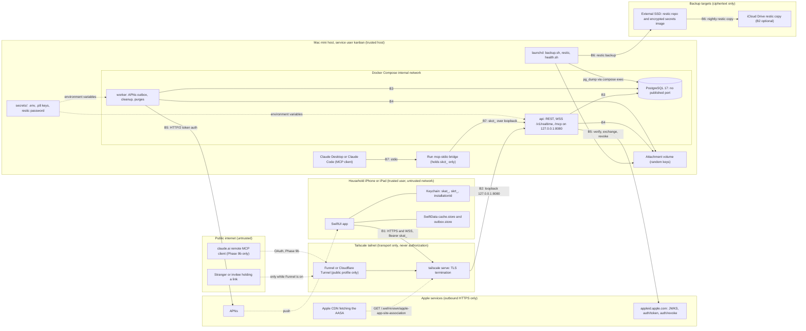

# SharedKanban threat model

Phase 0 document, written 2026-10-01. It applies the decisions in docs/decisions/decision-register.md (D01 to D22, cited inline) to the question "what can go wrong, and which decision, built in which phase, stops it". It does not introduce mechanisms of its own: where the register is silent the row says so and the question goes to section 6. Component shapes are in docs/architecture.md and endpoint contracts in docs/api.md. Every threat row names the test or drill that proves its mitigation; a phase is not done while a row assigned to it has no passing test or an explicit owner waiver.

STRIDE letters used in the tables: S spoofing, T tampering, R repudiation, I information disclosure, D denial of service, E elevation of privilege. Likelihood is judged for a two-person household running the release-1 Tailscale profile (D10); rows note when the public profile changes it.

## 1. Scope, assets, actors and trust boundaries

### 1.1 Scope

In scope: the SwiftUI iPhone/iPad app; the Vapor `api` and `worker` containers, PostgreSQL and the attachment volume on the Mac mini; the MCP server inside `api` and the `mcp-stdio` bridge; the three ingress profiles (LAN development, Tailscale private, Funnel or Cloudflare Tunnel public); backups and the host operations run by the human and the Cowork session; and the Apple integrations (Sign in with Apple, APNs, TestFlight). Release 1 is the baseline; Phase 9b remote MCP is covered where it changes the picture.

### 1.2 Assets

| Asset | Where it lives | What protects it | Register |
|---|---|---|---|
| User identity: Apple subject, display name, email (possibly a private relay address), encrypted Apple refresh token | `users` row in PostgreSQL | Audience-checked tokens; AES-GCM under `APPLE_TOKEN_KEY`; anonymized tombstone on deletion | D09, D16 |
| Session tokens `skat_` (60 min) and `skrt_` (90-day sliding, 365-day absolute) | Raw only in the device Keychain; SHA-256 hashes in `sessions` | Opaque, hashed, rotating, revocable per installation | D16 |
| Secondary tokens: upload `skut_`, Claude connection `skct_` | Outbox store on device; Claude client config on the Mac mini; hashes server-side | Single purpose, bounded lifetime, revoked with the session or from Settings | D14, D15, D16 |
| Invitation tokens | Fragment of the https link; hash in `invitations` | 256-bit, single use, expiring, inviter re-checked | D04 |
| Project data: projects, columns, tasks, comments, members, activity events (kept forever) | PostgreSQL; SwiftData cache on each member device | One authorizer; file protection and backup exclusion on device | D03, D12, D17 |
| Attachments | `/Users/kanban/SharedKanban/data/attachments`; 200 MB device cache | Random keys, allowlist, membership on download | D14 |
| APNs device tokens | `devices` rows tied to sessions | Deleted on every revocation; minimal payloads | D07 |
| Apple keys and server secrets: Sign in with Apple `.p8`, APNs `.p8`, App Store Connect API key, `APPLE_TOKEN_KEY`, database password, restic password | `/Users/kanban/SharedKanban/secrets/`, outside the repository and outside restic; encrypted image on the SSD; password manager | File permissions; trusted host; rotation playbook | D11, D20, D21 |
| Backups | restic repositories on the external SSD and iCloud Drive; last 8 plaintext dumps locally | restic encryption, retention, weekly checks, monthly drills | D21 |
| Audit and security logs: `mcp_audit_log` (1 year), `security.session_reuse` rows, structured JSON logs | PostgreSQL and the host | Redaction; included in backups | D11, D15, D16 |
| The Mac mini itself: host OS, Docker Desktop, Tailscale node identity, TLS certificate, login keychain kept unlocked for signing | The household | Physical custody, UPS, the owner's FileVault decision | D20, D21 |
| Cloud accounts: Apple Developer, Tailscale, iCloud (backup copy) | Third parties | The owner's credentials (section 6) | D10, D20, D21 |

### 1.3 Actors

| Actor | Trust | Reach |
|---|---|---|
| Household member (owner, admin, editor, viewer) | Trusted person who makes mistakes; may become a former member | Everything in projects they belong to |
| Invitee | Unknown until signed in; holds a bearer link | `/invite` page; preview and accept after Sign in with Apple |
| Removed member | Formerly trusted; keeps a device cache and possibly tokens | Nothing from the next request; cache until the client wipes it |
| Stranger on the internet | Hostile; reaches nothing on the private profile; reaches `/v1/*`, `/invite`, the AASA and `/health` on the public profile | TLS front door only |
| Claude via MCP (the model) | No authority of its own; acts under one user's grant; can be injected by content it reads | Read tools, proposals, and `confirm_change` with the token it holds |
| Malicious or compromised MCP client | Hostile process on the host, or remote after Phase 9b | `/mcp` with a stolen `skct_` |
| Attacker with a stolen device | Holds a locked or unlocked phone | Keychain, cache, the live session |
| Attacker with physical Mac mini access | Full compromise by definition (D21) | Everything at rest |
| Compromised dependency or image | Code running inside `api`, `worker` or the app | Everything that process reaches |
| Operator sessions: Cowork on the Mac mini, the cloud Linux session | Trusted but AI-driven; can be misled by content they read | Host, secrets directory, Xcode, `Run admin`, `Run mcp-token` |
| Apple, Tailscale, iCloud, Cloudflare (if chosen) | Trusted for what they carry only | Identity tokens and pushes; transport; ciphertext; edge decryption (Cloudflare) |

### 1.4 Trust boundaries

Boundaries and what crosses them:

- B1 device to ingress: TLS terminated by tailscale serve (or Funnel/Cloudflare); every request and WebSocket upgrade carries a `skat_` bearer; Release builds have no ATS exceptions (D10, D13, D16).
- B2 ingress to `api`: loopback only; forwarded client-IP headers are trusted only for requests arriving from the tunnel (D10).
- B3 `api`/`worker` to PostgreSQL: Docker internal network, no published port outside the `dev` profile (D11).
- B4 `api`/`worker` to the attachment volume: keys validated before any path is built; 0700 mount; no static file serving (D14).
- B5 `api`/`worker` to Apple: outbound only, to an allowlist of Apple hosts that is best effort and not relied on (D10).
- B6 host to backup targets: restic ciphertext only; the secrets directory never enters a repository (D21).
- B7 MCP client to bridge to `/mcp`: the bridge holds one connection token and no database credentials; `/mcp` is loopback-only until Phase 9b (D15).
- B8 model to content: everything read tools return (notes, comments, titles) is untrusted data to the model; nothing auto-applies (D15).
- B9 human to operator AI sessions: Cowork and the cloud session act on the host and repository within the scope D20 defines; what they read (logs, issues, repository content) is data, not instruction.

## 2. Assumptions and out of scope

Assumptions this model relies on:

- The two household members trust each other with the data they share; roles exist to prevent accidents and to govern future members, but a removed member and an invitee are treated as adversarial.
- The Mac mini is a trusted host: anyone running as the `kanban` user, or with an admin account on the machine, is a full compromise (D15, D21). Its physical custody is the owner's.
- Apple's identity, push and distribution services behave as documented; exact behavior is verified at Phases 3 and 8 (register assumptions).
- The Tailscale control plane is trusted for the private profile; tailnet membership is transport only and grants nothing (D10). Compromise of the Tailscale account is in scope (T-NET-06).
- iCloud Drive, B2 and the SSD see only restic ciphertext (D21).
- Server clocks are NTP-synchronized (D21); all expiry comparisons are server-side (D16).
- The Docker egress allowlist is best effort; no row depends on it (D10).

Out of scope:

- Compromise of Apple, Tailscale or Let's Encrypt infrastructure, and attacks on WireGuard or TLS cryptography.
- iOS kernel or jailbreak attacks, malicious App Store builds, and the device passcode or Find My remote wipe (assumed to be the user's responsibility).
- Cloudflare edge compromise; choosing Cloudflare Tunnel is recorded as a change of privacy posture, not modeled further (D10).
- Volumetric denial of service beyond household-scale rate limits (D22).
- Side channels, timing attacks beyond constant-time hash comparison (D16), and multi-tenant isolation (there is one household).
- Email, SMS and web clients; none exist in release 1.
