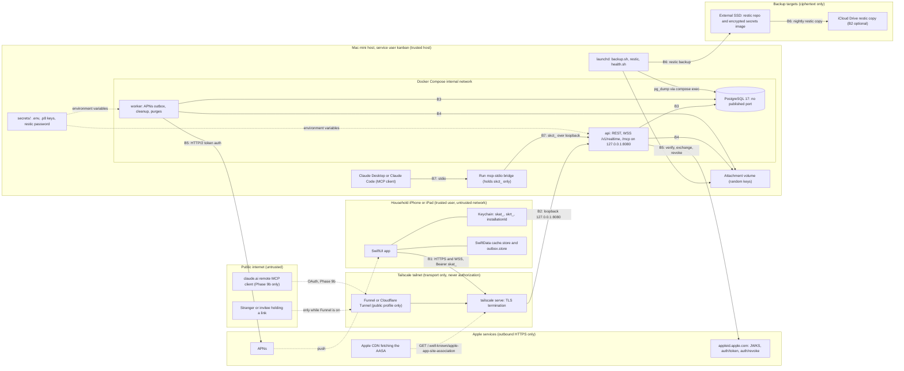

# SharedKanban threat model

Phase 0 document, written 2026-10-01. It applies the decisions in docs/decisions/decision-register.md (D01 to D22, cited inline) to the question "what can go wrong, and which decision, built in which phase, stops it". It does not introduce mechanisms of its own: where the register is silent the row says so and the question goes to section 6. Component shapes are in docs/architecture.md and endpoint contracts in docs/api.md. Every threat row names the test or drill that proves its mitigation; a phase is not done while a row assigned to it has no passing test or an explicit owner waiver.

STRIDE letters used in the tables: S spoofing, T tampering, R repudiation, I information disclosure, D denial of service, E elevation of privilege. Likelihood is judged for a two-person household running the release-1 Tailscale profile (D10); rows note when the public profile changes it.

## 1. Scope, assets, actors and trust boundaries

### 1.1 Scope

In scope: the SwiftUI iPhone/iPad app; the Vapor `api` and `worker` containers, PostgreSQL and the attachment volume on the Mac mini; the MCP server inside `api` and the `mcp-stdio` bridge; the three ingress profiles (LAN development, Tailscale private, Funnel or Cloudflare Tunnel public); backups and the host operations run by the human and the Cowork session; and the Apple integrations (Sign in with Apple, APNs, TestFlight). Release 1 is the baseline; Phase 9b remote MCP is covered where it changes the picture.

### 1.2 Assets

| Asset | Where it lives | What protects it | Register |
|---|---|---|---|
| User identity: Apple subject, display name, email (possibly a private relay address), encrypted Apple refresh token | `users` row in PostgreSQL | Audience-checked tokens; AES-GCM under `APPLE_TOKEN_KEY`; anonymized tombstone on deletion | D09, D16 |
| Session tokens `skat_` (60 min) and `skrt_` (90-day sliding, 365-day absolute) | Raw only in the device Keychain; SHA-256 hashes in `sessions` | Opaque, hashed, rotating, revocable per installation | D16 |
| Secondary tokens: upload `skut_`, Claude connection `skct_` | Outbox store on device; Claude client config on the Mac mini; hashes server-side | Single purpose, bounded lifetime, revoked with the session or from Settings | D14, D15, D16 |
| Invitation tokens | Fragment of the https link; hash in `invitations` | 256-bit, single use, expiring, inviter re-checked | D04 |
| Project data: projects, columns, tasks, comments, members, activity events (kept forever) | PostgreSQL; SwiftData cache on each member device | One authorizer; file protection and backup exclusion on device | D03, D12, D17 |
| Attachments | `/Users/kanban/SharedKanban/data/attachments`; 200 MB device cache | Random keys, allowlist, membership on download | D14 |
| APNs device tokens | `devices` rows tied to sessions | Deleted on every revocation; minimal payloads | D07 |
| Apple keys and server secrets: Sign in with Apple `.p8`, APNs `.p8`, App Store Connect API key, `APPLE_TOKEN_KEY`, database password, restic password | `/Users/kanban/SharedKanban/secrets/`, outside the repository and outside restic; encrypted image on the SSD; password manager | File permissions; trusted host; rotation playbook | D11, D20, D21 |
| Backups | restic repositories on the external SSD and iCloud Drive; last 8 plaintext dumps locally | restic encryption, retention, weekly checks, monthly drills | D21 |
| Audit and security logs: `mcp_audit_log` (1 year), `security.session_reuse` rows, structured JSON logs | PostgreSQL and the host | Redaction; included in backups | D11, D15, D16 |
| The Mac mini itself: host OS, Docker Desktop, Tailscale node identity, TLS certificate, login keychain kept unlocked for signing | The household | Physical custody, UPS, the owner's FileVault decision | D20, D21 |
| Cloud accounts: Apple Developer, Tailscale, iCloud (backup copy) | Third parties | The owner's credentials (section 6) | D10, D20, D21 |

### 1.3 Actors

| Actor | Trust | Reach |
|---|---|---|
| Household member (owner, admin, editor, viewer) | Trusted person who makes mistakes; may become a former member | Everything in projects they belong to |
| Invitee | Unknown until signed in; holds a bearer link | `/invite` page; preview and accept after Sign in with Apple |
| Removed member | Formerly trusted; keeps a device cache and possibly tokens | Nothing from the next request; cache until the client wipes it |
| Stranger on the internet | Hostile; reaches nothing on the private profile; reaches `/v1/*`, `/invite`, the AASA and `/health` on the public profile | TLS front door only |
| Claude via MCP (the model) | No authority of its own; acts under one user's grant; can be injected by content it reads | Read tools, proposals, and `confirm_change` with the token it holds |
| Malicious or compromised MCP client | Hostile process on the host, or remote after Phase 9b | `/mcp` with a stolen `skct_` |
| Attacker with a stolen device | Holds a locked or unlocked phone | Keychain, cache, the live session |
| Attacker with physical Mac mini access | Full compromise by definition (D21) | Everything at rest |
| Compromised dependency or image | Code running inside `api`, `worker` or the app | Everything that process reaches |
| Operator sessions: Cowork on the Mac mini, the cloud Linux session | Trusted but AI-driven; can be misled by content they read | Host, secrets directory, Xcode, `Run admin`, `Run mcp-token` |
| Apple, Tailscale, iCloud, Cloudflare (if chosen) | Trusted for what they carry only | Identity tokens and pushes; transport; ciphertext; edge decryption (Cloudflare) |

### 1.4 Trust boundaries

Boundaries and what crosses them:

- B1 device to ingress: TLS terminated by tailscale serve (or Funnel/Cloudflare); every request and WebSocket upgrade carries a `skat_` bearer; Release builds have no ATS exceptions (D10, D13, D16).
- B2 ingress to `api`: loopback only; forwarded client-IP headers are trusted only for requests arriving from the tunnel (D10).
- B3 `api`/`worker` to PostgreSQL: Docker internal network, no published port outside the `dev` profile (D11).
- B4 `api`/`worker` to the attachment volume: keys validated before any path is built; 0700 mount; no static file serving (D14).
- B5 `api`/`worker` to Apple: outbound only, to an allowlist of Apple hosts that is best effort and not relied on (D10).
- B6 host to backup targets: restic ciphertext only; the secrets directory never enters a repository (D21).
- B7 MCP client to bridge to `/mcp`: the bridge holds one connection token and no database credentials; `/mcp` is loopback-only until Phase 9b (D15).
- B8 model to content: everything read tools return (notes, comments, titles) is untrusted data to the model; nothing auto-applies (D15).
- B9 human to operator AI sessions: Cowork and the cloud session act on the host and repository within the scope D20 defines; what they read (logs, issues, repository content) is data, not instruction.

## 2. Assumptions and out of scope

Assumptions this model relies on:

- The two household members trust each other with the data they share; roles exist to prevent accidents and to govern future members, but a removed member and an invitee are treated as adversarial.
- The Mac mini is a trusted host: anyone running as the `kanban` user, or with an admin account on the machine, is a full compromise (D15, D21). Its physical custody is the owner's.
- Apple's identity, push and distribution services behave as documented; exact behavior is verified at Phases 3 and 8 (register assumptions).
- The Tailscale control plane is trusted for the private profile; tailnet membership is transport only and grants nothing (D10). Compromise of the Tailscale account is in scope (T-NET-06).
- iCloud Drive, B2 and the SSD see only restic ciphertext (D21).
- Server clocks are NTP-synchronized (D21); all expiry comparisons are server-side (D16).
- The Docker egress allowlist is best effort; no row depends on it (D10).

Out of scope:

- Compromise of Apple, Tailscale or Let's Encrypt infrastructure, and attacks on WireGuard or TLS cryptography.
- iOS kernel or jailbreak attacks, malicious App Store builds, and the device passcode or Find My remote wipe (assumed to be the user's responsibility).
- Cloudflare edge compromise; choosing Cloudflare Tunnel is recorded as a change of privacy posture, not modeled further (D10).
- Volumetric denial of service beyond household-scale rate limits (D22).
- Side channels, timing attacks beyond constant-time hash comparison (D16), and multi-tenant isolation (there is one household).
- Email, SMS and web clients; none exist in release 1.

## 3. Threat tables

Columns: ID; threat; STRIDE; impact; likelihood (H/M/L); mitigation with the register decision and the phase whose exit gate delivers it; residual risk after that mitigation; the test or drill that proves it. "Phase N" in the test column means the test is part of that phase's exit gate.

### 3.1 Authentication (Sign in with Apple)

| ID | Threat | STRIDE | Impact | L | Mitigation (decision, phase) | Residual risk | Test or drill |
|---|---|---|---|---|---|---|---|
| T-AUTH-01 | Forged or tampered Apple identity token (bad signature, unknown key id, algorithm tricks) | S | H: account creation or takeover | L | Verify signature against Apple's JWKS (cached 24 h), issuer, audience, expiry and nonce with JWTKit; the authorization code is also exchanged with Apple (D10, D11, D16; Phase 3) | JWKS refetch rule on an Apple key rotation is set at Phase 3 | Phase 3: fake-provider tests for bad signature, unknown key id, `alg=none` → 401 `unauthenticated` |
| T-AUTH-02 | Replayed nonce or identity token submitted again to mint a second session | S | H | L | The authorization code is short-lived and single use at Apple (verify at Phase 3), so a replay fails at the exchange; the server must reject a nonce it has already accepted (brief Prompt 3, D16; Phase 3). Deletion uses a server-issued single-use 5-minute challenge (D09) | How sign-in nonces are tracked is not fixed by the register (section 6, question 1) | Phase 3: replayed-nonce test; deletion challenge replay → 401 `reauth_required` |
| T-AUTH-03 | Token issued for another audience (another app or a Services ID) | S | H | L | `aud` must equal this app's bundle identifier; no web Services ID exists in release 1 (D15, D16; Phase 3) | Adding a web client later widens the audience set | Phase 3: wrong-audience test → 401 |
| T-AUTH-04 | Expired, future-dated or clock-skewed token accepted | S | M | L | `exp` and `iat` enforced; deletion requires `iat` within 5 minutes; NTP on the Mac mini (D09, D21; Phase 3) | Apple-side skew tolerance | Phase 3: expired-token and stale-`iat` tests |
| T-AUTH-05 | Code exchange skipped, or the Sign in with Apple `.p8` leaks and lets an attacker mint `client_secret` JWTs | S, I | H | L | Exchange is server-side only; the `.p8` lives in the secrets directory, never in the repository or CI; live Apple endpoints are never used in automated tests (D11, D20, D21; Phase 3) | Key theft equals host compromise (T-MINI-02); rotation is playbook 5.5 | Phase 3: deterministic fake provider; Phase 11: repository secret scan |

### 3.2 Sessions and tokens

| ID | Threat | STRIDE | Impact | L | Mitigation (decision, phase) | Residual risk | Test or drill |
|---|---|---|---|---|---|---|---|
| T-SESS-01 | Access token stolen in transit, from logs or from a proxy | S | H: impersonation for up to 60 min | L | TLS on every profile, no Release ATS exceptions, HSTS; opaque tokens never logged; WebSocket token in the header, never the query string; Keychain `AfterFirstUnlockThisDeviceOnly` (D10, D13, D16, D22; Phase 3) | Up to 60 minutes unless the session is revoked | Phase 3: redaction test greps logs for `skat_`/`skrt_`; Phase 11 log audit |
| T-SESS-02 | Refresh token stolen and reused | S, E | H: durable impersonation | L | Rotation on every refresh; a non-current token outside the 60-s grace revokes the session with 401 `session_revoked`, a `security.session_reuse` audit row and a "Signed out for your safety" push; sessions list, per-session revoke and revoke-all in Settings (D16; Phase 3) | A thief who refreshes first keeps access until the victim's next refresh or a manual revoke | Phase 3: refresh-reuse test; playbook 5.1 drill |
| T-SESS-03 | Revoked or logged-out session keeps working on REST, sockets or uploads | E | M | L | Per-request database check of `revoked_at`, expiry and `users.deleted_at`; every revocation closes sockets with 4401 and invalidates upload tokens; hub re-validates sessions every 60 s (D13, D14, D16; Phases 3, 6) | Up to 60 s for revocations made with the `admin` subcommand | Phase 3: revoked session → 401; Phase 6: revoke mid-connection |
| T-SESS-04 | Device records outlive the session: pushes reach a device the user no longer holds, or payloads leak content | I | M | L | Device rows reference the session and are deleted on logout and every revocation; APNs 410 marks inactive; payloads carry the title and at most 80 characters of comment, never notes, tokens or emails (D07; Phase 8) | Lock-screen previews follow the iOS setting | Phase 8: token-invalidation test; fake push provider asserts payload shape |

### 3.3 Authorization

| ID | Threat | STRIDE | Impact | L | Mitigation (decision, phase) | Residual risk | Test or drill |
|---|---|---|---|---|---|---|---|
| T-AUTHZ-01 | Cross-project ids (task, column, neighbor, attachment, comment) supplied by a member of another project | E, I | H | M | Every service method calls `ProjectAuthorizer`; moves reject foreign columns and neighbors with 404; attachments carry `project_id`; 404 never confirms existence (D03, D06, D14, D22; Phase 2) | Implementation slips only; the matrix test is the guard | Phase 2: cross-project neighbor and column tests; Phase 5: "cannot load another project" |
| T-AUTHZ-02 | Role escalation: admin manages admins, invitation above the inviter's standing, checks only in the UI | E | H | L | Capability enum behind one authorizer shared by REST and MCP; only the owner manages admins; invitation role capped by the inviter's current role and re-checked at acceptance; single-owner index and trigger (D03, D04; Phases 2, 7) | A second account cannot escalate because invitations never exceed the inviter (D03) | Phase 2 and 7: full role × capability matrix; accept-after-demotion |
| T-AUTHZ-03 | Removed member keeps access through a cached token, an open socket or queued offline edits | E | H | M | Membership row deleted; next request 404; `hub.evict` within 1 s; queued operations fail `not_found`; assignee cleared (D03, D08, D13; Phase 7) | Data already cached on the removed device until the 404 wipes it (D12) | Phase 6: revoke mid-connection; manual scenario 6 |
| T-AUTHZ-04 | Viewer (or editor) performs a write outside their matrix row | E | M | M | Matrix enforced server-side → 403 `forbidden`; MCP `confirm_change` re-runs the same authorizer (D03, D15; Phase 7) | None | Phase 7: matrix; Phase 9: viewer proposal denied with an audit row |
| T-AUTHZ-05 | Owner leaves or deletes the account leaving no owner; writes to archived or deleted projects | E, D | M | L | 409 `owner_must_transfer`; one-transaction transfer; deletion decides every owned project in one request; 409 `project_archived`; soft delete with owner-only 30-day restore (D03, D09; Phases 3, 7) | Projects deleted during account deletion cannot be restored | Phase 3: deletion with owned projects; Phase 7: owner-leave; constraint-trigger test with manual SQL |

### 3.4 Invitations

| ID | Threat | STRIDE | Impact | L | Mitigation (decision, phase) | Residual risk | Test or drill |
|---|---|---|---|---|---|---|---|
| T-INV-01 | Token guessing, enumeration or creation spam | S, D | H | L | 256-bit CSPRNG token stored only as a hash; unknown → 404; preview, accept and decline require sign-in, 10/min per user and 30/min per IP; creation 5 per project per hour (D04; Phase 7) | IP limits are blind where the client address does not reach the origin (D10) | Phase 7: entropy and length test; rate-limit test |
| T-INV-02 | Replay of an already-used token | S, E | M | L | Single use under `SELECT … FOR UPDATE`; 410 `invitation_unavailable` with reason `used` (D04; Phase 7) | None | Phase 7: replay test |
| T-INV-03 | Revoked invitation, or inviter demoted or removed before acceptance | E | M | L | `revoked_at` → 410; inviter standing re-checked at acceptance → 410 `inviter_unavailable`; project deletion auto-revokes pending invitations (D03, D04; Phase 7) | None | Phase 7: revoke-after-share; accept-after-inviter-removal |
| T-INV-04 | Expired token accepted | E | L | L | Expiry of 1, 7 or 30 days (default 7) → 410 reason `expired` (D04; Phase 7) | A 30-day link widens the window; the share message states the expiry | Phase 7: expiry test |
| T-INV-05 | Link leakage: share sheet, forwarded message, link previews, proxy or CDN logs, another app claiming the custom scheme | I, E | M: a stranger joins with the invited role | M | Token in the URL fragment never reaches Vapor, tailscale serve, Funnel, cloudflared or CDN logs; content-free `/invite` page with `no-store`; received token kept in memory only; single use, expiry, revocation; owner and admins receive a `member.joined` push (D04, D07; Phase 7) | A bearer link: whoever opens it first joins; the share message names the project; scheme hijack negligible for a household | Phase 7: fragment survival in Messages, Mail and Notes; log grep for 43-character tokens |
| T-INV-06 | Identity by email (Apple private relay, rotating relay addresses) binds the wrong person | S | M | H if email were used | No email matching; the token is bound at acceptance to whoever signed in after a preview naming project, inviter and role; email is captured only at first sign-in (D04, D09; Phase 7) | An invitation cannot be pinned to one person | Phase 7: already-member consumption; acceptance by a different Apple ID recorded in `member.joined` |

### 3.5 Attachments

| ID | Threat | STRIDE | Impact | L | Mitigation (decision, phase) | Residual risk | Test or drill |
|---|---|---|---|---|---|---|---|
| T-ATT-01 | Path traversal through the storage key or the original filename | T, I | H | L | Key is 64 hex characters from 32 CSPRNG bytes validated against `^[0-9a-f]{64}$` before any path is built, sharded, no extension; `original_name` sanitized and never used for paths; no FileMiddleware (D14; Phase 8) | None by construction | Phase 8: traversal attempts in keys and names |
| T-ATT-02 | Type spoofing: HTML, SVG or a polyglot uploaded as an image and rendered on the api origin | T, E | M: script on the origin that serves the AASA and `/invite` | M | Strict allowlist; magic-byte sniff must match the declared family → 415; SVG, HTML, zip, OOXML and CSV excluded; downloads served with `Content-Disposition: attachment`, `nosniff`, `CSP default-src 'none'; sandbox` and `no-store` (D14; Phase 8) | Polyglots are neutralized by headers, not by sniffing (D14) | Phase 8: sniff-versus-declared mismatch; polyglot fixture header check |
| T-ATT-03 | Oversized or lying body (declared size, hash mismatch, repeated aborted streams) | D | M | M | 25 MB → 413; declared size enforced while streaming; SHA-256 compared with the initiate value; 1 MB JSON cap elsewhere (D14, D22; Phase 8) | Disk churn bounded by the pending-upload cap | Phase 8: oversized body; hash mismatch |
| T-ATT-04 | Unauthorized download (guessed id, removed member, pending or deleted row) | I | H | L | Membership required; `state = complete` and `deleted_at IS NULL`; UUID ids; 404 otherwise; nothing is served statically (D14, D22; Phase 8) | None | Phase 8: unauthorized and deleted-row download tests |
| T-ATT-05 | `Content-Disposition` injection or misleading filename (CRLF, quotes, `..`, direction overrides) | T | L | L | Control characters and separators stripped, 255-character cap; ASCII-safe `filename` plus percent-encoded `filename*` (D14; Phase 8) | Display-name trickery inside the app only | Phase 8: filename fixtures with CRLF, quotes and `..` |
| T-ATT-06 | Orphan files and `.part` leftovers: disclosure after deletion, disk waste, restore confusion | I, D | L | M | Deleted rows unlinked after 24 h; pending rows older than 48 h and their `.part` files removed hourly; weekly scan quarantines row-less files for 7 days; missing files flagged in System Status (D14; Phase 8) | Restic snapshots keep deleted bytes until retention expires (D21) | Phase 8: orphan cleanup tests; Phase 10 drill tolerates files without rows |
| T-ATT-07 | Quota exhaustion fills the single disk | D | M | M | 20 per task, 2 GB per project, 50 GB global, 10 pending per user, 30 initiates per hour; 507 `insufficient_storage` below 10 % or 10 GB free; alert at 20 % (D14, D21, D22; Phases 8, 10) | A member can still spend their share deliberately | Phase 8: pending-upload cap; Phase 10: free-space floor simulation |
| T-ATT-08 | Upload token theft during a background transfer | S | M | L | `skut_` is single purpose, bound to attachment, size, hash, user and issuing session, 24 h, hashed at rest, invalidated on logout, revocation and deletion (D14, D16; Phase 8) | Within 24 h a thief can only complete that one declared file | Phase 8: upload-token reuse, expiry and revocation tests |
