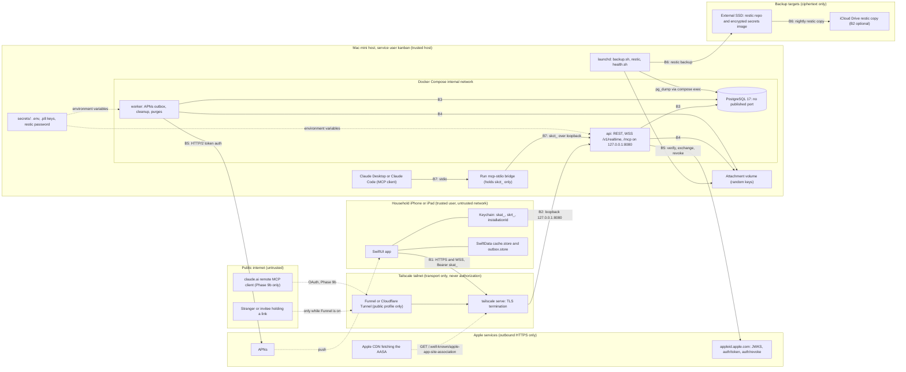

# SharedKanban threat model

Phase 0 document, written 2026-10-01. It applies the decisions in docs/decisions/decision-register.md (D01 to D22, cited inline) to the question "what can go wrong, and which decision, built in which phase, stops it". It adds no mechanisms of its own; where the register is silent the row says so and the question goes to section 6. Component shapes are in docs/architecture.md, endpoint contracts in docs/api.md. A phase is not done while one of its rows lacks a passing test or a recorded owner waiver.

Legend: STRIDE letters S spoofing, T tampering, R repudiation, I information disclosure, D denial of service, E elevation of privilege. H/M/L is judged for a two-person household on the release-1 Tailscale profile (D10); rows say when the public profile changes it. "Ph N" is the build phase whose exit gate delivers the mitigation.

## 1. Scope, assets, actors and trust boundaries

### 1.1 Scope

The SwiftUI app; the Vapor `api` and `worker`, PostgreSQL and the attachment volume on the Mac mini; the MCP server inside `api` and the `mcp-stdio` bridge; the LAN, Tailscale and Funnel/Cloudflare ingress profiles; backups and host operations by the human and the Cowork session; Sign in with Apple, APNs and TestFlight. Release 1 is the baseline; Phase 9b remote MCP is covered where it changes the picture.

### 1.2 Assets

| Asset | Where it lives | Protection | Register |
|---|---|---|---|
| User identity: Apple subject, display name, email (maybe a private relay address), Apple refresh token | `users` row | Audience-checked tokens; AES-GCM under `APPLE_TOKEN_KEY`; anonymized tombstone on deletion | D09, D16 |
| Session tokens `skat_` (60 min), `skrt_` (90-day sliding, 365-day absolute) | Raw only in the device Keychain; SHA-256 hashes in `sessions` | Opaque, hashed, rotating, revocable per installation | D16 |
| Upload `skut_` and Claude connection `skct_` tokens | Outbox store; Claude client config on the Mac mini; hashes server-side | Single purpose, bounded lifetime, revoked with the session or from Settings | D14, D15, D16 |
| Invitation tokens | Fragment of the https link; hash in `invitations` | 256-bit, single use, expiring, inviter re-checked | D04 |
| Project data, activity events (kept forever) | PostgreSQL; SwiftData cache on each device | One authorizer; file protection and backup exclusion on device | D03, D12, D17 |
| Attachments | `/Users/kanban/SharedKanban/data/attachments`; 200 MB device cache | Random keys, allowlist, membership on download | D14 |
| APNs device tokens | `devices` rows tied to sessions | Deleted on every revocation; minimal payloads | D07 |
| Apple keys and server secrets: Sign in with Apple `.p8`, APNs `.p8`, App Store Connect key, `APPLE_TOKEN_KEY`, database and restic passwords | `/Users/kanban/SharedKanban/secrets/`, outside git and restic; encrypted image on the SSD; password manager | File permissions; trusted host; rotation playbook | D11, D20, D21 |
| Backups | restic repositories on the SSD and iCloud Drive; last 8 plaintext dumps locally | restic encryption, retention, weekly checks, monthly drills | D21 |
| Audit and security logs: `mcp_audit_log` (1 year), `security.session_reuse`, JSON logs | PostgreSQL and the host | Redaction; included in backups | D11, D15, D16 |
| The Mac mini: host OS, Docker Desktop, Tailscale node, TLS certificate, login keychain kept unlocked for signing | The household | Physical custody, UPS, the owner's FileVault decision | D20, D21 |
| Cloud accounts: Apple Developer, Tailscale, iCloud | Third parties | The owner's credentials (section 6) | D10, D20, D21 |

### 1.3 Actors

| Actor | Trust | Reach |
|---|---|---|
| Household member (owner, admin, editor, viewer) | Trusted person who makes mistakes; may become a former member | Everything in their projects |
| Invitee | Unknown until signed in; holds a bearer link | `/invite`, preview and accept after sign-in |
| Removed member | Formerly trusted; keeps a cache and maybe tokens | Nothing from the next request; cache until wiped |
| Stranger on the internet | Hostile; nothing on the private profile; `/v1/*`, `/invite`, AASA, `/health` on the public profile | TLS front door only |
| Claude via MCP (the model) | No authority; acts under one user's grant; injectable by content it reads | Read tools, proposals, `confirm_change` with the token it holds |
| Malicious MCP client | Hostile process on the host, or remote after 9b | `/mcp` with a stolen `skct_` |
| Attacker with a stolen device | Holds a locked or unlocked phone | Keychain, cache, the live session |
| Attacker with physical Mac mini access | Full compromise by definition (D21) | Everything at rest |
| Compromised dependency or image | Code inside `api`, `worker` or the app | Everything that process reaches |
| Operator AI sessions (Cowork on the Mac mini, the cloud Linux session) | Trusted but misleadable by content they read | Host, secrets, Xcode, `Run admin`, `Run mcp-token` |
| Apple, Tailscale, iCloud, Cloudflare (if chosen) | Trusted only for what they carry | Identity and push; transport; ciphertext; edge decryption |

### 1.4 Trust boundaries

- B1 device to ingress: TLS by tailscale serve (or Funnel/Cloudflare); a `skat_` bearer on every request and upgrade; no Release ATS exceptions (D10, D13, D16).
- B2 ingress to `api`: loopback only; forwarded client-IP headers trusted only from the tunnel (D10).
- B3 `api`/`worker` to PostgreSQL: Docker internal network, unpublished outside `dev` (D11).
- B4 `api`/`worker` to attachments: keys validated before any path; 0700; nothing served statically (D14).
- B5 outbound to Apple only; the egress allowlist is best effort and not relied on (D10).
- B6 host to backup targets: restic ciphertext; secrets never enter a repository (D21).
- B7 MCP client to bridge to `/mcp`: one connection token, no database credentials; loopback until 9b (D15).
- B8 model to content: everything read tools return is untrusted data; nothing auto-applies (D15).
- B9 human to operator AI sessions: they act within the D20 scope; what they read is data, not instruction.

## 2. Assumptions and out of scope

Assumptions:

- The two members trust each other with shared data; roles prevent accidents and govern future members. Removed members and invitees are adversarial.
- The Mac mini is a trusted host: the `kanban` user or an admin account is a full compromise (D15, D21). Physical custody is the owner's.
- Apple identity, push and distribution behave as documented; verified at Phases 3 and 8.
- The Tailscale control plane is trusted for the private profile; tailnet membership grants nothing (D10). Account compromise is in scope (T-NET-06).
- iCloud Drive, B2 and the SSD see only restic ciphertext (D21). Server clocks are NTP-synchronized and all expiry checks are server-side (D16, D21).
- The Docker egress allowlist is best effort; no row depends on it (D10).

Out of scope:

- Compromise of Apple, Tailscale, Let's Encrypt or Cloudflare infrastructure; attacks on WireGuard or TLS cryptography (choosing Cloudflare Tunnel is recorded as a privacy-posture change, D10).
- iOS kernel or jailbreak attacks, malicious App Store builds, the device passcode and Find My remote wipe.
- Volumetric denial of service beyond household-scale rate limits (D22); side channels beyond constant-time hash comparison (D16); multi-tenant isolation (one household); email, SMS and web clients, which do not exist in release 1.

## 3. Threat tables

### 3.1 Authentication (Sign in with Apple)

| ID | Threat | STRIDE | Impact | L | Mitigation (decision, phase) | Residual risk | Test or drill |
|---|---|---|---|---|---|---|---|
| T-AUTH-01 | Forged or tampered identity token (signature, unknown key id, algorithm tricks) | S | H: account takeover | L | JWKS signature (24 h cache), issuer, audience, expiry and nonce verified with JWTKit; the code is also exchanged with Apple (D10, D11, D16; Ph 3) | JWKS refetch on key rotation decided at Ph 3 | Ph 3: bad signature, unknown key id, `alg=none` → 401 |
| T-AUTH-02 | Replayed nonce or identity token mints a second session | S | H | L | Apple codes are single use and short-lived (verify at Ph 3); the server rejects an already-accepted nonce (brief Prompt 3, D16); deletion uses a server-issued single-use challenge (D09; Ph 3) | Sign-in nonce tracking is not fixed by the register (question 1) | Ph 3: replayed nonce; challenge replay → 401 `reauth_required` |
| T-AUTH-03 | Token for another audience (another app or Services ID) | S | H | L | `aud` must equal the bundle identifier; no Services ID in release 1 (D15, D16; Ph 3) | A later web client widens the audience set | Ph 3: wrong audience → 401 |
| T-AUTH-04 | Expired, future-dated or skewed token | S | M | L | `exp` and `iat` enforced; deletion needs `iat` within 5 minutes; NTP on the Mac mini (D09, D21; Ph 3) | Apple-side skew tolerance | Ph 3: expired token; stale `iat` |
| T-AUTH-05 | Code exchange skipped, or the Sign in with Apple `.p8` leaks | S, I | H | L | Server-side exchange only; `.p8` in the secrets directory, never in git or CI; no live Apple endpoints in tests (D11, D20, D21; Ph 3) | Key theft equals host compromise (T-MINI-02); rotate per playbook 5.5 | Ph 3: deterministic fake; Ph 11: secret scan |

### 3.2 Sessions and tokens

| ID | Threat | STRIDE | Impact | L | Mitigation (decision, phase) | Residual risk | Test or drill |
|---|---|---|---|---|---|---|---|
| T-SESS-01 | Access token stolen in transit, from logs or a proxy | S | H: 60 min of impersonation | L | TLS everywhere, no Release ATS exceptions, HSTS; tokens never logged; socket token in the header, never the query; Keychain `AfterFirstUnlockThisDeviceOnly` (D10, D13, D16, D22; Ph 3) | Up to 60 minutes unless revoked | Ph 3: log grep for `skat_`/`skrt_`; Ph 11 log audit |
| T-SESS-02 | Refresh token stolen and reused | S, E | H | L | Rotation per refresh; a non-current token outside the 60-s grace revokes the session (401 `session_revoked`, `security.session_reuse` row, warning push); sessions list, revoke, revoke-all (D16; Ph 3) | A thief who refreshes first keeps access until the victim's next refresh or a manual revoke | Ph 3: refresh-reuse test; playbook 5.1 |
| T-SESS-03 | Revoked session keeps working on REST, sockets or uploads | E | M | L | Per-request check of `revoked_at`, expiry and `users.deleted_at`; revocation closes sockets (4401) and upload tokens; hub re-validates every 60 s (D13, D14, D16; Ph 3, 6) | Up to 60 s for `admin` revocations | Ph 3: revoked → 401; Ph 6: revoke mid-connection |
| T-SESS-04 | Device records outlive the session; push payloads leak content | I | M | L | Device rows die with the session; APNs 410 marks inactive; payloads carry the title and at most 80 characters of comment, never notes, tokens or emails (D07; Ph 8) | Lock-screen previews follow the iOS setting | Ph 8: token invalidation; fake push provider checks payloads |

### 3.3 Authorization

| ID | Threat | STRIDE | Impact | L | Mitigation (decision, phase) | Residual risk | Test or drill |
|---|---|---|---|---|---|---|---|
| T-AUTHZ-01 | Cross-project ids (task, column, neighbor, attachment, comment) | E, I | H | M | Every service method calls `ProjectAuthorizer`; moves reject foreign columns and neighbors; attachments carry `project_id`; 404 never confirms existence (D03, D06, D14, D22; Ph 2) | Implementation slips only | Ph 2: cross-project id tests; Ph 5: cannot load another project |
| T-AUTHZ-02 | Role escalation: admin manages admins, invitation above the inviter, UI-only checks | E | H | L | Capability enum behind one authorizer for REST and MCP; only the owner manages admins; invitation role capped by the inviter's current role at acceptance; single-owner index and trigger (D03, D04; Ph 2, 7) | None | Ph 2, 7: full role × capability matrix; accept-after-demotion |
| T-AUTHZ-03 | Removed member keeps access via token, socket or queued edits | E | H | M | Row deleted; next request 404; `hub.evict` within 1 s; queued operations fail `not_found`; assignee cleared (D03, D08, D13; Ph 7) | Cached data stays on the device until the 404 wipes it (D12) | Ph 6: revoke mid-connection; manual scenario 6 |
| T-AUTHZ-04 | Viewer or editor writes beyond their row | E | M | M | Matrix enforced server-side → 403; `confirm_change` re-runs the authorizer (D03, D15; Ph 7) | None | Ph 7: matrix; Ph 9: viewer proposal denied |
| T-AUTHZ-05 | No owner left (owner leaves or deletes the account); writes to archived or deleted projects | E, D | M | L | 409 `owner_must_transfer`; one-transaction transfer; deletion decides every owned project in one request; 409 `project_archived`; soft delete with 30-day owner restore (D03, D09; Ph 3, 7) | Projects deleted with the account have no restore | Ph 3: deletion with owned projects; Ph 7: owner-leave; trigger test |

### 3.4 Invitations

| ID | Threat | STRIDE | Impact | L | Mitigation (decision, phase) | Residual risk | Test or drill |
|---|---|---|---|---|---|---|---|
| T-INV-01 | Token guessing, enumeration, creation spam | S, D | H | L | 256-bit CSPRNG token, hash-only storage, unknown → 404; token endpoints need sign-in, 10/min per user, 30/min per IP; creation 5 per project per hour (D04; Ph 7) | IP limits blind where the address does not reach the origin (D10) | Ph 7: entropy and length; rate limits |
| T-INV-02 | Replay of a used token | S, E | M | L | Single use under `SELECT … FOR UPDATE`; 410 reason `used` (D04; Ph 7) | None | Ph 7: replay |
| T-INV-03 | Revoked invitation, or inviter demoted or removed first | E | M | L | `revoked_at` → 410; inviter standing re-checked at acceptance → 410 `inviter_unavailable`; project deletion auto-revokes (D03, D04; Ph 7) | None | Ph 7: revoke-after-share; accept-after-inviter-removal |
| T-INV-04 | Expired token accepted | E | L | L | 1, 7 or 30-day expiry, default 7 → 410 `expired` (D04; Ph 7) | A 30-day link widens the window | Ph 7: expiry |
| T-INV-05 | Link leakage: share sheet, forwarding, link previews, proxy or CDN logs, a rival app on the custom scheme | I, E | M: a stranger joins with the invited role | M | Token in the URL fragment never reaches Vapor, tailscale serve, Funnel, cloudflared or CDN logs; content-free `/invite` page, `no-store`; token in memory only; single use, expiry, revocation; `member.joined` push to owner and admins (D04, D07; Ph 7) | Bearer link: the first opener joins; the message names the project | Ph 7: fragment survival in Messages, Mail, Notes; log grep for tokens |
| T-INV-06 | Identity by email (private relay) binds the wrong person | S | M | H if email were used | No email matching; the token binds at acceptance to whoever signed in after a preview naming project, inviter and role (D04, D09; Ph 7) | An invitation cannot be pinned to one person | Ph 7: already-member consumption; acceptance by another Apple ID visible in `member.joined` |

### 3.5 Attachments

| ID | Threat | STRIDE | Impact | L | Mitigation (decision, phase) | Residual risk | Test or drill |
|---|---|---|---|---|---|---|---|
| T-ATT-01 | Path traversal via storage key or filename | T, I | H | L | 64-hex key from 32 CSPRNG bytes validated `^[0-9a-f]{64}$` before any path, sharded, no extension; `original_name` never a path; no FileMiddleware (D14; Ph 8) | None by construction | Ph 8: traversal attempts in keys and names |
| T-ATT-02 | Type spoofing: HTML, SVG or a polyglot as an image on the api origin | T, E | M: script on the origin serving the AASA and `/invite` | M | Allowlist; magic-byte sniff must match the declared family → 415; SVG, HTML, zip, OOXML, CSV excluded; downloads get `Content-Disposition: attachment`, `nosniff`, `CSP default-src 'none'; sandbox`, `no-store` (D14; Ph 8) | Polyglots neutralized by headers, not sniffing (D14) | Ph 8: sniff mismatch; polyglot header fixture |
| T-ATT-03 | Oversized or lying body (size, hash, aborted streams) | D | M | M | 25 MB → 413; declared size enforced while streaming; SHA-256 compared with initiate; 1 MB JSON cap (D14, D22; Ph 8) | Churn bounded by the pending cap | Ph 8: oversized body; hash mismatch |
| T-ATT-04 | Unauthorized download (guessed id, removed member, pending or deleted row); stolen upload token | I, S | H | L | Membership, `state = complete`, `deleted_at IS NULL`, UUID ids, 404 otherwise, nothing served statically; `skut_` bound to attachment, size, hash, user and session, 24 h, hashed, revoked with the session (D14, D16, D22; Ph 8) | A stolen `skut_` can complete only that one declared file within 24 h | Ph 8: unauthorized and deleted-row download; upload-token reuse, expiry, revocation |
| T-ATT-05 | `Content-Disposition` injection or misleading filename | T | L | L | Control characters and separators stripped, 255 cap; ASCII `filename` plus percent-encoded `filename*` (D14; Ph 8) | Display tricks inside the app only | Ph 8: CRLF, quotes and `..` fixtures |
| T-ATT-06 | Orphan files and `.part` leftovers | I, D | L | M | Deleted rows unlinked after 24 h; stale pending rows and `.part` files removed hourly; weekly scan quarantines row-less files 7 days; missing files flagged in System Status (D14; Ph 8) | Restic keeps deleted bytes until retention expires (D21) | Ph 8: cleanup tests; Ph 10 drill tolerates files without rows |
| T-ATT-07 | Quota exhaustion fills the disk | D | M | M | 20 per task, 2 GB per project, 50 GB global, 10 pending per user, 30 initiates per hour; 507 below 10 % or 10 GB free; alert at 20 % (D14, D21, D22; Ph 8, 10) | A member can still spend their share | Ph 8: pending cap; Ph 10: free-space floor |

### 3.6 WebSocket realtime

| ID | Threat | STRIDE | Impact | L | Mitigation (decision, phase) | Residual risk | Test or drill |
|---|---|---|---|---|---|---|---|
| T-WS-01 | Unauthenticated subscribe, or token in the query string | S | H | L | Bearer on the upgrade header only; invalid → 401 before upgrade (D13; Ph 6) | None | Ph 6: subscribe without token; token in query → 401 |
| T-WS-02 | Events from a project the user does not belong to; existence probing | I | H | L | Per-project subscription after the same membership check as REST; non-members get `not_found`, never `forbidden` (D13; Ph 6) | None | Ph 6: subscribe without membership |
| T-WS-03 | Stale membership (removed, demoted, archived, deleted, revoked) while connected; socket floods | E, I, D | M | M | `hub.evict` after commit within 1 s; every revocation closes with 4401; 60-s re-validation; 3 sockets per session, 20 subscriptions, 10 messages/s, 64 KB frames → 4429 (D13; Ph 6) | Up to 60 s for `admin` revocations; up to 1 s of events after removal | Ph 6: revoke mid-connection; archive and delete evictions; rate-limit close |
| T-WS-04 | Uncommitted or out-of-order data broadcast | I, T | M | L | Publication only from the post-commit hook on `Mutation.commit`; sequence allocated inside the transaction under the project lock; the worker never publishes; clients apply only `lastSequence + 1` (D06, D13, D17; Ph 6) | In-process hub is correct only with one `api` instance (D13) | Ph 6: failing transaction emits nothing; gap detection |

### 3.7 MCP connector

| ID | Threat | STRIDE | Impact | L | Mitigation (decision, phase) | Residual risk | Test or drill |
|---|---|---|---|---|---|---|---|
| T-MCP-01 | Prompt injection through task content returned by read tools, or through tool arguments | T, E | H: harmful proposals | M | Control characters stripped from returned content; every mutation is a proposal with an explicit diff; nothing auto-applies; risk level and annotations shown; every call audited (D15; Ph 9) | Not preventable server-side; the veto rests on the MCP client's per-call approval because the model holds the confirmation token (D15) | Ph 9: injected-argument tests; manual scenario 7 (deny, re-propose, confirm, audit) |
| T-MCP-02 | Confused deputy: a proposal for a project the grant's user cannot access, or a grant used for another user | E | H | L | Every action bound to the grant's user and client; the same `ProjectAuthorizer`; full re-authorization at confirm time; captured versions → 409 `stale_proposal` (D03, D15; Ph 9) | None | Ph 9: removal between proposal and confirmation; stale versions |
| T-MCP-03 | Scope escalation: writes without `tasks:write`, membership without `members:manage` | E | H | L | One required scope per tool; defaults `projects:read`, `tasks:read`; `members:manage` a separate explicit opt-in; scopes fixed at creation; denials audited (D15; Ph 9) | The owner may over-grant; the screen lists scopes | Ph 9: denied-scope test |
| T-MCP-04 | Confirmation bypass through a direct write path or an auto-apply setting | E | H | L | Mutation tools only write `PendingAIChange`; no auto-apply preference exists; `confirm_change` runs the normal services with `via = mcp` (D15; Ph 9) | None | Ph 9: bypass attempts; no mutation tool calls a service write |
| T-MCP-05 | Replayed, expired, cross-user or cross-client confirmation token | S, E | M | L | Atomic `pending → confirmed`; hash, user, `client_id` and 10-minute expiry checked; stored operationIds make a double confirm a no-op; 409 `change_already_applied` (D15, D18; Ph 9) | None | Ph 9: duplicate and expired confirmation; another user's token |
| T-MCP-06 | Undeclared parameters or malformed arguments | T | M | M | Strict JSON Schemas, `additionalProperties: false`; undeclared parameters rejected; ids validated against the user's projects (D15; Ph 9) | None | Ph 9: undeclared-parameter test |
| T-MCP-07 | Overlong inputs or tool-call floods | D | L | M | Title 200, notes 20,000, comment 5,000, arrays 50; 60 reads and 10 proposals per minute per grant; audit arguments truncated to 4 KB (D15; Ph 9) | None | Ph 9: overlong strings; rate limit |
| T-MCP-08 | Raw database or filesystem access from the AI side; credentials in the AI-launched process | E, I | H | L | MCP server inside `api` over the services, no queries or filesystem of its own; the stdio bridge holds only the connection token; `/mcp` loopback-only until 9b (D10, D15; Ph 9) | None | Ph 9: MCP module imports no Fluent, SQLKit or FileManager; bridge environment holds only `skct_` |
| T-MCP-09 | Stolen connection token, malicious MCP client on the host, audit tampering | S, E, R | M | L | `skct_` hashed, 90-day expiry, accepted only by `/mcp`, revocable in Settings and with `Run mcp-token revoke`; audit rows for every call including denials, kept 1 year, in backups, shown in Settings → Claude activity (D15, D16; Ph 9) | Plaintext token in the client config readable by the `kanban` user (accepted, D15) | Ph 9: revoke → 401 plus audit row; playbook 5.6 |

### 3.8 Tunnel and ingress

| ID | Threat | STRIDE | Impact | L | Mitigation (decision, phase) | Residual risk | Test or drill |
|---|---|---|---|---|---|---|---|
| T-NET-01 | Funnel or Cloudflare Tunnel makes every route internet-reachable | S, D | H | M once enabled | Release-1 production is the Tailscale private profile; Funnel only on need, path-scoped to `/v1/*`, `/invite`, `/.well-known/*`, `/health`, `/mcp` after 9b; transport is never authorization; bearer plus project authorization on every request (D10; Ph 10) | Once public, sign-in, invitations and `/invite` reach anyone with the app; Cloudflare decrypts at its edge | Ph 10: public-profile checklist with an external path scan |
| T-NET-02 | Origin reachable around the TLS front door (LAN port, published PostgreSQL) | S, I | H | L | `api` publishes `127.0.0.1:8080` only outside `dev`; PostgreSQL never published outside `dev`; tailscale serve proxies to loopback (D10, D11; Ph 10) | The `dev` profile on a LAN, Debug builds only | Ph 10: listener check from another LAN host |
| T-NET-03 | Weak TLS: self-signed certificates, ATS exceptions, downgrade | I | H | L | Let's Encrypt through tailscale serve/cert; no Release ATS exceptions; HSTS and `nosniff` on every response (D10, D22; Ph 10) | Edge decryption if Cloudflare is chosen | Ph 10: external TLS check; Ph 11: Info.plist audit |
| T-NET-04 | Rate-limit gaps: shared household IP, client IP invisible behind Funnel | D | M | M | Limits keyed per user first; per-IP only where the address reaches the origin; forwarded headers trusted only from the tunnel; 429 with `Retry-After` (D10, D22; Ph 3, 7, 10) | Pre-authentication endpoints on the public profile depend on IP forwarding (verify at Ph 10) | Ph 3, 7: limit tests; Ph 10: forwarded-IP check |
| T-NET-05 | Brute force against sign-in, invitations or the 9b pairing code | S | M | L | 256-bit tokens everywhere; 8-character pairing code; per-user and per-IP limits; failed verifications logged as reason codes (D04, D15, D16; Ph 3, 7) | None at household scale | Ph 7: entropy tests; Ph 3: auth limits |
| T-NET-06 | Tailscale account compromise, or a stranger with the TestFlight build signs in | S, E | H | L | Tailnet reach is transport only; every request needs a bearer; TestFlight is invite-only; sign-in limited 10/min per IP; `Run admin sessions revoke-all` exists (D10, D11, D16, D20) | An intruder with the app can create an account and spend quota; no sign-up allowlist in the register (question 2) | Ph 10: tailnet device review; remove a device and confirm loss of reach |

### 3.9 Backups

| ID | Threat | STRIDE | Impact | L | Mitigation (decision, phase) | Residual risk | Test or drill |
|---|---|---|---|---|---|---|---|
| T-BAK-01 | Unencrypted dumps readable from the disk or a lost SSD | I | H | M | restic encrypts the repositories on the SSD and iCloud Drive; secrets never enter a repository (D21; Ph 10) | The last 8 `pg_dump` files are plaintext under `data/backups/db` on a FileVault-off disk (question 3) | Ph 10: repository files unreadable without the password |
| T-BAK-02 | Key loss: restic password or secrets-image passphrase | D | H: backups unusable | L | Password at `secrets/restic-password` (0600) and in the password manager; `export-secrets.sh` encrypted image on the SSD; checklist item 8 (D20, D21; Ph 10) | A lost restic password equals lost backups (D21) | Quarterly drill restores from the password-manager copy |
| T-BAK-03 | Off-device copy exposure: iCloud account compromise, bucket leak, SSD theft | I | M | L | Repositories are ciphertext; "Optimize Mac Storage" off; secrets excluded (D21; Ph 10) | Size and timing metadata visible; the SSD also carries the encrypted secrets image | Ph 10: `restic check` on both repositories |
| T-BAK-04 | Restore integrity: corrupt snapshot, dump and attachment skew, a drill touching production, a silently stopped job | T, D | H | M | Weekly `restic check --read-data-subset=10%`; monthly automated drill into `sharedkanban-drill` with blank Apple and APNs credentials, row counts, attachment re-hash, `/ready` and smoke tests; quarterly human-observed drill; alerts when a backup is older than 30 h or the SSD is missing (D21; Ph 10) | Dump and files not point-in-time consistent; RPO 6 h local, 24 h off-device | Ph 10 exit gate: restore into a disposable stack; manual scenario 8 |

### 3.10 Account deletion

| ID | Threat | STRIDE | Impact | L | Mitigation (decision, phase) | Residual risk | Test or drill |
|---|---|---|---|---|---|---|---|
| T-DEL-01 | Incomplete deletion leaves sessions, devices, upload tokens, grants, invitations or memberships | I, R | H | L | One transaction revokes sessions, deletes device rows, invalidates upload tokens, grants and pending AI changes, deletes invitations and memberships, clears assignees, anonymizes the user row; the client wipes Keychain, both stores, cache, reminders and the APNs registration (D09; Ph 3) | Tombstone, attributed content and event fragments remain as "Deleted member" (disclosed) | Ph 3: deletion tests; deleted user's token → 401; the other member sees `member.left` |
| T-DEL-02 | Orphaned ownership after deletion | E, D | M | L | 409 `owned_projects_require_transfer`; transfers and deletions decided in one request through the D03 transfer path; solo-owned projects deleted permanently (D03, D09; Ph 3) | Those projects have no restore | Ph 3: deletion with and without owned shared projects |
| T-DEL-03 | Apple revocation fails, or Apple-side consent revocation goes unnoticed | R, E | L | M | Fresh code exchange plus `/auth/revoke`, fallback to the stored encrypted token, hourly worker retry for 7 days, never blocks deletion; `getCredentialState` on launch; server-to-server notifications once a public hostname exists (D09, D10; Ph 3) | On the private profile Apple cannot deliver revocation events; other devices stay signed in until their next launch or a manual revoke | Ph 3: revoke-failure path with the fake; manual: revoke in Apple ID settings and relaunch |
| T-DEL-04 | Deletion with a stolen access token | S | H | L | A fresh Sign in with Apple bound to a server-issued single-use 5-minute challenge, matching `sub` and recent `iat` (D09; Ph 3) | None | Ph 3: challenge replay, stale token, wrong subject |

### 3.11 Logging and privacy

| ID | Threat | STRIDE | Impact | L | Mitigation (decision, phase) | Residual risk | Test or drill |
|---|---|---|---|---|---|---|---|
| T-LOG-01 | Secrets in logs: session, upload, connection or invitation tokens, Apple tokens, file paths | I | H | M | JSON log handler redacts tokens and paths; raw tokens never logged; invitation token stays in the fragment; Apple failures logged as reason codes; MCP arguments redacted and truncated; the error envelope carries no stack traces (D04, D11, D15, D16, D22; Ph 3, 9, 10) | Redaction is pattern-based; new token classes must be added | Ph 3, 9: redaction tests grep for token prefixes and 43-character base64url; Ph 11 log audit |
| T-LOG-02 | Over-retention: events forever, audit 1 year, fragments after deletion, backups, push previews, photo location metadata | I | M | H by design | Events never store emails, tokens, display names or full notes; previews truncated to 200 characters; reads and sign-ins not recorded; `last_ip_prefix` only; location EXIF stripped by default; minimal push bodies; backups age out under 14/8/12 retention; disclosed in the privacy inventory (D07, D14, D16, D17, D21; Ph 11) | Fragments and attributed content persist after deletion (D17) | Ph 11: privacy inventory review; fixture asserting `changes` truncation; Ph 8: GPS EXIF fixture stripped |
| T-LOG-03 | Crash reports and diagnostics leak content | I | L | M | No crash-reporting dependency in the register; server logs stay on the Mac mini; any client analytics or crash SDK needs an ADR (D11) | TestFlight crash logs reach Apple; contents checked at Ph 11 | Ph 11: privacy inventory and dependency review |

### 3.12 Device loss

| ID | Threat | STRIDE | Impact | L | Mitigation (decision, phase) | Residual risk | Test or drill |
|---|---|---|---|---|---|---|---|
| T-DEV-01 | Lost or stolen signed-in iPhone or iPad; device backup or restore carrying tokens elsewhere | S, I | H | L | Keychain `AfterFirstUnlockThisDeviceOnly`, non-synchronizable, this-device-only, first-launch leftover wipe; stores and cache `completeUntilFirstUserAuthentication` and excluded from backup; per-session revoke and revoke-all from another device close sockets, invalidate upload tokens and delete device rows (D07, D12, D13, D14, D16; Ph 3) | Data readable after first unlock if the passcode is known; passcode and remote wipe are out of scope | Ph 3: revoke from a second device, confirm 401 on the first; restore-to-new-device manual check; playbook 5.1 |

### 3.13 Mac mini compromise or theft

| ID | Threat | STRIDE | Impact | L | Mitigation (decision, phase) | Residual risk | Test or drill |
|---|---|---|---|---|---|---|---|
| T-MINI-01 | Physical theft with FileVault off exposes database, attachments, dumps and keys | I | H | L | FileVault OFF by default is a recorded owner decision for unattended restarts; ON is documented; theft is a full compromise: revoke all sessions, rotate the APNs and Sign in with Apple keys, remove the Tailscale node (D21; Ph 10) | Everything at rest is exposed; raw session tokens are not stored, so data leaks but live sessions do not | Ph 10: tabletop run of playbook 5.3 |
| T-MINI-02 | Secrets at rest: `.env`, both `.p8` keys, `APPLE_TOKEN_KEY`, restic password, the login keychain kept unlocked for signing | I | H | L | Secrets directory outside git and restic, 0600; only `.env.example` committed; encrypted secrets image on the SSD; nothing in `CLAUDE.md` (D11, D20, D21; Ph 1, 10) | Any process running as `kanban` reads them; `APPLE_TOKEN_KEY` sits beside its ciphertext, so it only protects an exported dump | Ph 10: permission check; Ph 11: repository history secret scan |
| T-MINI-03 | Host compromise: malware, exposed sharing services, auto-login console, container escape, or an operator AI session misled by content it reads or minting Claude tokens for any user with `mcp-token create` | E | H | L | Loopback-only services; Tailscale-only ingress; automatic security updates; non-root read-only containers with writable mounts only for attachments and `/tmp`; PostgreSQL internal; best-effort egress allowlist; Cowork's scope is defined and scripted and every MCP write stays audited and confirmed (D10, D11, D15, D20, D21; Ph 10) | macOS sharing services and the `kanban` password are not covered by the register (question 8); a host operator can act as either member through MCP (question 7) | Ph 10: Compose configuration and Sharing settings review; Ph 9: audit rows carry `client_id` |

### 3.14 Supply chain

| ID | Threat | STRIDE | Impact | L | Mitigation (decision, phase) | Residual risk | Test or drill |
|---|---|---|---|---|---|---|---|
| T-SUP-01 | Compromised or vulnerable Swift package (Vapor, Fluent, JWTKit, APNSwift, swift-crypto, swift-log) | T, E | H | L | No server dependency without an ADR; `Package.resolved` pins exact versions recorded in docs/architecture.md; CI on every push; Ph 11 dependency review (D11, D20; Ph 1, 11) | No signature or advisory verification for SwiftPM in the register (question 6) | Ph 11: dependency review; `Package.resolved` diffs reviewed on every change |
| T-SUP-02 | Malicious or drifting Docker images, Homebrew tools (restic, Tailscale, `postgresql@17`), CI | T | H | L | Official images, pinned major tags, multi-stage slim runtime, non-root; CI holds no deploy credentials because the Mac mini is the only deployer (D11, D20; Ph 1, 10) | Tags are mutable; digests are not pinned in the register (question 6) | Ph 10: record image digests at deploy; rebuild from a clean environment |

### 3.15 Availability at household scale

| ID | Threat | STRIDE | Impact | L | Mitigation (decision, phase) | Residual risk | Test or drill |
|---|---|---|---|---|---|---|---|
| T-AVL-01 | Power loss, or a failed macOS, Docker or app update | D | M | M | UPS over USB, shutdown after 5 minutes on battery, `pmset autorestart 1`, service-user auto-login, Docker and Tailscale at login, `health.sh` restarts the stack after three failures; security updates with restarts after a backup, major upgrades off; explicit `migrate` step; launchd escape hatch exercised (D11, D21; Ph 10) | FileVault ON would stall a restart; Docker Desktop after macOS updates is a known soft spot | Ph 10: pull-the-plug drill; launchd path exercise; rollback rehearsal |
| T-AVL-02 | Disk failure or disk full | D | H | M | 6-hourly dumps, restic to the SSD, nightly off-device copy, retention, weekly checks, monthly drill; quotas and the 507 floor; alerts for backup age, missing SSD and free space (D14, D21; Ph 10) | Up to 6 h (SSD) or 24 h (off-device) of edits lost; in-flight outbox operations replay after a restore (D08, D18) | Ph 10: restore drill; unplug-the-SSD drill |
| T-AVL-03 | Home internet loss, Tailscale outage, tunnel idle limits | D | M | M | Offline cache and outbox; local reminders keep working; reconnect on path change; client watchdog after 24 h; Funnel limits verified (D07, D08, D10, D13, D21; Ph 6, 10) | No remote access until restored; invitations and membership changes are online-only | Ph 6: reconnect tests; Ph 10: idle-timeout check |

## 4. Security requirements by build phase

A phase's exit gate is not signed until every row listed for it has a passing test (section 3, "Test or drill" column) and the extra gate items below are true. The owner reads the phase report; the tests are the evidence.

| Phase | Rows that must pass | Extra gate items (register) |
|---|---|---|
| 1 Scaffold | T-MINI-02 (repository part), T-SUP-01, T-SUP-02 | No secrets or production URLs in git; `.env.example` and the `Environment.xcconfig` example committed, real files ignored; `Package.resolved` pins exact versions recorded in docs/architecture.md; warnings as errors for server and SharedDTOs; `/health` and `/ready`; CI runs shared and server tests; the ATS exception exists only in the Debug Info.plist; Apple Developer enrollment started (D10, D11, D20). |
| 2 Domain | T-AUTHZ-01, T-AUTHZ-02, T-AUTHZ-05 (trigger test), T-WS-04 (sequence allocation) | `ProjectAuthorizer` is the only permission path; single-owner and 3-to-4-column triggers; one-event-per-version test; idempotency replay, mismatch, stored-409 and TTL tests; migrations are an explicit step (D03, D05, D06, D11, D17, D18, D19). |
| 3 Sign in | T-AUTH-01 to T-AUTH-05, T-SESS-01 to T-SESS-03, T-DEL-01 to T-DEL-04, T-DEV-01, T-LOG-01 (redaction) | Deterministic Apple fake, never live endpoints; encrypted Apple refresh token; sessions list, revoke, revoke-all; auth rate limits; Keychain attributes and first-launch wipe; real-device sign-in checklist produced (D09, D12, D16, D22). |
| 4 Prototype | none | No networking; in-memory repository only; custom UTType with no `.text` drag representation; sample data holds no personal data (D01, D12). |
| 5 Client sync | T-AUTHZ-01 (client half), T-AUTHZ-03 (cache wipe) | Store files protected and excluded from backup; cache wiped on schema mismatch; 403/404 removes the project subtree; outbox carries `requestVersion`; forced sign-out keeps stores, a different user wipes them (D08, D12). |
| 6 Drag and realtime | T-WS-01 to T-WS-04, T-SESS-03 (socket half), T-AVL-03 (reconnect) | Move contract rejects cross-project ids and self-neighbors; reconnect backoff and gap detection; two-device manual script (D06, D08, D13). |
| 7 Sharing | T-INV-01 to T-INV-06, T-AUTHZ-02 to T-AUTHZ-05, T-NET-05 (entropy) | Content-free `/invite` page with `no-store` and the AASA route; invitation rate limits; owner-leave 409 and the transfer endpoint; `member.role_changed` handled live; fragment survival verified in Messages, Mail and Notes; membership audit events; concise security review produced (D03, D04, D17, D22). |
| 8 Files and push | T-ATT-01 to T-ATT-07, T-SESS-04, T-LOG-02 (EXIF) | Fake push provider asserts payload shape, collapse ids, dedup and actor exclusion; device token lifecycle; deep links re-check authorization; background-resume test (D07, D14). |
| 9 MCP | T-MCP-01 to T-MCP-09, T-AUTHZ-04 (MCP half) | `/mcp` loopback-only; credential-free bridge; hashed grants with default scopes and separate `members:manage`; Connect Claude and Claude activity screens; connector instructions state the per-call approval dependency; 9b adds PKCE, resource indicators and the other-audience test (D10, D15). |
| 10 Deployment | T-NET-01 to T-NET-04, T-NET-06, T-BAK-01 to T-BAK-04, T-MINI-01 to T-MINI-03, T-AVL-01 to T-AVL-03 | `api` on `127.0.0.1:8080`, PostgreSQL unpublished, hardened images, secrets permissions; tailscale serve TLS, key expiry disabled, Funnel off unless needed and path-scoped; HSTS and `nosniff` verified from outside; backups, nightly copy, weekly check, monthly drill, `restore.sh`, `health.sh`, UPS and auto-restart, FileVault decision recorded, launchd path exercised, image digests recorded; runbook covers section 5; production log redaction (D10, D11, D21, D22). |
| 11 Hardening | every row re-run; T-LOG-01 to T-LOG-03, T-SUP-01 | The brief's audit list; static analysis and dependency review; privacy inventory covering Deleted-member fragments, audit and event retention; TestFlight checklist; two-user end-to-end scenario; every section 3 row has a passing test or an owner waiver recorded in the release criteria. |

## 5. Incident playbook stubs

Full procedures belong in `deploy/runbook.md` (Phase 10); these stubs fix the detect, contain and recover steps it must expand.

### 5.1 Stolen refresh token

- Detect: a `security.session_reuse` row and the "Signed out for your safety" push (D16); an unknown device in Settings → Sessions; an unfamiliar `last_ip_prefix`.
- Contain: revoke that session or revoke-all from Settings, or `Run admin sessions revoke-all` on the Mac mini; sockets close, upload tokens die, device rows go (D07, D13, D14, D16).
- Recover: sign in again on the legitimate devices; review the activity feed and MCP audit for actions by that session; nothing server-side needs rotation because tokens are opaque.
- Verify: the stolen token returns 401 `session_revoked`.

### 5.2 Compromised invitation link

- Detect: an unexpected `member.joined` push to the owner and admins (D07); an unknown name in the member list; a pending invitation in `GET /v1/projects/{id}/invitations`.
- Contain: revoke it with `DELETE /v1/invitations/{id}`; if already used, remove the member, which returns 404 on their next request, evicts their sockets and clears their assignments (D03, D04, D13).
- Recover: review activity by that actor and restore anything archived; issue a fresh 1-day invitation; all of this is online-only (D08).

### 5.3 Lost or stolen Mac mini

- Detect: `health.sh` and the client watchdog report the server unreachable; the Tailscale admin console shows the node offline; physical absence.
- Contain: remove the node from the tailnet and disable Funnel if on; in the developer portal revoke the Sign in with Apple key, the APNs key and the App Store Connect API key and create new ones; treat everything on the disk as read (D21).
- Recover: on replacement hardware restore the latest snapshot with `restore.sh` using the restic password from the password manager; load secrets from the encrypted image with the rotated keys and a fresh `APPLE_TOKEN_KEY`; rejoin the tailnet and re-enable `tailscale serve`; run `Run admin sessions revoke-all` so every device signs in again and re-registers for push; revoke pending invitations.
- Verify: `/ready`, a sign-in on each device, attachment hashes from the drill script.

### 5.4 Disk failure

- Detect: `/ready` and System Status alerts (backup age, free space, missing SSD), `health.sh` failures, macOS disk warnings (D21).
- Contain: stop the stack with `docker compose down`; run no migrations; leave the SSD attached but untouched.
- Recover: replace the disk, rebuild the host stance from the runbook, restore with `restore.sh` into the live stack after stopping it (D21); accept the RPO loss; phones replay in-flight outbox operations on reconnect (D08, D18).
- Verify: row counts, attachment re-hash, `/ready`, a two-device edit.

### 5.5 Expired or invalid Apple or APNs key

- Detect: APNs rejects the provider token in worker logs; sign-ins fail at the code exchange; deletion revoke retries fail (D09). APNs-based alerts cannot carry this one, so check Settings → Server status (question 5).
- Contain: existing sessions keep working because app tokens do not depend on Apple keys (D16); only new sign-ins, deletions and pushes are affected.
- Recover: the human creates the replacement key in the developer portal (D20 checklist item 3) and drops it in the secrets folder; Cowork updates `.env`, restarts `api` and `worker`, runs `export-secrets.sh`, and verifies with a sandbox push and a real sign-in.

### 5.6 Suspicious MCP activity

- Detect: unexpected entries in Settings → Claude activity, feed items "via Claude" the user did not confirm, denial or rate-limit spikes in `mcp_audit_log` (D15).
- Contain: revoke the connection token in Settings → Connect Claude or with `Run mcp-token revoke`; cancel pending changes (they expire in 10 minutes anyway); if `/mcp` is public, remove it from the Funnel path set (D10, D15).
- Recover: read the 1-year audit trail and the activity feed; undo unwanted changes by hand (restore archived tasks, re-edit fields); inspect the Claude client's configuration and the task content it read for injected instructions; issue a new token with the narrowest scopes.

## 6. Open security questions for review

1. Sign-in nonce replay: D16 lists the nonce check but not how a replayed sign-in nonce or token is detected; D09 defines a server-issued challenge only for deletion. Decide at Phase 3 whether sign-in nonces are server-issued or accepted nonces are recorded until expiry.
2. Sign-up gate: on the public profile anyone with the TestFlight build and an Apple ID can create an account (T-NET-06). Should `/v1/auth/apple` accept only owner-approved Apple subjects, or is TestFlight's invite list enough?
3. Plaintext local dumps: D21 keeps the last 8 `pg_dump` files unencrypted on a FileVault-off disk. Accept, shorten local retention, or does the owner choose FileVault ON?
4. Tailscale account protection: which identity provider and second factor guard the tailnet, and should tailnet ACLs limit which devices reach the Mac mini as defense in depth, given that D10 relies on none of it?
5. Alerting blind spot: D21 alerts travel through APNs, so an invalid APNs key or a dead worker cannot announce itself; the client watchdog covers "unreachable" only. Is Settings → Server status plus the monthly drill enough?
6. Supply-chain verification: SwiftPM has no advisory feed and D11 pins images by major tag; should Phase 10 record image digests and Phase 11 adopt a dependency-audit tool? Confirm too that only Apple's TestFlight crash reporting is used and what it may contain.
7. MCP human veto: the MCP client's per-call approval is the only veto in release 1 (D15); should the in-app approval mode move from release-2 candidate to a Phase 9 deliverable? Relatedly, `Run mcp-token create --user` lets a host operator pair Claude as either member without that member's consent.
8. Host hardening outside the register: Screen Sharing, Remote Login, the `kanban` account password and Gatekeeper need a runbook decision at Phase 10.
9. Fragment survival and retention disclosure: if Messages or Mail strip URL fragments at Phase 7, the D04 fallback (path token with redaction at every hop) changes T-INV-05 and T-LOG-01, so decide the fallback before Phase 7; and the Deleted-member fragments and 1-year MCP audit rows must be stated in the App Store privacy inventory with both members' agreement.
